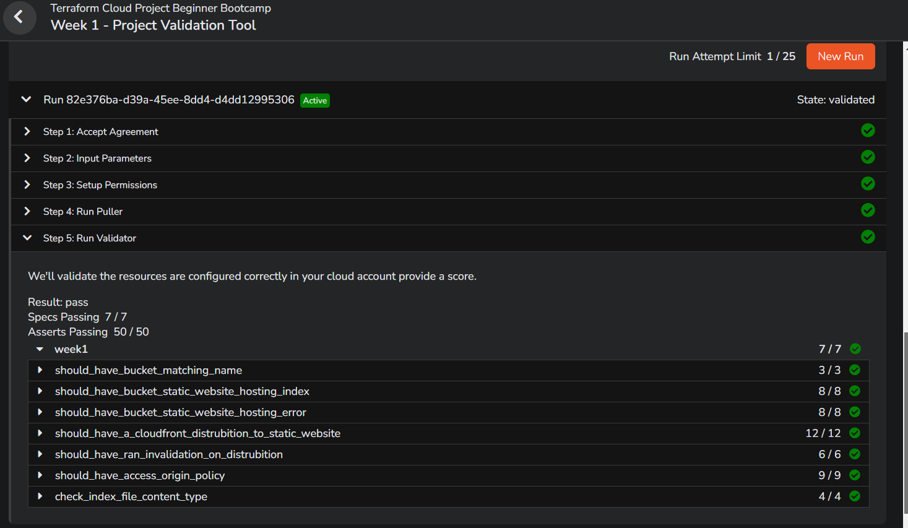

# Terraform Beginner Bootcamp 2023  Week 1  — Building Week Journal

[Week-1 Architecture](#week-1-architecture) :cloud: :potted_plant:

[Notes for revision](#notes-for-revision) :syringe: :medal_sports:
- [Fixing Tags](#fixing-tags)
- [Root Module Structure](#root-module-structure)
    + [Root module](#root-module)
- [Terraform and Input Variables](#terraform-and-input-variables)
- [Terraform Cloud Variables](#terraform-cloud-variables)
- [Terraform Variables](#terraform-variables)
  * [Declaring an Input Variable - example](#declaring-an-input-variable---example)
  * [Loading Terraform Input Variables](#loading-terraform-input-variables)
    + [var flag](#var-flag)
    + [terraform.tvfars](#terraformtvfars)
    + [var-file flag](#var-file-flag)
    + [auto.tfvars](#autotfvars)
  * [Order of terraform input variables](#order-of-terraform-input-variables)
    + [Regex with variable conditions](#regex-with-variable-conditions)
    + [Considerations for using variable with Terraform Cloud](#considerations-for-using-variable-with-terraform-cloud)
- [Dealing With Configuration Drift](#dealing-with-configuration-drift)
- [What is Configuration drift?](#what-is-configuration-drift-)
- [What happens if we lose our `terraform.tfstate` state file?](#what-happens-if-we-lose-our--terraformtfstate--state-file-)
  * [Fix Missing Resources with Terraform Import](#fix-missing-resources-with-terraform-import)
  * [Terraform import block TFv1.5.0](#terraform-import-block-tfv150)
  * [Fix Manual Configuration](#fix-manual-configuration)
- [Fix using Terraform Refresh](#fix-using-terraform-refresh)
- [Terraform Modules](#terraform-modules)
  * [Terraform Module Structure](#terraform-module-structure)
  * [Passing Input Variables](#passing-input-variables)
  * [Modules Sources](#modules-sources)
  * [Module Outputs](#module-outputs)
- [Considerations when using ChatGPT to write Terraform](#considerations-when-using-chatgpt-to-write-terraform)
- [S3 Static website hosting using Terraform](#s3-static-website-hosting-using-terraform)
- [Working with Files in Terraform](#working-with-files-in-terraform)
  * [Fileexists function](#fileexists-function)
  * [Filemd5](#filemd5)
  * [Path Variable](#path-variable)
- [Terraform Console](#terraform-console)
- [Terraform Locals](#terraform-locals)
- [Terraform Data Sources](#terraform-data-sources)
- [Defining IAM Policies in TF code - Working with JSON](#defining-iam-policies-in-tf-code---working-with-json)
  * [Changing the Lifecycle of Resources](#changing-the-lifecycle-of-resources)
- [Terraform Data](#terraform-data)
- [Provisioners](#provisioners)
  * [Local-exec](#local-exec)
  * [Remote-exec](#remote-exec)
- [Heredoc String](#heredoc-string)
- [Fileset Function](#fileset-function)
- [For Each Expressions](#for-each-expressions)
- [Terraform Expressions](#terraform-expressions)
  * [Expression Types and Values](#expression-types-and-values)
  * [Collection Types](#collection-types)


[Personal Documentation](#personal-documentation) :memo: :pencil:

[Task Status](#task-status) :star: :face_in_clouds: :partying_face: :white_check_mark:

# Task Status
| Topic | Status |
| --- | --- | 
| [Journal TOC and Major Version](#journal-toc-and-major-version)  | <ul><li> [x] </li></ul> |
| [Restructure Root Module](#restructure-root-module) | <ul><li> [x] </li></ul> |
| [Terraform Import and Configuration Drift](#terraform-import-and-configuration-drift) | <ul><li> [x] </li></ul> |
| [Create Terrahouse Module](#create-terrahouse-module) | <ul><li> [x] </li></ul> |
| [Static Website Hosting](#static-website-hosting) | <ul><li> [x] </li></ul> |
| [Content Delivery Network](#content-delivery-network) | <ul><li> [x] </li></ul> |
| [Terraform Data and Content Version](#terraform-data-and-content-version) | <ul><li> [x] </li></ul> |
| [Invalidate Cache and Local Exec](#invalidate-cache-and-local-exec) | <ul><li> [x] </li></ul> |
| [Assets Upload and For Each](#assets-upload-and-for-each) | <ul><li> [x] </li></ul> |
| [Working Through Git Graph Issues](#working-through-git-graph-issues) | <ul><li> [x] </li></ul> |
| [Project Validation](#project-validation) | <ul><li> [x] </li></ul> |

# Week 1 Architecture


The complete end-to-end architecture of what we will achieve at the end of the bootcamp is available [here](https://lucid.app/lucidchart/e3f15b1a-2211-4ddb-8c95-f144c2504db4/edit?invitationId=inv_0873b3c6-c652-463f-9f2b-fa0f1b420823&page=0_0#) 

_Diagram copyrights: Andrew Brown from ExamPro.co_

-----------------------------------------------------------------------------------------------------
# Notes For Revision

## Fixing Tags

[How to Delete Local and Remote Tags on Git](https://devconnected.com/how-to-delete-local-and-remote-tags-on-git/)

Locally delete a tag
```sh
git tag -d <tag_name>
```

Remotely delete tag
```sh
git push --delete origin tagname
```

Checkout the commit that you want to retag. Grab the SHA from your Github history.
```sh
git checkout <SHA>
git tag M.M.P
git push --tags
git checkout main
```

example:
```sh
git checkout 2813847
git tag 1.1.0
git push --tags
```

## Root Module Structure

Our root module structure is as follows:

```
PROJECT_ROOT
│
├── main.tf                 # everything else.
├── variables.tf            # stores the structure of input variables
├── terraform.tfvars        # the data of variables we want to load into our terraform project
├── providers.tf            # defined required providers and their configuration
├── outputs.tf              # stores our outputs
└── README.md               # required for root modules
```

[Standard Module Structure](https://developer.hashicorp.com/terraform/language/modules/develop/structure)

Standard Terraform module structure:
#### Root module
- mandatory element
- Terraform files must exist in the root directory of the repository
- primary entrypoint for the module 

**README**
- The root module and any nested modules should have README files
- This file should be named `README` or `README.md`. 
- should contain the description of the module and what it should be used for.
- **examples** can be included in a `examples` directory

**LICENSE**
-  The license under which this module is available

`main.tf`, `variables.tf`, `outputs.tf` : are the recommended filenames for a minimal module, even if they are empty.


Example of a minimal recommended module following the standard structure

```txt
$ tree minimal-module/
.
├── README.md
├── main.tf
├── variables.tf
├── outputs.tf
```

Complete structure example:

```txt
$ tree complete-module/
.
├── README.md
├── main.tf
├── variables.tf
├── outputs.tf
├── ...
├── modules/
│   ├── nestedA/
│   │   ├── README.md
│   │   ├── variables.tf
│   │   ├── main.tf
│   │   ├── outputs.tf
│   ├── nestedB/
│   ├── .../
├── examples/
│   ├── exampleA/
│   │   ├── main.tf
│   ├── exampleB/
│   ├── .../
```

## Terraform and Input Variables

## Terraform Cloud Variables

In terraform we can set two kind of variables:
1) **Enviroment Variables** - those you would set in your bash terminal eg. AWS credentials
2) **Terraform Variables** - those that you would normally set in your tfvars file

> We can set Terraform Cloud variables to be sensitive so they are not shown visibliy in the UI.

## Terraform Variables
[Terraform Variables](https://developer.hashicorp.com/terraform/language/values/variables)
- similar to shell input variables/function arguments.
- are 
- let you customize aspects of Terraform modules without altering the module's own source code. 
- allows reusing modules across different Terraform configurations (example: same code used for different envs like dev, prod, qa etc.)
- good practice to briefly describe the purpose of each variable using the optional `description` argument:
> For brevity, input variables are often referred to as just "variables" or "Terraform variables"

### Declaring an Input Variable - example
```tf
variable "availability_zone_name" {
  type    = string
  default = "eu-central-1a"
  description = "The availablity zone in which our AWS resources will be created."
}
```

### Loading Terraform Input Variables

[Terraform Input Variables](https://developer.hashicorp.com/terraform/language/values/variables)

#### var flag
We can use the `-var` flag to set an input variable or override a variable in the tfvars file eg. `terraform -var user_ud="my-user_id"`


#### terraform.tvfars
This is the default file to load in terraform variables in blunk


#### var-file flag
When use different file in place of `.terraform.tfvars` to define the input variables, then we need to explicitly provide the argument `-var-file` during the terraform plan or apply
One use case for having var files other than `.terraform.tfvars` can be: our organization wishes to maintain dedicated var files for each of our environments. Like a `dev.tfvars` for `dev` env, `qa.tfvars` for `qa` env. etc.
Example:


dev.tfvars
```tf
environment = "dev"
resoure_group_location = "us-east-1"
```

```tf
terraform plan -var-file="dev.tfvars"
terraform apply -var-file="dev.tfvars"
```

#### auto.tfvars
- Can have any name, but must end with an `.auto.tfvars` extension.
- The variables inside these files will be auto loaded during terraform plan or apply


### Order of terraform input variables


[Variable Precedence](https://developer.hashicorp.com/terraform/language/values/variables#variable-definition-precedence)

#### Regex with variable conditions
`regex` applies a regular expression to a string and returns the matching substrings.
[Terraform Regex](https://developer.hashicorp.com/terraform/language/functions/regex)

```
variable "user_uuid" {
  description = "The UUID of the user"
  type        = string
  validation {
    condition        = can(regex("^[0-9a-fA-F]{8}-[0-9a-fA-F]{4}-[1-5][0-9a-fA-F]{3}-[89abAB][0-9a-fA-F]{3}-[0-9a-fA-F]{12}$", var.user_uuid))
    error_message    = "The user_uuid value is not a valid UUID."
  }
}
```

#### Considerations for using variable with Terraform Cloud

You can set two different types of variables in Terraform cloud
- Environment Variables - vars that are required for the functionality to work. (those you would normally set in $PATH of your bash terminal). Vars like AWS access key, secret access key and region would be a few examples.
- Terraform Variables - Those that you would normally set in the `terraform.tfvars` file

https://developer.hashicorp.com/terraform/cloud-docs/workspaces/variables

## Dealing With Configuration Drift

## What is Configuration drift?
- One challenge when managing infrastructure as code is `drift`.
- `Drift` is the term for when the _real-world state_ of your infrastructure differs from the _state defined in your configuration_. 
- The Terraform state file `terraform.tfstate`  is the record of all resources Terraform manages. Since in our project, we are not commiting the TF state file to our repo, it is lost when we close our environment. The next time our environemnt is launched, TF is unable to determine which resources exist and what is their defined state.

## What happens if we lose our `terraform.tfstate` state file?

If you lose your statefile, you most likley have to tear down all your cloud infrastructure manually.

You can use terraform port but it won't for all Cloud resources. You need check the terraform providers documentation for which resources support import.

### Fix Missing Resources with Terraform Import

`terraform import aws_s3_bucket.bucket bucket-name`

[Terraform Import](https://developer.hashicorp.com/terraform/cli/import)
[AWS S3 Bucket Import](https://registry.terraform.io/providers/hashicorp/aws/latest/docs/resources/s3_bucket#import)
Command to import S3 bucket: `terraform import aws_s3_bucket.<bucket-variable-name> <AWS-bucket_name>`
example: ``tf import aws_s3_bucket.example <bucket_name>``

### Terraform import block TFv1.5.0
[Terraform Import](https://www.hashicorp.com/blog/terraform-1-5-brings-config-driven-import-and-checks?source=post_page-----a6ca245a7daf--------------------------------)
The import block takes two required arguments one optional argument.:
`to` - The instance address this resource will have in your state file. for example, you can provide a resource id for your Azure resource.
`id` - A string with the import ID of the resource in your terraform configuration file.
`provider` (optional) - An optional custom resource provider, This is useful when you’re using multiple providers.

example:
```tf
import {
  # ID of the cloud resource
  # Check provider documentation for importable resources and format
  id = "i-abcd1234"
 
  # Resource address
  to = aws_instance.example
}
```


### Fix Manual Configuration

- when someone goes and delete or modifies cloud resource manually through ClickOps. 

- If we run `terraform plan` it with attempt to put our infrstraucture back into the expected state fixing Configuration Drift

Further reading: https://developer.hashicorp.com/terraform/tutorials/state/resource-drift


## Fix using Terraform Refresh

```sh
terraform apply -refresh-only -auto-approve
```

## Terraform Modules

### Terraform Module Structure

It is recommend to place modules in a `modules` directory when locally developing modules but you can name it whatever you like.

```txt
$ tree complete-module/
.
├── README.md
├── main.tf
├── variables.tf
├── outputs.tf
├── ...
├── modules/
│   ├── nestedA/
│   │   ├── README.md
│   │   ├── variables.tf
│   │   ├── main.tf
│   │   ├── outputs.tf
│   ├── nestedB/
│   ├── .../
├── examples/
│   ├── exampleA/
│   │   ├── main.tf
│   ├── exampleB/
│   ├── .../
```


### Passing Input Variables

- We can pass input variables to our module.
- The module has to declare the terraform variables in its own `variables.tf`
```tf
module "terrahouse_aws" {
  source = "./modules/terrahouse_aws"
  user_uuid = var.user_uuid
  bucket_name = var.bucket_name
}
```
- However, a definition is also required in the `variables.tf` at the root level. This however, does not need to match the whole definition from the `modules/terrahouse_aws/variables.tf`. Adding a var name, with a type and description should suffice.
Definition in the root level `variables.tf` :
```tf
variable "user_uuid" {
 type = string
}

variable "bucket_name" {
 type = string
}
```

### Modules Sources

Using the source we can import the module from various places eg:
- locally
- Github
- Terraform Registry

```tf
module "terrahouse_aws" {
  source = "./modules/terrahouse_aws"
}
```

[Modules Sources](https://developer.hashicorp.com/terraform/language/modules/sources)


### Module Outputs
- modules can define their own o/ps
`modules/terrahouse_aws/outputs.tf`
```tf
output "bucket_name" {
  value = aws_s3_bucket.website_bucket.bucket
}
```

The outputs are only **visible within the module itself**. If we want to have the outputs available at the root level, we need to make reference in the root `outputs.tf` to the output of the module.
eg:
```tf
output "bucket_name" {
    description = "Bucket name for our static website"
    value = module.terrahouse_aws.bucket_name               
}
```

- similar to _module input vars_ , the module o/ps need to be referenced in the root level `outputs.tf`
```tf
output "bucket_name" {
  description = "Bucket name for our static website hosting"
  value = module.terrahouse_aws.bucket_name
}
```

## Considerations when using ChatGPT to write Terraform

LLMs such as ChatGPT may not be trained on the latest documentation or information about Terraform.

It may likely produce older examples that could be deprecated. Often affecting providers.


## S3 Static website hosting using Terraform
[AWS provider S3 website hosting conf](https://registry.terraform.io/providers/hashicorp/aws/latest/docs/resources/s3_bucket_website_configuration)

[Static Website endpoint](https://registry.terraform.io/providers/hashicorp/aws/latest/docs/resources/s3_bucket_website_configuration#website_endpoint)

[eTag](https://registry.terraform.io/providers/hashicorp/aws/latest/docs/resources/s3_bucket_object#etag)

## Working with Files in Terraform
Uploading files using TF (eg: upload obj in a S3 bucket) is not a necessarily a valid use case, since TF is all about managing state of resources. An object(index.html file) in our case is data.
TF supports `provisioners` which have the capability to remotely or locally execute commands, but it is not advisable to use these to upload data; we are still doing this in our project just to learn the capability. In a real production env, we won't use TF for data management.

[AWS S3 Object](https://registry.terraform.io/providers/hashicorp/aws/latest/docs/data-sources/s3_object)


### Fileexists function

This is a built in terraform function to check the existance of a file.
https://developer.hashicorp.com/terraform/language/functions/fileexists

```tf
condition = fileexists(var.error_html_filepath)
```

### Filemd5

Function that hashes the contents of a given file rather than a literal string. 
https://developer.hashicorp.com/terraform/language/functions/filemd5

In our project we are using this, in order to help TF determine when we have modified our data file. 
> Note: For data files, TF simply checks their name to determine if they exist or not. If we already have a file with this name, and make modifications in it, TF will not be able to determine so. Hence we are adding and `etag` using MD5 so TF can see a different hash for each file update.

### Path Variable

In terraform there is a special variable called `path` that allows us to reference local paths:
- path.module = get the path for the current module
- path.root = get the path for the root module
[Special Path Variable](https://developer.hashicorp.com/terraform/language/expressions/references#filesystem-and-workspace-info)


```tf
resource "aws_s3_object" "index_html" {
  bucket = aws_s3_bucket.website_bucket.bucket
  key    = "index.html"
  source = "${path.root}/public/index.html"
}
```

## Terraform Console
Syntax: `terraform console`
- A command that provides an interactive console for evaluating and experimenting with [expressions](https://developer.hashicorp.com/terraform/language/expressions)
- Can use it to test interpolations before using them in configurations and to interact with any values currently saved in state
https://developer.hashicorp.com/terraform/cli/commands/console


## Terraform Locals

Locals allows us to define local variables.
It can be very useful when we need transform data into another format and have referenced a varaible.

```tf
locals {
  s3_origin_id = "MyS3Origin"
}
```
[Local Values](https://developer.hashicorp.com/terraform/language/values/locals)

## Terraform Data Sources

This allows use to source data from cloud resources.

This is useful when we want to reference cloud resources without importing them.

```tf
data "aws_caller_identity" "current" {}

output "account_id" {
  value = data.aws_caller_identity.current.account_id
}
```
https://registry.terraform.io/providers/hashicorp/aws/latest/docs/data-sources/caller_identity

[Data Sources](https://developer.hashicorp.com/terraform/language/data-sources)


## Defining IAM Policies in TF code - Working with JSON
Can be done in 2 ways:
1) We use the jsonencode to create the json policy iin the hcl.

```tf
> jsonencode({"hello"="world"})
{"hello":"world"}
```

[jsonencode](https://developer.hashicorp.com/terraform/language/functions/jsonencode)

```tf
policy = jsonencode({
  "Version" = "2012-10-17",
  "Statement" = {
    "Sid" = "AllowCloudFrontServicePrincipalReadOnly",
    "Effect" = "Allow",
    "Principal" = {
      "Service" = "cloudfront.amazonaws.com"
    },
    "Action" = "s3:GetObject",
    "Resource" = "arn:aws:s3:::${aws_s3_bucket.website_bucket.id}/*",
    "Condition" = {
    "StringEquals" = {
        #"AWS:SourceArn": data.aws_caller_identity.current.arn
        "AWS:SourceArn" = "arn:aws:cloudfront::${data.aws_caller_identity.current.account_id}:distribution/${aws_cloudfront_distribution.s3_distribution.id}"
      }
    }
  }
})
```

2) Referencing an IAM Policy that already exists in our AWS a/c, or creating a policy in TF as then reference it in our resource block
```tf
policy = data.aws_iam_policy_document.allow_access_from_another_account.json
```
Where a policy named `allow_access_from_another_account.json` must exist in our AWS a/c.

### Changing the Lifecycle of Resources

[Meta Arguments Lifcycle](https://developer.hashicorp.com/terraform/language/meta-arguments/lifecycle)

## Terraform Data

Plain data values such as Local Values and Input Variables don't have any side-effects to plan against and so they aren't valid in replace_triggered_by. You can use terraform_data's behavior of planning an action each time input changes to indirectly use a plain value to trigger replacement.

https://developer.hashicorp.com/terraform/language/resources/terraform-data

## Provisioners

Provisioners allow you to execute commands on compute instances eg. a AWS CLI command.

They are not recommended for use by Hashicorp because Configuration Management tools, such as Ansible are a better fit, but the functionality exists.

[Provisioners](https://developer.hashicorp.com/terraform/language/resources/provisioners/syntax)

### Local-exec

This will execute command on the machine running the terraform commands eg. `terraform plan` , `terraform apply`

```tf
resource "aws_instance" "web" {
  # ...

  provisioner "local-exec" {
    command = "echo The server's IP address is ${self.private_ip}"
  }
}
```

https://developer.hashicorp.com/terraform/language/resources/provisioners/local-exec

### Remote-exec

This will execute commands on a machine which you target. You will need to provide credentials such as ssh to get into the machine.

```tf
resource "aws_instance" "web" {
  # ...

  # Establishes connection to be used by all
  # generic remote provisioners (i.e. file/remote-exec)
  connection {
    type     = "ssh"
    user     = "root"
    password = var.root_password
    host     = self.public_ip
  }

  provisioner "remote-exec" {
    inline = [
      "puppet apply",
      "consul join ${aws_instance.web.private_ip}",
    ]
  }
}
```
https://developer.hashicorp.com/terraform/language/resources/provisioners/remote-exec


## Heredoc String

A HereDoc is a multiline string or a file literal that is treated as a special block, for sending input streams to other commands and programs. HereDocs are especially useful when redirecting multiple commands at once, which helps make Bash scripts neater and easier to understand.
The most common syntax for here documents, originating in Unix shells, is `<<` followed by a delimiting identifier (often the word EOF or END), followed, starting on the next line, by the text to be quoted, and then closed by the same delimiting identifier on its own line.

```sh
<<EOT
hello
world
EOT
```
It permits the use of backslash`\` to divide string into seperate lines and make it more readable.

```tf
<<COMMAND
aws cloudfront create-invalidation \
--distribution-id ${aws_cloudfront_distribution.s3_distribution.id} \
--paths '/*'
    COMMAND
```

https://developer.hashicorp.com/terraform/language/expressions/strings#heredoc-strings


## Fileset Function
Fileset enumerates a set of regular file names given a path and pattern.

```tf
fileset(path, pattern)
```

[Fileset ](https://developer.hashicorp.com/terraform/language/functions/fileset)

A common use of `fileset` is to create one resource instance per matched file, using the for_each meta-argument

```tf
resource "example_thing" "example" {
  for_each = fileset(path.module, "files/*")

  # other configuration using each.value
}

```

## For Each Expressions

For each allows us to enumerate over complex data types.

```sh
[for s in var.list : upper(s)]
```

This is mostly useful when you are creating multiples of a cloud resource and you want to reduce the amount of repetitive terraform code.

[For Each Expressions](https://developer.hashicorp.com/terraform/language/meta-arguments/for_each)


## Terraform Expressions
Expressions are used to refer to or compute values within a configuration.
[Terraform expressions](https://developer.hashicorp.com/terraform/language/expressions/types)

### Expression Types and Values


### Collection Types


[Complex Types](https://developer.hashicorp.com/terraform/language/expressions/type-constraints#complex-types)

-----------------------------------------------------------------------------------------------------

# Personal Documentation 
1. ## Journal TOC and Major Version
  - Under issue `#19Create TOC Readme ` and PR `#19 create toc readme` we did the following:
    - We restructured the documentation into `journal/<week.md>`
    - We moved our week-0 notes from `./README.md` to `./journal/week-0.md`
    - Created `./journal/week-1.md` for week-1 documentation

2. ## Restructure Root Module
2.1 Create an `Issue`
```txt
Restructure Root Module
[ ] variables.tf
[ ] outputs.tf
[ ] main.tf
[ ] providers.tf
https://developer.hashicorp.com/terraform/language/modules/develop/structure
[ ] Migrate back to TF local state

Label: enhancement
```

2.1 Create a branch and launch in Gitpod

2.3 Create the following files at the project root level: `outputs.tf` , `providers.tf`, `variables.tf`  and `terraform.tfvars`

2.4 Open `main.tf`. We will be reviewing this file and moving code to the relevant newly created files: `outputs.tf` , `providers.tf`, `variables.tf`  and `terraform.tfvars`

2.5 Update `providers.tf` by pasting the provider block from the `main.tf` here

```tf
terraform {
   cloud {
    organization = "aggarwaltanushree"
    workspaces {
      name = "terra-house-1"
    }
   }
  required_providers {
    random = {
      source = "hashicorp/random"
      version = "3.5.1"
    }
    aws = {
      source = "hashicorp/aws"
      version = "5.16.2"
    }
  }
}

provider "aws" {
}
provider "random" {
  # Configuration options
}
```

2.6 Update  `outputs.tf` file
```tf
output "random_bucket_name" {
  value = random_string.bucket_name.result
}
```

2.7 Update `variables.tf` with the definintion of a new var `user_uuid`
```tf
variable "user_uuid" {
  description = "The UUID of the user"
  type        = string
  validation {
    condition        = can(regex("^[0-9a-fA-F]{8}-[0-9a-fA-F]{4}-[1-5][0-9a-fA-F]{3}-[89abAB][0-9a-fA-F]{3}-[0-9a-fA-F]{12}$", var.user_uuid))
    error_message    = "The user_uuid value is not a valid UUID."
  }
}
```

2.8 Next, we would like to add `tags`  to our `S3 bucket` (it will be the name of our S3 bucket). We need to verify in the [Terraform Registry S3 bucket documentation](https://registry.terraform.io/providers/hashicorp/aws/latest/docs/resources/s3_bucket) if S3 buckets support tagging and the associated syntax.
Add `tags` to S3 bucket resource in `main.tf`
```tf
  tags = {
    UserUuid = var.user_uuid
  }
```

2.9.1 Update `terraform.tfvars` by creating a new var named `user_uuid` and assign it the value of your `ExamPro a/c UUID`
```tf
user_uuid="<add value here>"
```
2.9.2 Also create a TF cloud `terraform variable` for the same, while we are at it. This will be referenced when we migrate to TF Cloud.

2.10 Revert back from TF Cloud to TF Local
2.10.1 Run `tf init` followed by `tf destroy` to destory your TF cloud resources.
2.10.2 Comment out the `cloud provider block` in `providers.tf` 

```tf
terraform {
 #  cloud {
 #   organization = "aggarwaltanushree"
 #   workspaces {
 #     name = "terra-house-1"
 #   }
 #  }
  required_providers {
    random = {
      source = "hashicorp/random"
      version = "3.5.1"
    }
    aws = {
      source = "hashicorp/aws"
      version = "5.16.2"
    }
  }
}	
```

2.10.3 Delete the `terrafor.lock.hcl` file and `.terraform` folder so we can migrate back to TF local.

2.11 Run `tf init` to initialize TF local 

2.12 Run `terraform plan -var user_uuid="<insert value here>"`. 
Now that we know that our var works correctly, lets try `terraform plan` (this will pick the var value from our `terraform.tfvars` file followed by `tf apply`.

> Since our TF state file: `terraform.tfstate` will not be checked into our code repository and we are not running `tf destroy`, we will face issues the next time we try to work with our resources. We will tackle this in our next branch!

2.13 Note: we will not be checking-in `terraform.tfvars` file. So we can add a step in our `.gitpod.yml` to copy `terraform.tfvars.example` as `terraform.tfvars` in our project

Let's update the `terraform` section of our `.gitpod.yml`

```yml
cp $PROJECT_ROOT/terraform.tfvars.example $PROJECT_ROOT/terraform.tfvars
```

2.14 Update the documentation

2.15 Stage, commit and sync the changed to Github

2.16 Create a PR and Merge this branch `21-restructure-root-module` to the `main` branch.

2.17 Issue tags to the `main branch` as `1.1.0`

3. ## Terraform Import and Configuration Drift
3.1 Create an `Issue`
```txt
Configuration Drift

[ ] use terraform import
[ ] purposely cause configuration drift via clickops, and correct state.
Label: bug
```

3.2 Create a branch and launch in Gitpod

3.3 Run `tf init` to intialize our TF env

3.4 Since we do not have the state file `terraform.tfstate`, we will need to `import` the lost resources manually.

`tf import aws_s3_bucket.example <bucket_name>`
`tf import random_string.bucket_name <bucket_name>`

3.5 Run `tf plan` to see if it is able to determine our resource state now.
Notice, that it works fine for the S3 bucket, but not for the `random`.

> So, this is where the use of `random` ends in our project. It worked great for our initial hands-on practice, but is no longer needed going forward.

3.6 Delete the `random` provider from `providers.tf` 

```tf
random = {
      source = "hashicorp/random"
      version = "3.5.1"
    }
```

3.7 Define a bucket name variable name, condition and validation in `variables.tf`

```tf
variable "bucket_name" {
  description = "The name of the S3 bucket"
  type        = string

  validation {
    condition     = (
      length(var.bucket_name) >= 3 && length(var.bucket_name) <= 63 && 
      can(regex("^[a-z0-9][a-z0-9-.]*[a-z0-9]$", var.bucket_name))
    )
    error_message = "The bucket name must be between 3 and 63 characters, start and end with a lowercase letter or number, and can contain only lowercase letters, numbers, hyphens, and dots."
  }
}
```

3.8.1 Create a var example for the bucket name in `terraform.tfvars.example`

```tf
bucket_name="<enter-bucket-name>"
```


3.8.2 Add this var to `terraform.tfvars` file with the real bucket name.


3.9 Update the S3 bucket name to `website_bucket` in `main.tf`, and delete the `random_string` resource block from the file.

```tf
# https://registry.terraform.io/providers/hashicorp/aws/latest/docs/resources/s3_bucket
resource "aws_s3_bucket" "website_bucket" {
  # Bucket Naming Rules
  #https://docs.aws.amazon.com/AmazonS3/latest/userguide/bucketnamingrules.html?icmpid=docs_amazons3_console
  bucket = var.bucket_name

  tags = {
    UserUuid = var.user_uuid
  }
}
```

3.10 Update the `outputs.tf` with the updated bucket name.

```tf
output "bucket_name" {
  value = aws_s3_bucket.website_bucket.bucket
}
```

3.11 Run `tf plan` if it works, follow it with `tf apply`

3.12 Update the documentation

3.13 Stage, commit and sync the changed to Github

3.14  Create a PR and Merge this branch `23-configuration-drift` to the `main` branch.

3.15 Issue tags to the `main branch` as `1.2.0`

4. ## Create Terrahouse Module
4.1 Create an `Issue`
```txt
AWS Terrahouse Module
 Setup directory structure for our module
 port our s3 bucket into the module.
label: enhancement
```

4.2 Create a branch and launch in Gitpod

4.3 Add a new folder named `modules/terrahouse_aws` and create the following filed under it `main.tf`, `outputs.tf`, `variables.tf`, `README.md`, `LICENSE` and `resource-storage.tf`

4.4.1 Update `modules/terrahouse_aws/main.tf` with the contents of `./main.tf`. 
4.4.2 Move the `aws` provider block from `./provider.tf` to `modules/terrahouse_aws/main.tf`. Delete the `./provider.tf` file.

```tf
terraform {
  required_providers {
    aws = {
      source = "hashicorp/aws"
      version = "5.16.2"
    }
  }
}
provider "aws"{
}

# https://registry.terraform.io/providers/hashicorp/aws/latest/docs/resources/s3_bucket
resource "aws_s3_bucket" "website_bucket" {
  # Bucket Naming Rules
  #https://docs.aws.amazon.com/AmazonS3/latest/userguide/bucketnamingrules.html?icmpid=docs_amazons3_console
  bucket = var.bucket_name

  tags = {
    UserUuid = var.user_uuid
  }
}
```


4.5 Move the contents of `./variables.tf` to `modules/terrahouse_aws/variables.tf`
```tf
variable "user_uuid" {
  description = "The UUID of the user"
  type        = string
  validation {
    condition        = can(regex("^[0-9a-fA-F]{8}-[0-9a-fA-F]{4}-[1-5][0-9a-fA-F]{3}-[89abAB][0-9a-fA-F]{3}-[0-9a-fA-F]{12}$", var.user_uuid))
    error_message    = "The user_uuid value is not a valid UUID."
  }
}

variable "bucket_name" {
  description = "The name of the S3 bucket"
  type        = string

  validation {
    condition     = (
      length(var.bucket_name) >= 3 && length(var.bucket_name) <= 63 && 
      can(regex("^[a-z0-9][a-z0-9-.]*[a-z0-9]$", var.bucket_name))
    )
    error_message = "The bucket name must be between 3 and 63 characters, start and end with a lowercase letter or number, and can contain only lowercase letters, numbers, hyphens, and dots."
  }
}
```

4.6 Move the contents of `./outputs.tf` to `modules/terrahouse_aws/outputs.tf`

```tf
output "bucket_name" {
  value = aws_s3_bucket.website_bucket.bucket
}
```

4.7 Import our new module `terrahouse_aws` to `./main.tf` and its associated variables.

```tf
module "terrahouse_aws" {
  source = "./modules/terrahouse_aws"
  user_uuid = var.user_uuid
  bucket_name = var.bucket_name
}
```

4.8 Let's try to execute to see if there are any errors.
`tf init`
> Notice the **warning** 

```sh
Warning: Redundant empty provider block
│ 
│   on modules/terrahouse_aws/main.tf line 9:
│    9: provider "aws"{
│ 
│ Earlier versions of Terraform used empty provider blocks ("proxy provider configurations") for child modules to declare their need to be
│ passed a provider configuration by their callers. That approach was ambiguous and is now deprecated.
│ 
│ If you control this module, you can migrate to the new declaration syntax by removing all of the empty provider "aws" blocks and then
│ adding or updating an entry like the following to the required_providers block of module.terrahouse_aws:
│     aws = {
│       source = "hashicorp/aws"
│     }
│ 
│ (and one more similar warning elsewhere)
╵

Terraform has been successfully initialized!
```

> This indicates that we can delete the `aws` provider block from our `modules/terrahouse_aws/main.tf, since it is blank.
```tf
provider "aws"{
}
```

4.9 Lets' do a `tf plan` now.
> Error : complains about undeclared variables. 
```sh
Error: Reference to undeclared input variable
│ 
│   on main.tf line 3, in module "terrahouse_aws":
│    3:   user_uuid = var.user_uuid
│ 
│ An input variable with the name "user_uuid" has not been declared. This variable can be declared with a variable "user_uuid" {} block.
╵
╷
│ Error: Reference to undeclared input variable
│ 
│   on main.tf line 4, in module "terrahouse_aws":
│    4:   bucket_name = var.bucket_name
│ 
│ An input variable with the name "bucket_name" has not been declared. This variable can be declared with a variable "bucket_name" {}
│ block.
╵
```
> We know that we defined these variables in our `modules/terrahouse_aws/variables.tf`. However, a definition is also required in the `variables.tf` at the root level. This however, does not need to match the whole definition from the `modules/terrahouse_aws/variables.tf`. Adding a var name, with a type and description should suffice.

`variables.tf`
```tf
variable "user_uuid" {
 type = string
}

variable "bucket_name" {
 type = string
}
```

Try `tf plan` again. This time it should be able to read the input vars.

4.10 Let's proceed with `tf apply`
> Notice that it is able to create the resources, but does not list any outputs. This was working fine before we moved our o/p definitions to the  module. This is because, even though we have our o/p def in the module `outputs.tf`, they need to be referenced in the `./outputs.tf` for them to be displayed.
```sh
Apply complete! Resources: 1 added, 0 changed, 0 destroyed.
gitpod /workspace/terraform-beginner-bootcamp-2023 (25-aws-terrahouse-module) $ tf output
╷
│ Warning: No outputs found
│ 
│ The state file either has no outputs defined, or all the defined outputs are empty. Please define an output in your configuration with
│ the `output` keyword and run `terraform refresh` for it to become available. If you are using interpolation, please verify the
│ interpolated value is not empty. You can use the `terraform console` command to assist.
╵
gitpod /workspace/terraform-beginner-bootcamp-2023 (25-aws-terrahouse-module) $ 
```

4.11 Reference the `bucket_name` o/p defined in `modules/terrahouse_aws/outputs.tf` in our root level `outputs.tf`
```tf
output "bucket_name" {
  description = "Bucket name for our static website hosting"
  value = module.terrahouse_aws.bucket_name
}
```

4.12 `tf plan` and `tf apply --auto-approve`.  Check the outputs: `tf outputs`
```sh
gitpod /workspace/terraform-beginner-bootcamp-2023 (25-aws-terrahouse-module) $ tf apply --auto-approve
module.terrahouse_aws.aws_s3_bucket.website_bucket: Refreshing state... [id=jvf0qijub046z6nj13vhm9463gjgf9g7]

Changes to Outputs:
  + bucket_name = "jvf0qijub046z6nj13vhm9463gjgf9g7"

You can apply this plan to save these new output values to the Terraform state, without changing any real infrastructure.

Apply complete! Resources: 0 added, 0 changed, 0 destroyed.

Outputs:

bucket_name = "jvf0qijub046z6nj13vhm9463gjgf9g7"
gitpod /workspace/terraform-beginner-bootcamp-2023 (25-aws-terrahouse-module) $ tf output
bucket_name = "jvf0qijub046z6nj13vhm9463gjgf9g7"
gitpod /workspace/terraform-beginner-bootcamp-2023 (25-aws-terrahouse-module) $ 
```

4.13 Run `tf destroy --auto-approve`

4.14 Update the documentation

4.15 Stage, commit and sync the changed to Github

4.16  Create a PR and Merge this branch `25-aws-terrahouse-module` to the `main` branch.

4.17 Issue tags to the `main branch` as `1.3.0`

5. ## Static Website Hosting
5.1 Create an `Issue`
```txt
S3 Static Website Hosting

 Configure out bucket for s3 static website hosting
 Upload an index.html
 Upload an error.html
 Update our outputs for static website hosting url

Label: enhancement
```

5.2 Create a branch and launch in Gitpod

5.3.1  Create an `output` for `website_endpoint` in `modules/terrahouse_aws/outputs.tf`
https://registry.terraform.io/providers/hashicorp/aws/latest/docs/resources/s3_bucket_website_configuration#website_endpoint

```tf
output "website_endpoint" {
  value = aws_s3_bucket_website_configuration.website_configuration.website_endpoint
}
```

5.3.2 Since we wish to reference this at the root level, let's add it to the `./outputs.tf`

```tf
output "s3_website_endpoint" {
  description = "S3 Static Website hosting endpoint"
  value = module.terrahouse_aws.website_endpoint
}
```


5.4 Create a new folder and name it `public`
5.5 Create files `index.html` and `error.html` which will be configured as the index and error pages of our static website.

`index.html`:
```html
Hello Terraformers!!!!
```

`error.html`:
```html
Error found!
```

5.6.1 Define variables for `index.html` and `error.html` files in `modules/terrahouse_aws/variables.tf`
```tf
variable "index_html_filepath" {
  description = "The file path for index.html"
  type        = string

  validation {
    condition     = fileexists(var.index_html_filepath)
    error_message = "The provided path for index.html does not exist."
  }
}

variable "error_html_filepath" {
  description = "The file path for error.html"
  type        = string

  validation {
    condition     = fileexists(var.error_html_filepath)
    error_message = "The provided path for error.html does not exist."
  }
}
```

5.6.2 Reference them in the `variables.tf` in the root module.
```tf
variable "index_html_filepath" {
  type = string
}

variable "error_html_filepath" {
  type = string
}
```

5.7 Assing the vars which we created in the above step, values in `terraform.tfvars.example` and `terraform.tfvars`
```
index_html_filepath="/workspace/terraform-beginner-bootcamp-2023/public/index.html"
error_html_filepath="/workspace/terraform-beginner-bootcamp-2023/public/error.html"
```

5.8 Update `modules/terrahouse_aws/main.tf` to add `aws_s3_object` resources:  "index_html" and "error.html"
```tf
terraform {
  required_providers {
    aws = {
      source = "hashicorp/aws"
      version = "5.16.2"
    }
  }
}

# https://registry.terraform.io/providers/hashicorp/aws/latest/docs/resources/s3_bucket
resource "aws_s3_bucket" "website_bucket" {
  # Bucket Naming Rules
  #https://docs.aws.amazon.com/AmazonS3/latest/userguide/bucketnamingrules.html?icmpid=docs_amazons3_console
  bucket = var.bucket_name

  tags = {
    UserUuid = var.user_uuid
  }
}

# https://registry.terraform.io/providers/hashicorp/aws/latest/docs/resources/s3_bucket_website_configuration
resource "aws_s3_bucket_website_configuration" "website_configuration" {
  bucket = aws_s3_bucket.website_bucket.bucket

  index_document {
    suffix = "index.html"
  }

  error_document {
    key = "error.html"
  }
}
# https://registry.terraform.io/providers/hashicorp/aws/latest/docs/resources/s3_object
resource "aws_s3_object" "index_html" {
  bucket = aws_s3_bucket.website_bucket.bucket
  key    = "index.html"
  source = var.index_html_filepath

  etag = filemd5(var.index_html_filepath)
}

# https://registry.terraform.io/providers/hashicorp/aws/latest/docs/resources/s3_object
resource "aws_s3_object" "error_html" {
  bucket = aws_s3_bucket.website_bucket.bucket
  key    = "error.html"
  source = var.error_html_filepath

  etag = filemd5(var.error_html_filepath)
}
```


5.9 Reference the index and error file path variables in the `terrahouse_aws` module in root module `main.tf
```tf
module "terrahouse_aws" {
  source = "./modules/terrahouse_aws"
  user_uuid = var.user_uuid
  bucket_name = var.bucket_name
  index_html_filepath = var.index_html_filepath
  error_html_filepath = var.error_html_filepath
}
```

5.10 Run `tf init`, `tf plan`, `tf apply --auto-approve`

```tf
gitpod /workspace/terraform-beginner-bootcamp-2023 (27-s3-static-website-hosting) $ tf plan

Terraform used the selected providers to generate the following execution plan. Resource actions are indicated with the following symbols:
  + create

Terraform will perform the following actions:

  # module.terrahouse_aws.aws_s3_bucket.website_bucket will be created
  + resource "aws_s3_bucket" "website_bucket" {
      + acceleration_status         = (known after apply)
      + acl                         = (known after apply)
      + arn                         = (known after apply)
      + bucket                      = "jvf0qijub046z6nj13vhm9463gjgf9g7"
      + bucket_domain_name          = (known after apply)
      + bucket_prefix               = (known after apply)
      + bucket_regional_domain_name = (known after apply)
      + force_destroy               = false
      + hosted_zone_id              = (known after apply)
      + id                          = (known after apply)
      + object_lock_enabled         = (known after apply)
      + policy                      = (known after apply)
      + region                      = (known after apply)
      + request_payer               = (known after apply)
      + tags                        = {
          + "UserUuid" = "3fffbe00-6c46-402b-bfce-8fe34ad165fe"
        }
      + tags_all                    = {
          + "UserUuid" = "3fffbe00-6c46-402b-bfce-8fe34ad165fe"
        }
      + website_domain              = (known after apply)
      + website_endpoint            = (known after apply)
    }

  # module.terrahouse_aws.aws_s3_bucket_website_configuration.website_configuration will be created
  + resource "aws_s3_bucket_website_configuration" "website_configuration" {
      + bucket           = "jvf0qijub046z6nj13vhm9463gjgf9g7"
      + id               = (known after apply)
      + routing_rules    = (known after apply)
      + website_domain   = (known after apply)
      + website_endpoint = (known after apply)

      + error_document {
          + key = "error.html"
        }

      + index_document {
          + suffix = "index.html"
        }
    }

  # module.terrahouse_aws.aws_s3_object.error_html will be created
  + resource "aws_s3_object" "error_html" {
      + acl                    = (known after apply)
      + bucket                 = "jvf0qijub046z6nj13vhm9463gjgf9g7"
      + bucket_key_enabled     = (known after apply)
      + content_type           = (known after apply)
      + etag                   = "0d1509bca093ee2dae452ac52785b0fc"
      + force_destroy          = false
      + id                     = (known after apply)
      + key                    = "error.html"
      + kms_key_id             = (known after apply)
      + server_side_encryption = (known after apply)
      + source                 = "/workspace/terraform-beginner-bootcamp-2023/public/error.html"
      + storage_class          = (known after apply)
      + tags_all               = (known after apply)
      + version_id             = (known after apply)
    }

  # module.terrahouse_aws.aws_s3_object.index_html will be created
  + resource "aws_s3_object" "index_html" {
      + acl                    = (known after apply)
      + bucket                 = "jvf0qijub046z6nj13vhm9463gjgf9g7"
      + bucket_key_enabled     = (known after apply)
      + content_type           = (known after apply)
      + etag                   = "06ceb38211480a14b70d5ffbdc062ec6"
      + force_destroy          = false
      + id                     = (known after apply)
      + key                    = "index.html"
      + kms_key_id             = (known after apply)
      + server_side_encryption = (known after apply)
      + source                 = "/workspace/terraform-beginner-bootcamp-2023/public/index.html"
      + storage_class          = (known after apply)
      + tags_all               = (known after apply)
      + version_id             = (known after apply)
    }

Plan: 4 to add, 0 to change, 0 to destroy.

Changes to Outputs:
  + bucket_name         = "jvf0qijub046z6nj13vhm9463gjgf9g7"
  + s3_website_endpoint = (known after apply)

───────────────────────────────────────────────────────────────────────────────────────────────────────────────────────────────────────────

Note: You didn't use the -out option to save this plan, so Terraform can't guarantee to take exactly these actions if you run "terraform
apply" now.
gitpod /workspace/terraform-beginner-bootcamp-2023 (27-s3-static-website-hosting) $ 
```

```tf
gitpod /workspace/terraform-beginner-bootcamp-2023 (27-s3-static-website-hosting) $ tf apply

Terraform used the selected providers to generate the following execution plan. Resource actions are indicated with the following symbols:
  + create

Terraform will perform the following actions:

  # module.terrahouse_aws.aws_s3_bucket.website_bucket will be created
  + resource "aws_s3_bucket" "website_bucket" {
      + acceleration_status         = (known after apply)
      + acl                         = (known after apply)
      + arn                         = (known after apply)
      + bucket                      = "jvf0qijub046z6nj13vhm9463gjgf9g7"
      + bucket_domain_name          = (known after apply)
      + bucket_prefix               = (known after apply)
      + bucket_regional_domain_name = (known after apply)
      + force_destroy               = false
      + hosted_zone_id              = (known after apply)
      + id                          = (known after apply)
      + object_lock_enabled         = (known after apply)
      + policy                      = (known after apply)
      + region                      = (known after apply)
      + request_payer               = (known after apply)
      + tags                        = {
          + "UserUuid" = "3fffbe00-6c46-402b-bfce-8fe34ad165fe"
        }
      + tags_all                    = {
          + "UserUuid" = "3fffbe00-6c46-402b-bfce-8fe34ad165fe"
        }
      + website_domain              = (known after apply)
      + website_endpoint            = (known after apply)
    }

  # module.terrahouse_aws.aws_s3_bucket_website_configuration.website_configuration will be created
  + resource "aws_s3_bucket_website_configuration" "website_configuration" {
      + bucket           = "jvf0qijub046z6nj13vhm9463gjgf9g7"
      + id               = (known after apply)
      + routing_rules    = (known after apply)
      + website_domain   = (known after apply)
      + website_endpoint = (known after apply)

      + error_document {
          + key = "error.html"
        }

      + index_document {
          + suffix = "index.html"
        }
    }

  # module.terrahouse_aws.aws_s3_object.error_html will be created
  + resource "aws_s3_object" "error_html" {
      + acl                    = (known after apply)
      + bucket                 = "jvf0qijub046z6nj13vhm9463gjgf9g7"
      + bucket_key_enabled     = (known after apply)
      + content_type           = (known after apply)
      + etag                   = "0d1509bca093ee2dae452ac52785b0fc"
      + force_destroy          = false
      + id                     = (known after apply)
      + key                    = "error.html"
      + kms_key_id             = (known after apply)
      + server_side_encryption = (known after apply)
      + source                 = "/workspace/terraform-beginner-bootcamp-2023/public/error.html"
      + storage_class          = (known after apply)
      + tags_all               = (known after apply)
      + version_id             = (known after apply)
    }

  # module.terrahouse_aws.aws_s3_object.index_html will be created
  + resource "aws_s3_object" "index_html" {
      + acl                    = (known after apply)
      + bucket                 = "jvf0qijub046z6nj13vhm9463gjgf9g7"
      + bucket_key_enabled     = (known after apply)
      + content_type           = (known after apply)
      + etag                   = "06ceb38211480a14b70d5ffbdc062ec6"
      + force_destroy          = false
      + id                     = (known after apply)
      + key                    = "index.html"
      + kms_key_id             = (known after apply)
      + server_side_encryption = (known after apply)
      + source                 = "/workspace/terraform-beginner-bootcamp-2023/public/index.html"
      + storage_class          = (known after apply)
      + tags_all               = (known after apply)
      + version_id             = (known after apply)
    }

Plan: 4 to add, 0 to change, 0 to destroy.

Changes to Outputs:
  + bucket_name         = "jvf0qijub046z6nj13vhm9463gjgf9g7"
  + s3_website_endpoint = (known after apply)

Do you want to perform these actions?
  Terraform will perform the actions described above.
  Only 'yes' will be accepted to approve.

  Enter a value: yes

module.terrahouse_aws.aws_s3_bucket.website_bucket: Creating...
module.terrahouse_aws.aws_s3_bucket.website_bucket: Creation complete after 1s [id=jvf0qijub046z6nj13vhm9463gjgf9g7]
module.terrahouse_aws.aws_s3_bucket_website_configuration.website_configuration: Creating...
module.terrahouse_aws.aws_s3_object.index_html: Creating...
module.terrahouse_aws.aws_s3_object.error_html: Creating...
module.terrahouse_aws.aws_s3_object.error_html: Creation complete after 0s [id=error.html]
module.terrahouse_aws.aws_s3_object.index_html: Creation complete after 0s [id=index.html]
module.terrahouse_aws.aws_s3_bucket_website_configuration.website_configuration: Creation complete after 0s [id=jvf0qijub046z6nj13vhm9463gjgf9g7]

Apply complete! Resources: 4 added, 0 changed, 0 destroyed.

Outputs:

bucket_name = "jvf0qijub046z6nj13vhm9463gjgf9g7"
s3_website_endpoint = "jvf0qijub046z6nj13vhm9463gjgf9g7.s3-website.eu-central-1.amazonaws.com"
gitpod /workspace/terraform-beginner-bootcamp-2023 (27-s3-static-website-hosting) $ tf output
bucket_name = "jvf0qijub046z6nj13vhm9463gjgf9g7"
s3_website_endpoint = "jvf0qijub046z6nj13vhm9463gjgf9g7.s3-website.eu-central-1.amazonaws.com"
gitpod /workspace/terraform-beginner-bootcamp-2023 (27-s3-static-website-hosting) $ 
```


5.11 Update the documentation

5.12 Destroy the resources `tf destroy`

```tf
gitpod /workspace/terraform-beginner-bootcamp-2023 (27-s3-static-website-hosting) $ tf destroy
module.terrahouse_aws.aws_s3_bucket.website_bucket: Refreshing state... [id=jvf0qijub046z6nj13vhm9463gjgf9g7]
module.terrahouse_aws.aws_s3_bucket_website_configuration.website_configuration: Refreshing state... [id=jvf0qijub046z6nj13vhm9463gjgf9g7]
module.terrahouse_aws.aws_s3_object.error_html: Refreshing state... [id=error.html]
module.terrahouse_aws.aws_s3_object.index_html: Refreshing state... [id=index.html]

Terraform used the selected providers to generate the following execution plan. Resource actions are indicated with the following symbols:
  - destroy

Terraform will perform the following actions:

  # module.terrahouse_aws.aws_s3_bucket.website_bucket will be destroyed
  - resource "aws_s3_bucket" "website_bucket" {
      - arn                         = "arn:aws:s3:::jvf0qijub046z6nj13vhm9463gjgf9g7" -> null
      - bucket                      = "jvf0qijub046z6nj13vhm9463gjgf9g7" -> null
      - bucket_domain_name          = "jvf0qijub046z6nj13vhm9463gjgf9g7.s3.amazonaws.com" -> null
      - bucket_regional_domain_name = "jvf0qijub046z6nj13vhm9463gjgf9g7.s3.eu-central-1.amazonaws.com" -> null
      - force_destroy               = false -> null
      - hosted_zone_id              = "Z21DNDUVLTQW6Q" -> null
      - id                          = "jvf0qijub046z6nj13vhm9463gjgf9g7" -> null
      - object_lock_enabled         = false -> null
      - region                      = "eu-central-1" -> null
      - request_payer               = "BucketOwner" -> null
      - tags                        = {
          - "UserUuid" = "3fffbe00-6c46-402b-bfce-8fe34ad165fe"
        } -> null
      - tags_all                    = {
          - "UserUuid" = "3fffbe00-6c46-402b-bfce-8fe34ad165fe"
        } -> null
      - website_domain              = "s3-website.eu-central-1.amazonaws.com" -> null
      - website_endpoint            = "jvf0qijub046z6nj13vhm9463gjgf9g7.s3-website.eu-central-1.amazonaws.com" -> null

      - grant {
          - id          = "4768121c120d569258ba7247f5d60971fa15a18ab8ba0f2dc3495ea72f785492" -> null
          - permissions = [
              - "FULL_CONTROL",
            ] -> null
          - type        = "CanonicalUser" -> null
        }

      - server_side_encryption_configuration {
          - rule {
              - bucket_key_enabled = false -> null

              - apply_server_side_encryption_by_default {
                  - sse_algorithm = "AES256" -> null
                }
            }
        }

      - versioning {
          - enabled    = false -> null
          - mfa_delete = false -> null
        }

      - website {
          - error_document = "error.html" -> null
          - index_document = "index.html" -> null
        }
    }

  # module.terrahouse_aws.aws_s3_bucket_website_configuration.website_configuration will be destroyed
  - resource "aws_s3_bucket_website_configuration" "website_configuration" {
      - bucket           = "jvf0qijub046z6nj13vhm9463gjgf9g7" -> null
      - id               = "jvf0qijub046z6nj13vhm9463gjgf9g7" -> null
      - website_domain   = "s3-website.eu-central-1.amazonaws.com" -> null
      - website_endpoint = "jvf0qijub046z6nj13vhm9463gjgf9g7.s3-website.eu-central-1.amazonaws.com" -> null

      - error_document {
          - key = "error.html" -> null
        }

      - index_document {
          - suffix = "index.html" -> null
        }
    }

  # module.terrahouse_aws.aws_s3_object.error_html will be destroyed
  - resource "aws_s3_object" "error_html" {
      - bucket                 = "jvf0qijub046z6nj13vhm9463gjgf9g7" -> null
      - bucket_key_enabled     = false -> null
      - content_type           = "binary/octet-stream" -> null
      - etag                   = "0d1509bca093ee2dae452ac52785b0fc" -> null
      - force_destroy          = false -> null
      - id                     = "error.html" -> null
      - key                    = "error.html" -> null
      - metadata               = {} -> null
      - server_side_encryption = "AES256" -> null
      - source                 = "/workspace/terraform-beginner-bootcamp-2023/public/error.html" -> null
      - storage_class          = "STANDARD" -> null
      - tags                   = {} -> null
      - tags_all               = {} -> null
    }

  # module.terrahouse_aws.aws_s3_object.index_html will be destroyed
  - resource "aws_s3_object" "index_html" {
      - bucket                 = "jvf0qijub046z6nj13vhm9463gjgf9g7" -> null
      - bucket_key_enabled     = false -> null
      - content_type           = "binary/octet-stream" -> null
      - etag                   = "06ceb38211480a14b70d5ffbdc062ec6" -> null
      - force_destroy          = false -> null
      - id                     = "index.html" -> null
      - key                    = "index.html" -> null
      - metadata               = {} -> null
      - server_side_encryption = "AES256" -> null
      - source                 = "/workspace/terraform-beginner-bootcamp-2023/public/index.html" -> null
      - storage_class          = "STANDARD" -> null
      - tags                   = {} -> null
      - tags_all               = {} -> null
    }

Plan: 0 to add, 0 to change, 4 to destroy.

Changes to Outputs:
  - bucket_name         = "jvf0qijub046z6nj13vhm9463gjgf9g7" -> null
  - s3_website_endpoint = "jvf0qijub046z6nj13vhm9463gjgf9g7.s3-website.eu-central-1.amazonaws.com" -> null

Do you really want to destroy all resources?
  Terraform will destroy all your managed infrastructure, as shown above.
  There is no undo. Only 'yes' will be accepted to confirm.

  Enter a value: yes

module.terrahouse_aws.aws_s3_bucket_website_configuration.website_configuration: Destroying... [id=jvf0qijub046z6nj13vhm9463gjgf9g7]
module.terrahouse_aws.aws_s3_object.index_html: Destroying... [id=index.html]
module.terrahouse_aws.aws_s3_object.error_html: Destroying... [id=error.html]
module.terrahouse_aws.aws_s3_bucket_website_configuration.website_configuration: Destruction complete after 1s
module.terrahouse_aws.aws_s3_object.error_html: Destruction complete after 1s
module.terrahouse_aws.aws_s3_object.index_html: Destruction complete after 1s
module.terrahouse_aws.aws_s3_bucket.website_bucket: Destroying... [id=jvf0qijub046z6nj13vhm9463gjgf9g7]
module.terrahouse_aws.aws_s3_bucket.website_bucket: Destruction complete after 0s

Destroy complete! Resources: 4 destroyed.
gitpod /workspace/terraform-beginner-bootcamp-2023 (27-s3-static-website-hosting) $ 
```

5.13 Stage, commit and sync the changed to Github

5.14  Create a PR and Merge this branch `27-s3-static-website-hosting` to the `main` branch.

5.15 Issue tags to the `main branch` as `1.4.0`

6. ## Content Delivery Network
6.1 Create an `Issue`
```txt
CDN Implementation

 CloudFront Distribution
 CloudFront Origin Access Controls
 Bucket Policy
 
Label: enhancement
```

6.2 Create a branch and launch in Gitpod

6.3 Create two new files: `modules/terrahouse_aws/resource-cdn.tf` and `modules/terrahouse_aws/resource-storage.tf`

6.4 Cut out all the resources from `modules/terrahouse_aws/main.tf` (leave provider block there) and paste into `modules/terrahouse_aws/resource-storage.tf`
```tf
#provider "aws"{
#}

# https://registry.terraform.io/providers/hashicorp/aws/latest/docs/resources/s3_bucket
resource "aws_s3_bucket" "website_bucket" {
  # Bucket Naming Rules
  #https://docs.aws.amazon.com/AmazonS3/latest/userguide/bucketnamingrules.html?icmpid=docs_amazons3_console
  bucket = var.bucket_name

  tags = {
    UserUuid = var.user_uuid
  }
}

# https://registry.terraform.io/providers/hashicorp/aws/latest/docs/resources/s3_bucket_website_configuration
resource "aws_s3_bucket_website_configuration" "website_configuration" {
  bucket = aws_s3_bucket.website_bucket.bucket

  index_document {
    suffix = "index.html"
  }

  error_document {
    key = "error.html"
  }
}
# https://registry.terraform.io/providers/hashicorp/aws/latest/docs/resources/s3_object
resource "aws_s3_object" "index_html" {
  bucket = aws_s3_bucket.website_bucket.bucket
  key    = "index.html"
  source = var.index_html_filepath
  content_type = "text/html"

  etag = filemd5(var.index_html_filepath)
}

# https://registry.terraform.io/providers/hashicorp/aws/latest/docs/resources/s3_object
resource "aws_s3_object" "error_html" {
  bucket = aws_s3_bucket.website_bucket.bucket
  key    = "error.html"
  source = var.error_html_filepath
  content_type = "text/html"
  
  etag = filemd5(var.error_html_filepath)
}
```

6.5 Update `modules/terrahouse_aws/resource-cdn.tf` with code for:
1) Origin Access control (OAC) and
2) Creating a CDN
```tf
# https://registry.terraform.io/providers/hashicorp/aws/latest/docs/resources/cloudfront_origin_access_control
# https://aws.amazon.com/blogs/networking-and-content-delivery/amazon-cloudfront-introduces-origin-access-control-oac/
resource "aws_cloudfront_origin_access_control" "default" {
  name   = "OAC ${var.bucket_name}"
  description  = "Origin Access Controls for Static Website Hosting ${var.bucket_name}"
  origin_access_control_origin_type = "s3"
  signing_behavior  = "always"
  signing_protocol  = "sigv4"
}

# Any local variables that we wish to use can be defined in this block
locals {
  s3_origin_id = "MyS3Origin"
}

# https://registry.terraform.io/providers/hashicorp/aws/latest/docs/resources/cloudfront_distribution
resource "aws_cloudfront_distribution" "s3_distribution" {
  origin {
    domain_name              = aws_s3_bucket.website_bucket.bucket_regional_domain_name
    origin_access_control_id = aws_cloudfront_origin_access_control.default.id
    origin_id                = local.s3_origin_id
  }

  enabled             = true
  is_ipv6_enabled     = true
  comment             = "Static website hosting for: ${var.bucket_name}"
  default_root_object = "index.html"

  #aliases = ["mysite.example.com", "yoursite.example.com"]

  default_cache_behavior {
    allowed_methods  = ["DELETE", "GET", "HEAD", "OPTIONS", "PATCH", "POST", "PUT"]
    cached_methods   = ["GET", "HEAD"]
    target_origin_id = local.s3_origin_id

    forwarded_values {
      query_string = false

      cookies {
        forward = "none"
      }
    }

    viewer_protocol_policy = "allow-all"
    min_ttl                = 0
    default_ttl            = 3600
    max_ttl                = 86400
  }
  price_class = "PriceClass_200"

  restrictions {
    geo_restriction {
      restriction_type = "none"
      locations        = []
    }
  }

  tags = {
    UserUuid = var.user_uuid
  }

  viewer_certificate {
    cloudfront_default_certificate = true
  }
}
```


6.6 Back in `modules/terrahouse_aws/resource-storage.tf` we will now add a `bucket-policy`.
> Our bucket policy will require our AWS account ID to create the IAM Policy AWS ARN. However, we do not wish to hardcode it in our code. Another way to achieve this is by using the `Data sources`.
We will define our data source in `modules/terrahouse_aws/main.tf` and reference it in the bucket policy.

```tf
resource "aws_s3_bucket_policy" "bucket_policy" {
  bucket = aws_s3_bucket.website_bucket.bucket
  #policy = data.aws_iam_policy_document.allow_access_from_another_account.json
  policy = jsonencode({
    "Version" = "2012-10-17",
    "Statement" = {
      "Sid" = "AllowCloudFrontServicePrincipalReadOnly",
      "Effect" = "Allow",
      "Principal" = {
        "Service" = "cloudfront.amazonaws.com"
      },
      "Action" = "s3:GetObject",
      "Resource" = "arn:aws:s3:::${aws_s3_bucket.website_bucket.id}/*",
      "Condition" = {
      "StringEquals" = {
          #"AWS:SourceArn": data.aws_caller_identity.current.arn
          "AWS:SourceArn" = "arn:aws:cloudfront::${data.aws_caller_identity.current.account_id}:distribution/${aws_cloudfront_distribution.s3_distribution.id}"
        }
      }
    }
  })
}
```


6.7 Create Data source for in AWS identity in `modules/terrahouse_aws/main.tf`
```tf
# https://registry.terraform.io/providers/hashicorp/aws/latest/docs/data-sources/caller_identity
data "aws_caller_identity" "current" {}

```


6.8 Let's update our `public/index.html` and `public/error.html` to contain valid HTML code , so it can be serverd by our CloudFront distribution.
`public/index.html`
```html
Hello <!DOCTYPE html>
<html lang="en">
<head>
    <meta charset="UTF-8">
    <meta name="viewport" content="width=device-width, initial-scale=1.0">
    <title>Hello Terraformers</title>
</head>
<body>
    <h1>Hello Terraformers</h1>
</body>
</html>
```


`public/error.html`
```html
<!DOCTYPE html>
<html lang="en">
<head>
    <meta charset="UTF-8">
    <meta name="viewport" content="width=device-width, initial-scale=1.0">
    <title>Error</title>
</head>
<body>
    <p>Error!</p>
</body>
</html>
```

6.9 Do a `tf init`, `tf plan` and `tf apply --auto-approve`. Check for errors.

```tf
gitpod /workspace/terraform-beginner-bootcamp-2023 (29-cdn-implementation) $ tf apply --auto-approve
module.terrahouse_aws.data.aws_caller_identity.current: Reading...
module.terrahouse_aws.data.aws_caller_identity.current: Read complete after 1s [id=496721073801]

Terraform used the selected providers to generate the following execution plan. Resource actions are indicated with the following symbols:
  + create

Terraform will perform the following actions:

  # module.terrahouse_aws.aws_cloudfront_distribution.s3_distribution will be created
  + resource "aws_cloudfront_distribution" "s3_distribution" {
      + arn                            = (known after apply)
      + caller_reference               = (known after apply)
      + comment                        = "Static website hosting for: jvf0qijub046z6nj13vhm9463gjgf9g7"
      + default_root_object            = "index.html"
      + domain_name                    = (known after apply)
      + enabled                        = true
      + etag                           = (known after apply)
      + hosted_zone_id                 = (known after apply)
      + http_version                   = "http2"
      + id                             = (known after apply)
      + in_progress_validation_batches = (known after apply)
      + is_ipv6_enabled                = true
      + last_modified_time             = (known after apply)
      + price_class                    = "PriceClass_200"
      + retain_on_delete               = false
      + staging                        = false
      + status                         = (known after apply)
      + tags                           = {
          + "UserUuid" = "3fffbe00-6c46-402b-bfce-8fe34ad165fe"
        }
      + tags_all                       = {
          + "UserUuid" = "3fffbe00-6c46-402b-bfce-8fe34ad165fe"
        }
      + trusted_key_groups             = (known after apply)
      + trusted_signers                = (known after apply)
      + wait_for_deployment            = true

      + default_cache_behavior {
          + allowed_methods        = [
              + "DELETE",
              + "GET",
              + "HEAD",
              + "OPTIONS",
              + "PATCH",
              + "POST",
              + "PUT",
            ]
          + cached_methods         = [
              + "GET",
              + "HEAD",
            ]
          + compress               = false
          + default_ttl            = 3600
          + max_ttl                = 86400
          + min_ttl                = 0
          + target_origin_id       = "MyS3Origin"
          + trusted_key_groups     = (known after apply)
          + trusted_signers        = (known after apply)
          + viewer_protocol_policy = "allow-all"

          + forwarded_values {
              + headers                 = (known after apply)
              + query_string            = false
              + query_string_cache_keys = (known after apply)

              + cookies {
                  + forward           = "none"
                  + whitelisted_names = (known after apply)
                }
            }
        }

      + origin {
          + connection_attempts      = 3
          + connection_timeout       = 10
          + domain_name              = (known after apply)
          + origin_access_control_id = (known after apply)
          + origin_id                = "MyS3Origin"
        }

      + restrictions {
          + geo_restriction {
              + locations        = (known after apply)
              + restriction_type = "none"
            }
        }

      + viewer_certificate {
          + cloudfront_default_certificate = true
          + minimum_protocol_version       = "TLSv1"
        }
    }

  # module.terrahouse_aws.aws_cloudfront_origin_access_control.default will be created
  + resource "aws_cloudfront_origin_access_control" "default" {
      + description                       = "Origin Access Controls for Static Website Hosting jvf0qijub046z6nj13vhm9463gjgf9g7"
      + etag                              = (known after apply)
      + id                                = (known after apply)
      + name                              = "OAC jvf0qijub046z6nj13vhm9463gjgf9g7"
      + origin_access_control_origin_type = "s3"
      + signing_behavior                  = "always"
      + signing_protocol                  = "sigv4"
    }

  # module.terrahouse_aws.aws_s3_bucket.website_bucket will be created
  + resource "aws_s3_bucket" "website_bucket" {
      + acceleration_status         = (known after apply)
      + acl                         = (known after apply)
      + arn                         = (known after apply)
      + bucket                      = "jvf0qijub046z6nj13vhm9463gjgf9g7"
      + bucket_domain_name          = (known after apply)
      + bucket_prefix               = (known after apply)
      + bucket_regional_domain_name = (known after apply)
      + force_destroy               = false
      + hosted_zone_id              = (known after apply)
      + id                          = (known after apply)
      + object_lock_enabled         = (known after apply)
      + policy                      = (known after apply)
      + region                      = (known after apply)
      + request_payer               = (known after apply)
      + tags                        = {
          + "UserUuid" = "3fffbe00-6c46-402b-bfce-8fe34ad165fe"
        }
      + tags_all                    = {
          + "UserUuid" = "3fffbe00-6c46-402b-bfce-8fe34ad165fe"
        }
      + website_domain              = (known after apply)
      + website_endpoint            = (known after apply)
    }

  # module.terrahouse_aws.aws_s3_bucket_policy.bucket_policy will be created
  + resource "aws_s3_bucket_policy" "bucket_policy" {
      + bucket = "jvf0qijub046z6nj13vhm9463gjgf9g7"
      + id     = (known after apply)
      + policy = (known after apply)
    }

  # module.terrahouse_aws.aws_s3_bucket_website_configuration.website_configuration will be created
  + resource "aws_s3_bucket_website_configuration" "website_configuration" {
      + bucket           = "jvf0qijub046z6nj13vhm9463gjgf9g7"
      + id               = (known after apply)
      + routing_rules    = (known after apply)
      + website_domain   = (known after apply)
      + website_endpoint = (known after apply)

      + error_document {
          + key = "error.html"
        }

      + index_document {
          + suffix = "index.html"
        }
    }

  # module.terrahouse_aws.aws_s3_object.error_html will be created
  + resource "aws_s3_object" "error_html" {
      + acl                    = (known after apply)
      + bucket                 = "jvf0qijub046z6nj13vhm9463gjgf9g7"
      + bucket_key_enabled     = (known after apply)
      + content_type           = "text/html"
      + etag                   = "7747a03263ec003858982cfdd2d3e0bd"
      + force_destroy          = false
      + id                     = (known after apply)
      + key                    = "error.html"
      + kms_key_id             = (known after apply)
      + server_side_encryption = (known after apply)
      + source                 = "/workspace/terraform-beginner-bootcamp-2023/public/error.html"
      + storage_class          = (known after apply)
      + tags_all               = (known after apply)
      + version_id             = (known after apply)
    }

  # module.terrahouse_aws.aws_s3_object.index_html will be created
  + resource "aws_s3_object" "index_html" {
      + acl                    = (known after apply)
      + bucket                 = "jvf0qijub046z6nj13vhm9463gjgf9g7"
      + bucket_key_enabled     = (known after apply)
      + content_type           = "text/html"
      + etag                   = "7605d598c52235f83346866906fc3400"
      + force_destroy          = false
      + id                     = (known after apply)
      + key                    = "index.html"
      + kms_key_id             = (known after apply)
      + server_side_encryption = (known after apply)
      + source                 = "/workspace/terraform-beginner-bootcamp-2023/public/index.html"
      + storage_class          = (known after apply)
      + tags_all               = (known after apply)
      + version_id             = (known after apply)
    }

Plan: 7 to add, 0 to change, 0 to destroy.

Changes to Outputs:
  + bucket_name         = "jvf0qijub046z6nj13vhm9463gjgf9g7"
  + s3_website_endpoint = (known after apply)
module.terrahouse_aws.aws_cloudfront_origin_access_control.default: Creating...
module.terrahouse_aws.aws_s3_bucket.website_bucket: Creating...
module.terrahouse_aws.aws_cloudfront_origin_access_control.default: Creation complete after 0s [id=E1T3HDEA619SZM]
module.terrahouse_aws.aws_s3_bucket.website_bucket: Creation complete after 1s [id=jvf0qijub046z6nj13vhm9463gjgf9g7]
module.terrahouse_aws.aws_s3_bucket_website_configuration.website_configuration: Creating...
module.terrahouse_aws.aws_s3_object.error_html: Creating...
module.terrahouse_aws.aws_s3_object.index_html: Creating...
module.terrahouse_aws.aws_cloudfront_distribution.s3_distribution: Creating...
module.terrahouse_aws.aws_s3_object.error_html: Creation complete after 0s [id=error.html]
module.terrahouse_aws.aws_s3_object.index_html: Creation complete after 0s [id=index.html]
module.terrahouse_aws.aws_s3_bucket_website_configuration.website_configuration: Creation complete after 0s [id=jvf0qijub046z6nj13vhm9463gjgf9g7]
module.terrahouse_aws.aws_cloudfront_distribution.s3_distribution: Still creating... [10s elapsed]
module.terrahouse_aws.aws_cloudfront_distribution.s3_distribution: Still creating... [20s elapsed]
module.terrahouse_aws.aws_cloudfront_distribution.s3_distribution: Still creating... [30s elapsed]
module.terrahouse_aws.aws_cloudfront_distribution.s3_distribution: Still creating... [40s elapsed]
module.terrahouse_aws.aws_cloudfront_distribution.s3_distribution: Still creating... [50s elapsed]
module.terrahouse_aws.aws_cloudfront_distribution.s3_distribution: Still creating... [1m0s elapsed]
module.terrahouse_aws.aws_cloudfront_distribution.s3_distribution: Still creating... [1m10s elapsed]
module.terrahouse_aws.aws_cloudfront_distribution.s3_distribution: Still creating... [1m20s elapsed]
module.terrahouse_aws.aws_cloudfront_distribution.s3_distribution: Still creating... [1m30s elapsed]
.
.
.

module.terrahouse_aws.aws_cloudfront_distribution.s3_distribution: Still creating... [7m0s elapsed]
module.terrahouse_aws.aws_cloudfront_distribution.s3_distribution: Still creating... [7m10s elapsed]
module.terrahouse_aws.aws_cloudfront_distribution.s3_distribution: Still creating... [7m20s elapsed]
module.terrahouse_aws.aws_cloudfront_distribution.s3_distribution: Still creating... [7m30s elapsed]
module.terrahouse_aws.aws_cloudfront_distribution.s3_distribution: Still creating... [7m40s elapsed]
module.terrahouse_aws.aws_cloudfront_distribution.s3_distribution: Still creating... [7m50s elapsed]
module.terrahouse_aws.aws_cloudfront_distribution.s3_distribution: Creation complete after 7m53s [id=E2EGWXIWF5D24U]
module.terrahouse_aws.aws_s3_bucket_policy.bucket_policy: Creating...
module.terrahouse_aws.aws_s3_bucket_policy.bucket_policy: Creation complete after 1s [id=jvf0qijub046z6nj13vhm9463gjgf9g7]

Apply complete! Resources: 7 added, 0 changed, 0 destroyed.

Outputs:

bucket_name = "jvf0qijub046z6nj13vhm9463gjgf9g7"
s3_website_endpoint = "jvf0qijub046z6nj13vhm9463gjgf9g7.s3-website.eu-central-1.amazonaws.com"
gitpod /workspace/terraform-beginner-bootcamp-2023 (29-cdn-implementation) $ 
```

6.10 Login to the AWS Management Console and navigate to `CloudFront`. Inspect the newly created CDN. Open the distribution URL `https://dmj47h41p0z05.cloudfront.net` to see if it serves our content - index.html.
It works!

6.11 `tf destroy`
```tf
gitpod /workspace/terraform-beginner-bootcamp-2023 (29-cdn-implementation) $ tf destroy --auto-approve
module.terrahouse_aws.aws_cloudfront_origin_access_control.default: Refreshing state... [id=E1T3HDEA619SZM]
module.terrahouse_aws.data.aws_caller_identity.current: Reading...
module.terrahouse_aws.aws_s3_bucket.website_bucket: Refreshing state... [id=jvf0qijub046z6nj13vhm9463gjgf9g7]
module.terrahouse_aws.data.aws_caller_identity.current: Read complete after 1s [id=496721073801]
module.terrahouse_aws.aws_s3_bucket_website_configuration.website_configuration: Refreshing state... [id=jvf0qijub046z6nj13vhm9463gjgf9g7]
module.terrahouse_aws.aws_s3_object.index_html: Refreshing state... [id=index.html]
module.terrahouse_aws.aws_s3_object.error_html: Refreshing state... [id=error.html]
module.terrahouse_aws.aws_cloudfront_distribution.s3_distribution: Refreshing state... [id=E2EGWXIWF5D24U]
module.terrahouse_aws.aws_s3_bucket_policy.bucket_policy: Refreshing state... [id=jvf0qijub046z6nj13vhm9463gjgf9g7]

Terraform used the selected providers to generate the following execution plan. Resource actions are indicated with the following symbols:
  - destroy

Terraform will perform the following actions:

  # module.terrahouse_aws.aws_cloudfront_distribution.s3_distribution will be destroyed
  - resource "aws_cloudfront_distribution" "s3_distribution" {
      - aliases                        = [] -> null
      - arn                            = "arn:aws:cloudfront::496721073801:distribution/E2EGWXIWF5D24U" -> null
      - caller_reference               = "terraform-20230927160422959900000001" -> null
      - comment                        = "Static website hosting for: jvf0qijub046z6nj13vhm9463gjgf9g7" -> null
      - default_root_object            = "index.html" -> null
      - domain_name                    = "dmj47h41p0z05.cloudfront.net" -> null
      - enabled                        = true -> null
      - etag                           = "E3LQBZOUMSA56K" -> null
      - hosted_zone_id                 = "Z2FDTNDATAQYW2" -> null
      - http_version                   = "http2" -> null
      - id                             = "E2EGWXIWF5D24U" -> null
      - in_progress_validation_batches = 0 -> null
      - is_ipv6_enabled                = true -> null
      - last_modified_time             = "2023-09-27 16:04:23.062 +0000 UTC" -> null
      - price_class                    = "PriceClass_200" -> null
      - retain_on_delete               = false -> null
      - staging                        = false -> null
      - status                         = "Deployed" -> null
      - tags                           = {
          - "UserUuid" = "3fffbe00-6c46-402b-bfce-8fe34ad165fe"
        } -> null
      - tags_all                       = {
          - "UserUuid" = "3fffbe00-6c46-402b-bfce-8fe34ad165fe"
        } -> null
      - trusted_key_groups             = [
          - {
              - enabled = false
              - items   = []
            },
        ] -> null
      - trusted_signers                = [
          - {
              - enabled = false
              - items   = []
            },
        ] -> null
      - wait_for_deployment            = true -> null

      - default_cache_behavior {
          - allowed_methods        = [
              - "DELETE",
              - "GET",
              - "HEAD",
              - "OPTIONS",
              - "PATCH",
              - "POST",
              - "PUT",
            ] -> null
          - cached_methods         = [
              - "GET",
              - "HEAD",
            ] -> null
          - compress               = false -> null
          - default_ttl            = 3600 -> null
          - max_ttl                = 86400 -> null
          - min_ttl                = 0 -> null
          - smooth_streaming       = false -> null
          - target_origin_id       = "MyS3Origin" -> null
          - trusted_key_groups     = [] -> null
          - trusted_signers        = [] -> null
          - viewer_protocol_policy = "allow-all" -> null

          - forwarded_values {
              - headers                 = [] -> null
              - query_string            = false -> null
              - query_string_cache_keys = [] -> null

              - cookies {
                  - forward           = "none" -> null
                  - whitelisted_names = [] -> null
                }
            }
        }

      - origin {
          - connection_attempts      = 3 -> null
          - connection_timeout       = 10 -> null
          - domain_name              = "jvf0qijub046z6nj13vhm9463gjgf9g7.s3.eu-central-1.amazonaws.com" -> null
          - origin_access_control_id = "E1T3HDEA619SZM" -> null
          - origin_id                = "MyS3Origin" -> null
        }

      - restrictions {
          - geo_restriction {
              - locations        = [] -> null
              - restriction_type = "none" -> null
            }
        }

      - viewer_certificate {
          - cloudfront_default_certificate = true -> null
          - minimum_protocol_version       = "TLSv1" -> null
        }
    }

  # module.terrahouse_aws.aws_cloudfront_origin_access_control.default will be destroyed
  - resource "aws_cloudfront_origin_access_control" "default" {
      - description                       = "Origin Access Controls for Static Website Hosting jvf0qijub046z6nj13vhm9463gjgf9g7" -> null
      - etag                              = "ETVPDKIKX0DER" -> null
      - id                                = "E1T3HDEA619SZM" -> null
      - name                              = "OAC jvf0qijub046z6nj13vhm9463gjgf9g7" -> null
      - origin_access_control_origin_type = "s3" -> null
      - signing_behavior                  = "always" -> null
      - signing_protocol                  = "sigv4" -> null
    }

  # module.terrahouse_aws.aws_s3_bucket.website_bucket will be destroyed
  - resource "aws_s3_bucket" "website_bucket" {
      - arn                         = "arn:aws:s3:::jvf0qijub046z6nj13vhm9463gjgf9g7" -> null
      - bucket                      = "jvf0qijub046z6nj13vhm9463gjgf9g7" -> null
      - bucket_domain_name          = "jvf0qijub046z6nj13vhm9463gjgf9g7.s3.amazonaws.com" -> null
      - bucket_regional_domain_name = "jvf0qijub046z6nj13vhm9463gjgf9g7.s3.eu-central-1.amazonaws.com" -> null
      - force_destroy               = false -> null
      - hosted_zone_id              = "Z21DNDUVLTQW6Q" -> null
      - id                          = "jvf0qijub046z6nj13vhm9463gjgf9g7" -> null
      - object_lock_enabled         = false -> null
      - policy                      = jsonencode(
            {
              - Statement = [
                  - {
                      - Action    = "s3:GetObject"
                      - Condition = {
                          - StringEquals = {
                              - "AWS:SourceArn" = "arn:aws:cloudfront::496721073801:distribution/E2EGWXIWF5D24U"
                            }
                        }
                      - Effect    = "Allow"
                      - Principal = {
                          - Service = "cloudfront.amazonaws.com"
                        }
                      - Resource  = "arn:aws:s3:::jvf0qijub046z6nj13vhm9463gjgf9g7/*"
                      - Sid       = "AllowCloudFrontServicePrincipalReadOnly"
                    },
                ]
              - Version   = "2012-10-17"
            }
        ) -> null
      - region                      = "eu-central-1" -> null
      - request_payer               = "BucketOwner" -> null
      - tags                        = {
          - "UserUuid" = "3fffbe00-6c46-402b-bfce-8fe34ad165fe"
        } -> null
      - tags_all                    = {
          - "UserUuid" = "3fffbe00-6c46-402b-bfce-8fe34ad165fe"
        } -> null
      - website_domain              = "s3-website.eu-central-1.amazonaws.com" -> null
      - website_endpoint            = "jvf0qijub046z6nj13vhm9463gjgf9g7.s3-website.eu-central-1.amazonaws.com" -> null

      - grant {
          - id          = "4768121c120d569258ba7247f5d60971fa15a18ab8ba0f2dc3495ea72f785492" -> null
          - permissions = [
              - "FULL_CONTROL",
            ] -> null
          - type        = "CanonicalUser" -> null
        }

      - server_side_encryption_configuration {
          - rule {
              - bucket_key_enabled = false -> null

              - apply_server_side_encryption_by_default {
                  - sse_algorithm = "AES256" -> null
                }
            }
        }

      - versioning {
          - enabled    = false -> null
          - mfa_delete = false -> null
        }

      - website {
          - error_document = "error.html" -> null
          - index_document = "index.html" -> null
        }
    }

  # module.terrahouse_aws.aws_s3_bucket_policy.bucket_policy will be destroyed
  - resource "aws_s3_bucket_policy" "bucket_policy" {
      - bucket = "jvf0qijub046z6nj13vhm9463gjgf9g7" -> null
      - id     = "jvf0qijub046z6nj13vhm9463gjgf9g7" -> null
      - policy = jsonencode(
            {
              - Statement = {
                  - Action    = "s3:GetObject"
                  - Condition = {
                      - StringEquals = {
                          - "AWS:SourceArn" = "arn:aws:cloudfront::496721073801:distribution/E2EGWXIWF5D24U"
                        }
                    }
                  - Effect    = "Allow"
                  - Principal = {
                      - Service = "cloudfront.amazonaws.com"
                    }
                  - Resource  = "arn:aws:s3:::jvf0qijub046z6nj13vhm9463gjgf9g7/*"
                  - Sid       = "AllowCloudFrontServicePrincipalReadOnly"
                }
              - Version   = "2012-10-17"
            }
        ) -> null
    }

  # module.terrahouse_aws.aws_s3_bucket_website_configuration.website_configuration will be destroyed
  - resource "aws_s3_bucket_website_configuration" "website_configuration" {
      - bucket           = "jvf0qijub046z6nj13vhm9463gjgf9g7" -> null
      - id               = "jvf0qijub046z6nj13vhm9463gjgf9g7" -> null
      - website_domain   = "s3-website.eu-central-1.amazonaws.com" -> null
      - website_endpoint = "jvf0qijub046z6nj13vhm9463gjgf9g7.s3-website.eu-central-1.amazonaws.com" -> null

      - error_document {
          - key = "error.html" -> null
        }

      - index_document {
          - suffix = "index.html" -> null
        }
    }

  # module.terrahouse_aws.aws_s3_object.error_html will be destroyed
  - resource "aws_s3_object" "error_html" {
      - bucket                 = "jvf0qijub046z6nj13vhm9463gjgf9g7" -> null
      - bucket_key_enabled     = false -> null
      - content_type           = "text/html" -> null
      - etag                   = "7747a03263ec003858982cfdd2d3e0bd" -> null
      - force_destroy          = false -> null
      - id                     = "error.html" -> null
      - key                    = "error.html" -> null
      - metadata               = {} -> null
      - server_side_encryption = "AES256" -> null
      - source                 = "/workspace/terraform-beginner-bootcamp-2023/public/error.html" -> null
      - storage_class          = "STANDARD" -> null
      - tags                   = {} -> null
      - tags_all               = {} -> null
    }

  # module.terrahouse_aws.aws_s3_object.index_html will be destroyed
  - resource "aws_s3_object" "index_html" {
      - bucket                 = "jvf0qijub046z6nj13vhm9463gjgf9g7" -> null
      - bucket_key_enabled     = false -> null
      - content_type           = "text/html" -> null
      - etag                   = "7605d598c52235f83346866906fc3400" -> null
      - force_destroy          = false -> null
      - id                     = "index.html" -> null
      - key                    = "index.html" -> null
      - metadata               = {} -> null
      - server_side_encryption = "AES256" -> null
      - source                 = "/workspace/terraform-beginner-bootcamp-2023/public/index.html" -> null
      - storage_class          = "STANDARD" -> null
      - tags                   = {} -> null
      - tags_all               = {} -> null
    }

Plan: 0 to add, 0 to change, 7 to destroy.

Changes to Outputs:
  - bucket_name         = "jvf0qijub046z6nj13vhm9463gjgf9g7" -> null
  - s3_website_endpoint = "jvf0qijub046z6nj13vhm9463gjgf9g7.s3-website.eu-central-1.amazonaws.com" -> null
module.terrahouse_aws.aws_s3_bucket_policy.bucket_policy: Destroying... [id=jvf0qijub046z6nj13vhm9463gjgf9g7]
module.terrahouse_aws.aws_s3_bucket_website_configuration.website_configuration: Destroying... [id=jvf0qijub046z6nj13vhm9463gjgf9g7]
module.terrahouse_aws.aws_s3_object.index_html: Destroying... [id=index.html]
module.terrahouse_aws.aws_s3_object.error_html: Destroying... [id=error.html]
module.terrahouse_aws.aws_s3_bucket_website_configuration.website_configuration: Destruction complete after 0s
module.terrahouse_aws.aws_s3_object.error_html: Destruction complete after 0s
module.terrahouse_aws.aws_s3_object.index_html: Destruction complete after 0s
module.terrahouse_aws.aws_s3_bucket_policy.bucket_policy: Destruction complete after 0s
module.terrahouse_aws.aws_cloudfront_distribution.s3_distribution: Destroying... [id=E2EGWXIWF5D24U]
module.terrahouse_aws.aws_cloudfront_distribution.s3_distribution: Still destroying... [id=E2EGWXIWF5D24U, 10s elapsed]
module.terrahouse_aws.aws_cloudfront_distribution.s3_distribution: Still destroying... [id=E2EGWXIWF5D24U, 20s elapsed]
module.terrahouse_aws.aws_cloudfront_distribution.s3_distribution: Still destroying... [id=E2EGWXIWF5D24U, 30s elapsed]
.
.

module.terrahouse_aws.aws_cloudfront_distribution.s3_distribution: Still destroying... [id=E2EGWXIWF5D24U, 7m10s elapsed]
module.terrahouse_aws.aws_cloudfront_distribution.s3_distribution: Still destroying... [id=E2EGWXIWF5D24U, 7m20s elapsed]
module.terrahouse_aws.aws_cloudfront_distribution.s3_distribution: Destruction complete after 7m23s
module.terrahouse_aws.aws_cloudfront_origin_access_control.default: Destroying... [id=E1T3HDEA619SZM]
module.terrahouse_aws.aws_s3_bucket.website_bucket: Destroying... [id=jvf0qijub046z6nj13vhm9463gjgf9g7]
module.terrahouse_aws.aws_cloudfront_origin_access_control.default: Destruction complete after 0s
module.terrahouse_aws.aws_s3_bucket.website_bucket: Destruction complete after 0s

Destroy complete! Resources: 7 destroyed.
gitpod /workspace/terraform-beginner-bootcamp-2023 (29-cdn-implementation) $ 
```

6.12 Update the documentation

6.13 Stage, commit and sync the changed to Github.

6.14  Create a PR and Merge this branch `29-cdn-implementation` to the `main` branch.

6.15 Issue tags `1.5.0` to the `main` branch.

7. ## Terraform Data and Content Version
7.1 Create an `Issue`
```txt
Setup Content Version

only change files when we set a content version
 
Label: enhancement
```

7.2 Create a branch and launch in Gitpod.

7.3 Create a new variable for `content-version` in `modules/terrahouse_aws/variables.tf`

```tf
variable "content_version" {
  description = "The content version. Should be a positive integer starting at 1."
  type        = number

  validation {
    condition     = var.content_version > 0 && floor(var.content_version) == var.content_version
    error_message = "The content_version must be a positive integer starting at 1."
  }
}
```

7.4 Reference the `content_version` of `modules/terrahouse_aws/variables.tf` in `./variables.tf`

```tf
variable "content_version" {
  type = number
}
```

7.5 Set a content version for our HTML pages which are being served by our CloudFront distribution.

`terraform.tfvars` and `terraform.tfvars.example`
```tf
content_version=1
```


7.6 Set the `content_version` for module terrahouse_aws in `./main.tf` as well.

```tf
content_version = var.content_version
```
7.7 Run `tf init` `tf apply --auto approve`

```tf
.
.
.
module.terrahouse_aws.aws_cloudfront_distribution.s3_distribution: Still creating... [4m20s elapsed]
module.terrahouse_aws.aws_cloudfront_distribution.s3_distribution: Still creating... [4m30s elapsed]
module.terrahouse_aws.aws_cloudfront_distribution.s3_distribution: Creation complete after 4m35s [id=E2N4Q9WW3WVNSP]
module.terrahouse_aws.aws_s3_bucket_policy.bucket_policy: Creating...
module.terrahouse_aws.aws_s3_bucket_policy.bucket_policy: Creation complete after 1s [id=jvf0qijub046z6nj13vhm9463gjgf9g7]

Apply complete! Resources: 7 added, 0 changed, 0 destroyed.

Outputs:

bucket_name = "jvf0qijub046z6nj13vhm9463gjgf9g7"
s3_website_endpoint = "jvf0qijub046z6nj13vhm9463gjgf9g7.s3-website.eu-central-1.amazonaws.com"
gitpod /workspace/terraform-beginner-bootcamp-2023 (31-setup-content-version) $ 
```

7.8 Make a minor change in `public/index.html` and run `tf plan`. Check if TF notices the change in file and updates the plan.
It does! But we don't want this to happen. We want the _plan_ to change only when the `content-version` changes.

7.9 Since we no longer want to trigger a plan/change when the `etag` of our `index.html` changes (i.e when we update the content of index file), we will ignore these by creating a `lifecycle` block in our HTML resources in `modules/terrahouse_aws/resource-storage.tf`

```tf
resource "aws_s3_object" "index_html" {
  bucket = aws_s3_bucket.website_bucket.bucket
  key    = "index.html"
  source = var.index_html_filepath
  content_type = "text/html"

  etag = filemd5(var.index_html_filepath)
  lifecycle {
    ignore_changes = [etag]
  }
}

# https://registry.terraform.io/providers/hashicorp/aws/latest/docs/resources/s3_object
resource "aws_s3_object" "error_html" {
  bucket = aws_s3_bucket.website_bucket.bucket
  key    = "error.html"
  source = var.error_html_filepath
  content_type = "text/html"

  etag = filemd5(var.error_html_filepath)
  #lifecycle {
  #  ignore_changes = [etag]
  #}
}
```
7.10 Run `tf plan` now. Notice that the plan does not change!
```tf
gitpod /workspace/terraform-beginner-bootcamp-2023 (31-setup-content-version) $ tf plan
module.terrahouse_aws.aws_cloudfront_origin_access_control.default: Refreshing state... [id=E2ZB84HKRZ8VQB]
module.terrahouse_aws.data.aws_caller_identity.current: Reading...
module.terrahouse_aws.aws_s3_bucket.website_bucket: Refreshing state... [id=jvf0qijub046z6nj13vhm9463gjgf9g7]
module.terrahouse_aws.data.aws_caller_identity.current: Read complete after 0s [id=496721073801]
module.terrahouse_aws.aws_s3_object.error_html: Refreshing state... [id=error.html]
module.terrahouse_aws.aws_s3_bucket_website_configuration.website_configuration: Refreshing state... [id=jvf0qijub046z6nj13vhm9463gjgf9g7]
module.terrahouse_aws.aws_s3_object.index_html: Refreshing state... [id=index.html]
module.terrahouse_aws.aws_cloudfront_distribution.s3_distribution: Refreshing state... [id=E2N4Q9WW3WVNSP]
module.terrahouse_aws.aws_s3_bucket_policy.bucket_policy: Refreshing state... [id=jvf0qijub046z6nj13vhm9463gjgf9g7]

No changes. Your infrastructure matches the configuration.

Terraform has compared your real infrastructure against your configuration and found no differences, so no changes are needed.
gitpod /workspace/terraform-beginner-bootcamp-2023 (31-setup-content-version) $ 
```


7.11 We want to _plan_ to change when the _content-version_ changes. This can be achieved by defining a `terraform-data` resource in `modules/terrahouse_aws/resource-storage.tf`
``tf
resource "terraform_data" "content_version" {
  input = var.content_version
}
```

and add a `replace_triggered_by` in our `lifecycle` block for `index.html` resource.

```tf
resource "aws_s3_object" "index_html" {
  bucket = aws_s3_bucket.website_bucket.bucket
  key    = "index.html"
  source = var.index_html_filepath
  content_type = "text/html"

  etag = filemd5(var.index_html_filepath)
  lifecycle {
    replace_triggered_by = [terraform_data.content_version.output]
    ignore_changes = [etag]
  }
}

# https://registry.terraform.io/providers/hashicorp/aws/latest/docs/resources/s3_object
resource "aws_s3_object" "error_html" {
  bucket = aws_s3_bucket.website_bucket.bucket
  key    = "error.html"
  source = var.error_html_filepath
  content_type = "text/html"

  etag = filemd5(var.error_html_filepath)
  #lifecycle {
  #  ignore_changes = [etag]
  #}
}
```

7.12 Run `tf plan` and `tf apply`.

```tf
gitpod /workspace/terraform-beginner-bootcamp-2023 (31-setup-content-version) $ tf plan
module.terrahouse_aws.data.aws_caller_identity.current: Reading...
module.terrahouse_aws.aws_cloudfront_origin_access_control.default: Refreshing state... [id=E2ZB84HKRZ8VQB]
module.terrahouse_aws.aws_s3_bucket.website_bucket: Refreshing state... [id=jvf0qijub046z6nj13vhm9463gjgf9g7]
module.terrahouse_aws.data.aws_caller_identity.current: Read complete after 0s [id=496721073801]
module.terrahouse_aws.aws_s3_bucket_website_configuration.website_configuration: Refreshing state... [id=jvf0qijub046z6nj13vhm9463gjgf9g7]
module.terrahouse_aws.aws_s3_object.error_html: Refreshing state... [id=error.html]
module.terrahouse_aws.aws_s3_object.index_html: Refreshing state... [id=index.html]
module.terrahouse_aws.aws_cloudfront_distribution.s3_distribution: Refreshing state... [id=E2N4Q9WW3WVNSP]
module.terrahouse_aws.aws_s3_bucket_policy.bucket_policy: Refreshing state... [id=jvf0qijub046z6nj13vhm9463gjgf9g7]

Terraform used the selected providers to generate the following execution plan. Resource actions are indicated with the following symbols:
  + create

Terraform will perform the following actions:

  # module.terrahouse_aws.terraform_data.content_version will be created
  + resource "terraform_data" "content_version" {
      + id     = (known after apply)
      + input  = 1
      + output = (known after apply)
    }

Plan: 1 to add, 0 to change, 0 to destroy.

────────────────────────────────────────────────────────────────────────────────────────────────────────────────────────────────────────────

Note: You didn't use the -out option to save this plan, so Terraform can't guarantee to take exactly these actions if you run "terraform
apply" now.

gitpod /workspace/terraform-beginner-bootcamp-2023 (31-setup-content-version) $ tf apply --auto-approve
module.terrahouse_aws.data.aws_caller_identity.current: Reading...
module.terrahouse_aws.aws_cloudfront_origin_access_control.default: Refreshing state... [id=E2ZB84HKRZ8VQB]
module.terrahouse_aws.aws_s3_bucket.website_bucket: Refreshing state... [id=jvf0qijub046z6nj13vhm9463gjgf9g7]
module.terrahouse_aws.data.aws_caller_identity.current: Read complete after 0s [id=496721073801]
module.terrahouse_aws.aws_s3_object.index_html: Refreshing state... [id=index.html]
module.terrahouse_aws.aws_s3_bucket_website_configuration.website_configuration: Refreshing state... [id=jvf0qijub046z6nj13vhm9463gjgf9g7]
module.terrahouse_aws.aws_s3_object.error_html: Refreshing state... [id=error.html]
module.terrahouse_aws.aws_cloudfront_distribution.s3_distribution: Refreshing state... [id=E2N4Q9WW3WVNSP]
module.terrahouse_aws.aws_s3_bucket_policy.bucket_policy: Refreshing state... [id=jvf0qijub046z6nj13vhm9463gjgf9g7]

Terraform used the selected providers to generate the following execution plan. Resource actions are indicated with the following symbols:
  + create

Terraform will perform the following actions:

  # module.terrahouse_aws.terraform_data.content_version will be created
  + resource "terraform_data" "content_version" {
      + id     = (known after apply)
      + input  = 1
      + output = (known after apply)
    }

Plan: 1 to add, 0 to change, 0 to destroy.
module.terrahouse_aws.terraform_data.content_version: Creating...
module.terrahouse_aws.terraform_data.content_version: Creation complete after 0s [id=fa135f2a-3330-0107-ae42-58e7896fdae4]

Apply complete! Resources: 1 added, 0 changed, 0 destroyed.

Outputs:

bucket_name = "jvf0qijub046z6nj13vhm9463gjgf9g7"
s3_website_endpoint = "jvf0qijub046z6nj13vhm9463gjgf9g7.s3-website.eu-central-1.amazonaws.com"
gitpod /workspace/terraform-beginner-bootcamp-2023 (31-setup-content-version) $ 

```


7.13 Update the `public/index.html` file and run `tf plan` again, to check if it notices the change.
It does not. This indicates that our lifecycle is working correctly.

```tf
gitpod /workspace/terraform-beginner-bootcamp-2023 (31-setup-content-version) $ tf plan
module.terrahouse_aws.terraform_data.content_version: Refreshing state... [id=fa135f2a-3330-0107-ae42-58e7896fdae4]
module.terrahouse_aws.aws_cloudfront_origin_access_control.default: Refreshing state... [id=E2ZB84HKRZ8VQB]
module.terrahouse_aws.data.aws_caller_identity.current: Reading...
module.terrahouse_aws.aws_s3_bucket.website_bucket: Refreshing state... [id=jvf0qijub046z6nj13vhm9463gjgf9g7]
module.terrahouse_aws.data.aws_caller_identity.current: Read complete after 1s [id=496721073801]
module.terrahouse_aws.aws_s3_bucket_website_configuration.website_configuration: Refreshing state... [id=jvf0qijub046z6nj13vhm9463gjgf9g7]
module.terrahouse_aws.aws_s3_object.error_html: Refreshing state... [id=error.html]
module.terrahouse_aws.aws_s3_object.index_html: Refreshing state... [id=index.html]
module.terrahouse_aws.aws_cloudfront_distribution.s3_distribution: Refreshing state... [id=E2N4Q9WW3WVNSP]
module.terrahouse_aws.aws_s3_bucket_policy.bucket_policy: Refreshing state... [id=jvf0qijub046z6nj13vhm9463gjgf9g7]

No changes. Your infrastructure matches the configuration.

Terraform has compared your real infrastructure against your configuration and found no differences, so no changes are needed.
```

7.14 Update `content-version` value to `2` in `terraform.tfvars`. Follow it with `tf plan` and `tf apply` to see if it picks the update.
```tf
content_version=2
```

```tf
gitpod /workspace/terraform-beginner-bootcamp-2023 (31-setup-content-version) $ tf plan
module.terrahouse_aws.terraform_data.content_version: Refreshing state... [id=fa135f2a-3330-0107-ae42-58e7896fdae4]
module.terrahouse_aws.data.aws_caller_identity.current: Reading...
module.terrahouse_aws.aws_cloudfront_origin_access_control.default: Refreshing state... [id=E2ZB84HKRZ8VQB]
module.terrahouse_aws.aws_s3_bucket.website_bucket: Refreshing state... [id=jvf0qijub046z6nj13vhm9463gjgf9g7]
module.terrahouse_aws.data.aws_caller_identity.current: Read complete after 0s [id=496721073801]
module.terrahouse_aws.aws_s3_bucket_website_configuration.website_configuration: Refreshing state... [id=jvf0qijub046z6nj13vhm9463gjgf9g7]
module.terrahouse_aws.aws_s3_object.index_html: Refreshing state... [id=index.html]
module.terrahouse_aws.aws_s3_object.error_html: Refreshing state... [id=error.html]
module.terrahouse_aws.aws_cloudfront_distribution.s3_distribution: Refreshing state... [id=E2N4Q9WW3WVNSP]
module.terrahouse_aws.aws_s3_bucket_policy.bucket_policy: Refreshing state... [id=jvf0qijub046z6nj13vhm9463gjgf9g7]

Terraform used the selected providers to generate the following execution plan. Resource actions are indicated with the following symbols:
  ~ update in-place
-/+ destroy and then create replacement

Terraform will perform the following actions:

  # module.terrahouse_aws.aws_s3_object.index_html will be replaced due to changes in replace_triggered_by
-/+ resource "aws_s3_object" "index_html" {
      + acl                    = (known after apply)
      ~ bucket_key_enabled     = false -> (known after apply)
      ~ etag                   = "7605d598c52235f83346866906fc3400" -> "1e55ac578f9c97d75109ed21a7b86bdf"
      ~ id                     = "index.html" -> (known after apply)
      + kms_key_id             = (known after apply)
      - metadata               = {} -> null
      ~ server_side_encryption = "AES256" -> (known after apply)
      ~ storage_class          = "STANDARD" -> (known after apply)
      - tags                   = {} -> null
      ~ tags_all               = {} -> (known after apply)
      + version_id             = (known after apply)
        # (5 unchanged attributes hidden)
    }

  # module.terrahouse_aws.terraform_data.content_version will be updated in-place
  ~ resource "terraform_data" "content_version" {
        id     = "fa135f2a-3330-0107-ae42-58e7896fdae4"
      ~ input  = 1 -> 2
      ~ output = 1 -> (known after apply)
    }

Plan: 1 to add, 1 to change, 1 to destroy.

────────────────────────────────────────────────────────────────────────────────────────────────────────────────────────────────────────────

Note: You didn't use the -out option to save this plan, so Terraform can't guarantee to take exactly these actions if you run "terraform
apply" now.
gitpod /workspace/terraform-beginner-bootcamp-2023 (31-setup-content-version) $ 
```

7.15 Update the documentation

7.16 Stage, commit and sync the changed to Github

7.17  Create a PR and Merge this branch `31-setup-content-version` to the `main` branch.

7.18 `tf destroy`

7.19 Issue tags to the `main branch` as `1.6.0`

8. ## Invalidate Cache and Local Exec
8.1 Create an `Issue`
```txt
Invalidate Cloudfront Distribution

 data_source for content_version
 trigger cloudfront distrubtion invalidation
 
Label: enhancement
```

8.2 Create a branch and launch in Gitpod

8.3 We want that our CDN cache invalidates when the `content-version` (implemented in the previous step) changes. For this we will be making use of `terraform-data`.
Let's create the `terraform-data` resource for this in our `modules/terrahouse_aws/resource-cdn.tf`
```tf
resource "terraform_data" "invalidate_cache" {
  triggers_replace = terraform_data.content_version.output

  provisioner "local-exec" {
    # https://developer.hashicorp.com/terraform/language/expressions/strings#heredoc-strings
    command = <<COMMAND
aws cloudfront create-invalidation \
--distribution-id ${aws_cloudfront_distribution.s3_distribution.id} \
--paths '/*'
    COMMAND

  }
}
```

8.4 Let's add an `Output` for the CloudFront distribution domain name/endpoint in our `/modules/terrahouse_aws/outputs.tf`
```tf
output "cloudfront_url" {
  value = aws_cloudfront_distribution.s3_distribution.domain_name
}
```

8.5 Reference the output in `./outputs.tf`
```
output "cloudfront_url" {
  description = "The CloudFront Distribution Domain Name"
  value = module.terrahouse_aws.cloudfront_url
}
```

8.6 Run `tf init`, `tf plan` and `tf apply --auto-approve`. Check the CDN URL in the browser to see if it loads our content.

```tf
gitpod /workspace/terraform-beginner-bootcamp-2023 (33-invalidate-cloudfront-distribution) $ tf apply
module.terrahouse_aws.data.aws_caller_identity.current: Reading...
module.terrahouse_aws.data.aws_caller_identity.current: Read complete after 0s [id=496721073801]

Terraform used the selected providers to generate the following execution plan. Resource actions are indicated with the following symbols:
  + create

Terraform will perform the following actions:
.
.

module.terrahouse_aws.aws_cloudfront_distribution.s3_distribution: Creation complete after 3m12s [id=E1U9O9P2MCM4SI]
module.terrahouse_aws.terraform_data.invalidate_cache: Creating...
module.terrahouse_aws.terraform_data.invalidate_cache: Provisioning with 'local-exec'...
module.terrahouse_aws.terraform_data.invalidate_cache (local-exec): Executing: ["/bin/sh" "-c" "aws cloudfront create-invalidation \\\n--distribution-id E1U9O9P2MCM4SI \\\n--paths '/*'\n"]
module.terrahouse_aws.aws_s3_bucket_policy.bucket_policy: Creating...
module.terrahouse_aws.aws_s3_bucket_policy.bucket_policy: Creation complete after 1s [id=jvf0qijub046z6nj13vhm9463gjgf9g7]
module.terrahouse_aws.terraform_data.invalidate_cache (local-exec): {
module.terrahouse_aws.terraform_data.invalidate_cache (local-exec):     "Location": "https://cloudfront.amazonaws.com/2020-05-31/distribution/E1U9O9P2MCM4SI/invalidation/I4EM7J8WNF3TELB15W9KXTQQYW",
module.terrahouse_aws.terraform_data.invalidate_cache (local-exec):     "Invalidation": {
module.terrahouse_aws.terraform_data.invalidate_cache (local-exec):         "Id": "I4EM7J8WNF3TELB15W9KXTQQYW",
module.terrahouse_aws.terraform_data.invalidate_cache (local-exec):         "Status": "InProgress",
module.terrahouse_aws.terraform_data.invalidate_cache (local-exec):         "CreateTime": "2023-09-29T11:34:59.624000+00:00",
module.terrahouse_aws.terraform_data.invalidate_cache (local-exec):         "InvalidationBatch": {
module.terrahouse_aws.terraform_data.invalidate_cache (local-exec):             "Paths": {
module.terrahouse_aws.terraform_data.invalidate_cache (local-exec):                 "Quantity": 1,
module.terrahouse_aws.terraform_data.invalidate_cache (local-exec):                 "Items": [
module.terrahouse_aws.terraform_data.invalidate_cache (local-exec):                     "/*"
module.terrahouse_aws.terraform_data.invalidate_cache (local-exec):                 ]
module.terrahouse_aws.terraform_data.invalidate_cache (local-exec):             },
module.terrahouse_aws.terraform_data.invalidate_cache (local-exec):             "CallerReference": "cli-1695987299-273617"
module.terrahouse_aws.terraform_data.invalidate_cache (local-exec):         }
module.terrahouse_aws.terraform_data.invalidate_cache (local-exec):     }
module.terrahouse_aws.terraform_data.invalidate_cache (local-exec): }
module.terrahouse_aws.terraform_data.invalidate_cache: Creation complete after 2s [id=2c4d3be5-3628-a9c2-7f24-00b257c15fdb]

Apply complete! Resources: 9 added, 0 changed, 0 destroyed.

Outputs:

bucket_name = "jvf0qijub046z6nj13vhm9463gjgf9g7"
cloudfront_url = "d146qxy4p80cbh.cloudfront.net"
s3_website_endpoint = "jvf0qijub046z6nj13vhm9463gjgf9g7.s3-website.eu-central-1.amazonaws.com"
gitpod /workspace/terraform-beginner-bootcamp-2023 (33-invalidate-cloudfront-distribution) $ 

```


8.7 Update the `public/index.html` and follow it with `tf plan` to see if it notices the change.
It should not, since we have not updated the `content-version`

```tf
gitpod /workspace/terraform-beginner-bootcamp-2023 (33-invalidate-cloudfront-distribution) $ tf plan
module.terrahouse_aws.terraform_data.content_version: Refreshing state... [id=ff291ddc-01d3-dbc6-5678-3aece6657e1a]
module.terrahouse_aws.data.aws_caller_identity.current: Reading...
module.terrahouse_aws.aws_cloudfront_origin_access_control.default: Refreshing state... [id=EN0W9OCHNY5HE]
module.terrahouse_aws.aws_s3_bucket.website_bucket: Refreshing state... [id=jvf0qijub046z6nj13vhm9463gjgf9g7]
module.terrahouse_aws.data.aws_caller_identity.current: Read complete after 1s [id=496721073801]
module.terrahouse_aws.aws_s3_bucket_website_configuration.website_configuration: Refreshing state... [id=jvf0qijub046z6nj13vhm9463gjgf9g7]
module.terrahouse_aws.aws_s3_object.error_html: Refreshing state... [id=error.html]
module.terrahouse_aws.aws_s3_object.index_html: Refreshing state... [id=index.html]
module.terrahouse_aws.aws_cloudfront_distribution.s3_distribution: Refreshing state... [id=E1U9O9P2MCM4SI]
module.terrahouse_aws.terraform_data.invalidate_cache: Refreshing state... [id=2c4d3be5-3628-a9c2-7f24-00b257c15fdb]
module.terrahouse_aws.aws_s3_bucket_policy.bucket_policy: Refreshing state... [id=jvf0qijub046z6nj13vhm9463gjgf9g7]

No changes. Your infrastructure matches the configuration.

Terraform has compared your real infrastructure against your configuration and found no differences, so no changes are needed.
```

8.8 Update the `content-version` and then run `tf plan` and `tf apply --auto-approve`
Check the CDN URL for updated content. Also check in the AWS Management console if the cache was invalidated.

```tf
 # module.terrahouse_aws.terraform_data.invalidate_cache must be replaced
-/+ resource "terraform_data" "invalidate_cache" {
      ~ id               = "2c4d3be5-3628-a9c2-7f24-00b257c15fdb" -> (known after apply)
      ~ triggers_replace = 1 -> (known after apply) # forces replacement
    }

Plan: 2 to add, 1 to change, 2 to destroy.

─────────────────────────────────────────
```

```tf
gitpod /workspace/terraform-beginner-bootcamp-2023 (33-invalidate-cloudfront-distribution) $ tf apply --auto-approve
module.terrahouse_aws.terraform_data.content_version: Refreshing state... [id=ff291ddc-01d3-dbc6-5678-3aece6657e1a]
module.terrahouse_aws.data.aws_caller_identity.current: Reading...
module.terrahouse_aws.aws_cloudfront_origin_access_control.default: Refreshing state... [id=EN0W9OCHNY5HE]
module.terrahouse_aws.aws_s3_bucket.website_bucket: Refreshing state... [id=jvf0qijub046z6nj13vhm9463gjgf9g7]
module.terrahouse_aws.data.aws_caller_identity.current: Read complete after 1s [id=496721073801]
module.terrahouse_aws.aws_s3_bucket_website_configuration.website_configuration: Refreshing state... [id=jvf0qijub046z6nj13vhm9463gjgf9g7]
module.terrahouse_aws.aws_s3_object.index_html: Refreshing state... [id=index.html]
module.terrahouse_aws.aws_s3_object.error_html: Refreshing state... [id=error.html]
module.terrahouse_aws.aws_cloudfront_distribution.s3_distribution: Refreshing state... [id=E1U9O9P2MCM4SI]
module.terrahouse_aws.terraform_data.invalidate_cache: Refreshing state... [id=2c4d3be5-3628-a9c2-7f24-00b257c15fdb]
module.terrahouse_aws.aws_s3_bucket_policy.bucket_policy: Refreshing state... [id=jvf0qijub046z6nj13vhm9463gjgf9g7]

Terraform used the selected providers to generate the following execution plan. Resource actions are indicated with the following symbols:
  ~ update in-place
-/+ destroy and then create replacement

Terraform will perform the following actions:

  # module.terrahouse_aws.aws_s3_object.index_html will be replaced due to changes in replace_triggered_by
-/+ resource "aws_s3_object" "index_html" {
      + acl                    = (known after apply)
      ~ bucket_key_enabled     = false -> (known after apply)
      ~ etag                   = "f89eb8a58848d951c60f945b64615a18" -> "4cc5e1643dc4cfad5022903c51137995"
      ~ id                     = "index.html" -> (known after apply)
      + kms_key_id             = (known after apply)
      - metadata               = {} -> null
      ~ server_side_encryption = "AES256" -> (known after apply)
      ~ storage_class          = "STANDARD" -> (known after apply)
      - tags                   = {} -> null
      ~ tags_all               = {} -> (known after apply)
      + version_id             = (known after apply)
        # (5 unchanged attributes hidden)
    }

  # module.terrahouse_aws.terraform_data.content_version will be updated in-place
  ~ resource "terraform_data" "content_version" {
        id     = "ff291ddc-01d3-dbc6-5678-3aece6657e1a"
      ~ input  = 1 -> 3
      ~ output = 1 -> (known after apply)
    }

  # module.terrahouse_aws.terraform_data.invalidate_cache must be replaced
-/+ resource "terraform_data" "invalidate_cache" {
      ~ id               = "2c4d3be5-3628-a9c2-7f24-00b257c15fdb" -> (known after apply)
      ~ triggers_replace = 1 -> (known after apply) # forces replacement
    }

Plan: 2 to add, 1 to change, 2 to destroy.
module.terrahouse_aws.terraform_data.invalidate_cache: Destroying... [id=2c4d3be5-3628-a9c2-7f24-00b257c15fdb]
module.terrahouse_aws.terraform_data.invalidate_cache: Destruction complete after 0s
module.terrahouse_aws.aws_s3_object.index_html: Destroying... [id=index.html]
module.terrahouse_aws.aws_s3_object.index_html: Destruction complete after 0s
module.terrahouse_aws.terraform_data.content_version: Modifying... [id=ff291ddc-01d3-dbc6-5678-3aece6657e1a]
module.terrahouse_aws.terraform_data.content_version: Modifications complete after 0s [id=ff291ddc-01d3-dbc6-5678-3aece6657e1a]
module.terrahouse_aws.terraform_data.invalidate_cache: Creating...
module.terrahouse_aws.terraform_data.invalidate_cache: Provisioning with 'local-exec'...
module.terrahouse_aws.terraform_data.invalidate_cache (local-exec): Executing: ["/bin/sh" "-c" "aws cloudfront create-invalidation \\\n--distribution-id E1U9O9P2MCM4SI \\\n--paths '/*'\n"]
module.terrahouse_aws.aws_s3_object.index_html: Creating...
module.terrahouse_aws.aws_s3_object.index_html: Creation complete after 0s [id=index.html]
module.terrahouse_aws.terraform_data.invalidate_cache (local-exec): {
module.terrahouse_aws.terraform_data.invalidate_cache (local-exec):     "Location": "https://cloudfront.amazonaws.com/2020-05-31/distribution/E1U9O9P2MCM4SI/invalidation/IQ4NVIWKVLA4V84TEOLAUCTJV",
module.terrahouse_aws.terraform_data.invalidate_cache (local-exec):     "Invalidation": {
module.terrahouse_aws.terraform_data.invalidate_cache (local-exec):         "Id": "IQ4NVIWKVLA4V84TEOLAUCTJV",
module.terrahouse_aws.terraform_data.invalidate_cache (local-exec):         "Status": "InProgress",
module.terrahouse_aws.terraform_data.invalidate_cache (local-exec):         "CreateTime": "2023-09-29T11:38:22.687000+00:00",
module.terrahouse_aws.terraform_data.invalidate_cache (local-exec):         "InvalidationBatch": {
module.terrahouse_aws.terraform_data.invalidate_cache (local-exec):             "Paths": {
module.terrahouse_aws.terraform_data.invalidate_cache (local-exec):                 "Quantity": 1,
module.terrahouse_aws.terraform_data.invalidate_cache (local-exec):                 "Items": [
module.terrahouse_aws.terraform_data.invalidate_cache (local-exec):                     "/*"
module.terrahouse_aws.terraform_data.invalidate_cache (local-exec):                 ]
module.terrahouse_aws.terraform_data.invalidate_cache (local-exec):             },
module.terrahouse_aws.terraform_data.invalidate_cache (local-exec):             "CallerReference": "cli-1695987502-761110"
module.terrahouse_aws.terraform_data.invalidate_cache (local-exec):         }
module.terrahouse_aws.terraform_data.invalidate_cache (local-exec):     }
module.terrahouse_aws.terraform_data.invalidate_cache (local-exec): }
module.terrahouse_aws.terraform_data.invalidate_cache: Creation complete after 1s [id=ab4d420b-9645-dc8f-b09f-142e0d0688f6]

Apply complete! Resources: 2 added, 1 changed, 2 destroyed.

Outputs:

bucket_name = "jvf0qijub046z6nj13vhm9463gjgf9g7"
cloudfront_url = "d146qxy4p80cbh.cloudfront.net"
s3_website_endpoint = "jvf0qijub046z6nj13vhm9463gjgf9g7.s3-website.eu-central-1.amazonaws.com"
```


8.9 Update the documentation

8.10 Stage, commit and sync the changed to Github

8.11  Create a PR and Merge this branch `33-invalidate-cloudfront-distribution` to the `main` branch.

8.12 `tf destroy`

8.13 Issue tags to the `main branch` as `1.7.0`

9. ## Assets Upload and For Each
9.1 Create an `Issue`
```txt
Assets Upload
[ ] use for each to upload assets
[ ] explore different data structures in terraform
[ ] Terraform console
 
Label: enhancement
```

9.2 Create a branch and launch in Gitpod.

9.3 Create an `assets` directory under `public` and upload a few images for our TerraHome in it. Reference the images in `public/index.html`
```html
<!DOCTYPE html>
<html lang="en">
<head>
    <meta charset="UTF-8">
    <meta name="viewport" content="width=device-width, initial-scale=1.0">
    <title>Pokemon</title>
</head>
<body>
    <h1>How to get starting playing Pokemon!<h1>
    
    
</body>
</html>
```

9.4 Update `.gitpod.yml` file to install a `http web server`

```yml
tasks:
  - name: terraform
    before: |
      source ./bin/set_tf_alias
      source ./bin/install_terraform_cli
      source ./bin/generate_tfrc_credentials
      cp $PROJECT_ROOT/terraform.tfvars.example $PROJECT_ROOT/terraform.tfvars
  - name: aws-cli
    env:
      AWS_CLI_AUTO_PROMPT: on-partial
    before: |
      source ./bin/set_tf_alias
      source ./bin/install_aws_cli
  - name: http-server
    before: |
      npm install --global http-server
    command: 
      http-server

vscode:
  extensions:
    - amazonwebservices.aws-toolkit-vscode
    - hashicorp.terraform
```

9.5 Install htpp-server in your current env.
At the terminal: `npm install --global http-server`, followed by `http-server` Make the port public. Open the URL in a web browser to check if the images are loaded.

9.6 Run `tf init` followed by `tf console`

9.7 We will experiment with a few commands at the `console`
Check current path : `path.root`
Check for all files available under the path `public/assets` : `fileset("${path.root}/public/assets","*")`
Check for all files available under the path `public/assets` of the type `jpg gif or png` : `fileset("${path.root}/public/assets","*.{jpg,png,gif}")`


9.8 We will now configure the `for each` in our `modules/terrahouse_aws/resource-storage.tf`
```tf
resource "aws_s3_object" "upload_assets" {
  for_each = fileset(var.assets_path,"*.{jpg,png,gif}")
  bucket = aws_s3_bucket.website_bucket.bucket
  key    = "assets/${each.key}"
  source = "${var.assets_path}/${each.key}"
  etag = filemd5("${var.assets_path}${each.key}")
  lifecycle {
    replace_triggered_by = [terraform_data.content_version.output]
    ignore_changes = [etag]
  }
}
```

9.9 Define the variable `var.assets_path` in `/modules/terrahouse_aws/variables.tf`
```tf
variable "assets_path" {
  description = "Path to assets folder"
  type = string
}
```

Also reference it in `./variables.tf`
```tf
variable "assets_path" {
  description = "Path to assets folder"
  type = string
}
```

9.10 Reference the `assets_path` var in `main.tf` under `module "terrahouse_aws" {`
```tf
 assets_path = var.assets_path
``` 
 
9.11 Define the assets path in `terraform.tfvars.example` and `terraform.tfvars`
```tf
assets_path="/workspace/terraform-beginner-bootcamp-2023/public/assets/"
```

9.12 Run `tf init`, `tf plan` and `tf apply --auto-approve`. Check the CloudFront URL to see if the images are loaded there.
```tf
gitpod /workspace/terraform-beginner-bootcamp-2023 (35-assets-upload) $ tf output
bucket_name = "jvf0qijub046z6nj13vhm9463gjgf9g7"
cloudfront_url = "d22vgumlowph2m.cloudfront.net"
s3_website_endpoint = "jvf0qijub046z6nj13vhm9463gjgf9g7.s3-website.eu-central-1.amazonaws.com"
```


9.13 Update the documentation

9.14 Stage, commit and sync the changed to Github

9.15  Create a PR and Merge this branch `35-assets-upload` to the `main` branch.

9.16 `tf destroy`

9.17 Issue tags to the `main branch` as `1.8.0`

10. ## Working Through Git Graph Issues
10.1 Create a new issue in your Github repositiory.

```txt
Issue name: Add Git Graph to Gitpod Configuration
Issue description: We want to add the git graph extensions in hopes of fixing our git graph issues.
Label: bug
```

10.2 Create a branch for this issue and launch it in Gitpod.

10.3 Add the _Git Graph_ extensions in `.gitpod.yml`

```yml
vscode:
  extensions:
    - amazonwebservices.aws-toolkit-vscode
    - hashicorp.terraform
    - phil294.git-log--graph
    - mhutchie.git-graph
```

10.4 Update the documentation

10.5 Stage, commit and sync the changed to Github

10.6  Create a PR and Merge this branch `37-add-git-graph-to-gitpod-configuration` to the `main` branch.

10.7 Issue tags to the `main branch` as `1.9.0`

11. ## Project Validation

