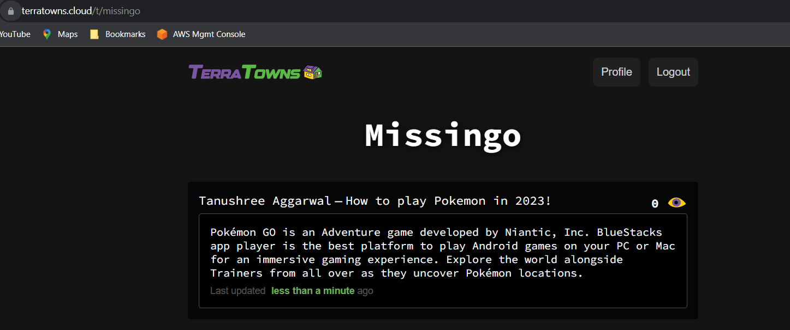
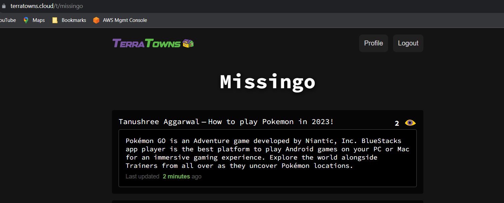
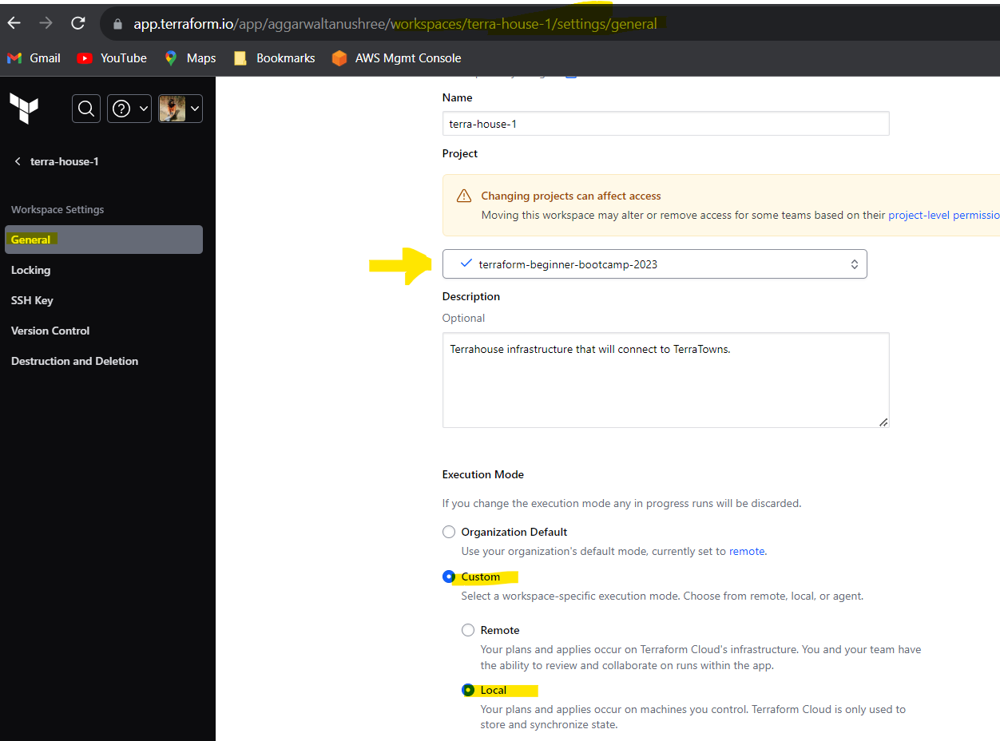
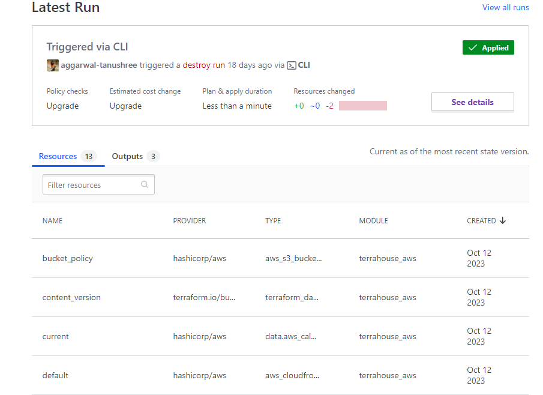
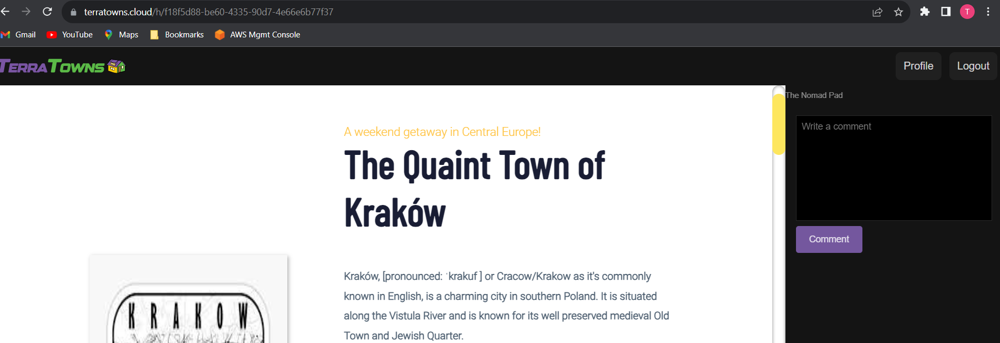
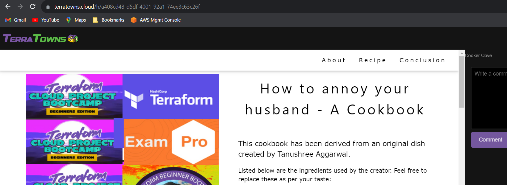

# Terraform Beginner Bootcamp 2023  Week 2  — Launching and Connecting My TerraHome to TerraTowns - Journal

[Week-2 Architecture](#week-2-architecture) :cloud: :evergreen_tree:

[Notes for revision](#notes-for-revision) :syringe: :medal_sports:
  * [Our Custom Provider - explained](#our-custom-provider---explained)
  * [Working with Ruby](#working-with-ruby)
    + [Bundler](#bundler)
      - [Install Gems](#install-gems)
      - [Executing ruby scripts in the context of bundler](#executing-ruby-scripts-in-the-context-of-bundler)
    + [Sinatra](#sinatra)
  * [Terratowns Mock Server](#terratowns-mock-server)
    + [Running the web server](#running-the-web-server)
    + [HTTP Requests](#http-requests)
      - [Anatomy of a HTTP request](#anatomy-of-a-http-request)
      - [Bearer Authentication](#bearer-authentication)
      - [HTTP error codes](#http-error-codes)
  * [CRUD](#crud)
  * [More Terraform](#more-terraform)
    + [Terraform CLI Config File](#terraform-cli-config-file)
    + [Debugging Terraform](#debugging-terraform)
- [Configuring Terraform Cloud for Local Execution but Cloud backup of State File](#configuring-terraform-cloud-for-local-execution-but-cloud-backup-of-state-file)
- [Terrahome AWS Multi Home Refactor](#terrahome-aws-multi-home-refactor)
  * [Steps to add a new home](#steps-to-add-a-new-home)
- [Terraform State command](#terraform-state-command)
  * [terraform state list](#terraform-state-list)
  * [terraform state show](#terraform-state-show)
- [Terraform Object variable](#terraform-object-variable)

[Personal Documentation](#personal-documentation) :memo: :pencil:

[Task Status](#task-status) :star: :face_in_clouds: :partying_face: :white_check_mark:

# Task Status
| Topic | Status |
| --- | --- | 
| [Week 2 Diagramming](#week-2-diagramming)  | <ul><li> [x] </li></ul> |
| [Setting Up Terraform Mock Server](#setting-up-terraform-mock-server) | <ul><li> [x] </li></ul> |
| [Setup Skeleton For Custom Terraform Provider](#setup-skeleton-for-custom-terraform-provider) | <ul><li> [x] </li></ul> |
| [Provider Block For Custom Terraform Provider](#provider-block-for-custom-terraform-provider) | <ul><li> [x] </li></ul> |
| [Resource Skeleton](#resource-skeleton) | <ul><li> [x] </li></ul> |
| [Implementing CRUD](#implementing-crud) | <ul><li> [x] </li></ul> |
| [Deploying To Terratowns](#deploying-to-terratowns) | <ul><li> [x] </li></ul> |
| [Terraform Cloud And Multi Home Refactor](#terraform-cloud-and-multi-home-refactor) | <ul><li> [x] </li></ul> |


# Week 2 Architecture


The complete end-to-end architecture of what we will achieve at the end of the bootcamp is available [here](https://lucid.app/lucidchart/e3f15b1a-2211-4ddb-8c95-f144c2504db4/edit?invitationId=inv_0873b3c6-c652-463f-9f2b-fa0f1b420823&page=0_0#) 

_Diagram copyrights: Andrew Brown from ExamPro.co_

-----------------------------------------------------------------------------------------------------
# Notes For Revision

## Our Custom Provider - explained
**Custom provider** named `terraform-provider-terratowns` (written in **golang**). 


The custom provider has a **resource** called `Home` which has four actions associated with it, namely:
- Read
- Update
- Create
- Delete

We have two servers:
i)  `TerraTowns` : `Development (Mock) Server` : `sinatra` server :  `localhost:4567`

ii) `TerraTowns.cloud` : `Production Server` : `rails`

> Sinatra : light-weight web server

> Rails : heavy-duty production server

We will use `bash scripts` under the path `/bin/terratowns/` to mock each of the four HTTP requests : 

i)   `create` 

ii)  `read`

iii) `update`

iv)  `delete`

|   	| TF Resource Action 	| HTTP Request Type 	|          API endpoint         	|
|---	|:------------------:	|:-----------------:	|:-----------------------------:	|
| 1 	| Create             	| POST              	| /api/u/:user_uuid/homes       	|
| 2 	| Read               	| GET               	| /api/u/:user_uuid/:uuid       	|
| 3 	| Update             	| PUT               	| /api/u/:user_uuid/homes/:uuid 	|
| 4 	| Delete             	| DELETE            	| /api/u/:user_uuid/homes/:uuid 	|


## Working with Ruby

### Bundler

- Bundler is a package manager for Ruby, i.e is the tool used to manage gem dependencies in Ruby applications
- It is the primary way to install ruby packages (known as **gems**) for Ruby.
- Bundler helps ensure that the necessary gems are available in development, staging, and production environments, preventing what's commonly known as "dependency hell"

#### Install Gems

You need to create a `Gemfile` and define your gems in that file.

```rb
source "https://rubygems.org"

gem 'sinatra'
gem 'rake'
gem 'pry'
gem 'puma'
gem 'activerecord'
```

Then you need to run the `bundle install` command

This will install the gems on the system globally (unlike nodejs which install packages in place in a folder called node_modules)

A `Gemfile.lock` will be created to lock down the gem versions used in this project.

#### Executing ruby scripts in the context of bundler

We have to use `bundle exec` to tell future ruby scripts to use the gems we installed. This is the way we set context.

### Sinatra

- Sinatra is a DSL (Domain-Specific Language) for rapidly creating web applications in the Ruby programming language. 

- Sinatra is a micro web-framework for ruby to build web-apps.

- It is designed to be lightweight and easy to use, making it an ideal choice for small to medium-sized projects.

- It is great for mock or development servers or for very simple projects.

- You can create a web-server in a single file. 

https://sinatrarb.com/


## Terratowns Mock Server

### Running the web server

We can run the web server by executing the following commands:

```rb
bundle install
bundle exec ruby server.rb
```

All of the code for our server is stored in a single file `terratowns_mock_server/server.rb`.


### HTTP Requests
#### Anatomy of a HTTP request


#### Bearer Authentication
Bearer authentication (also called token authentication) is an HTTP authentication scheme that involves security tokens called bearer tokens. 
The name “Bearer authentication” can be understood as "give access to the bearer of this token."
The bearer token is a cryptic string, usually generated by the server in response to a login request. 
The client must send this token in the Authorization header when making requests to protected resources: `Authorization: Bearer <token>`

https://swagger.io/docs/specification/authentication/bearer-authentication/


#### HTTP error codes
https://developer.mozilla.org/en-US/docs/Web/HTTP/Status#client_error_responses

Our error codes:
custom aXXXX codes will help us isolate in our troubleshooting where an error may have occured. These are unique to this project and not something normally included. You want error codes to be kind of obfuscated in production environments to not give away to much information about what was wrong. Because we are learning here, these codes were implemented.

a1001 - token/code/access-code does not match

a1002 - user_uuid not passed in HTTP header

a1003 - token/code/acess-code and user_uuid

## CRUD

Terraform Provider resources utilize CRUD.

CRUD stands for Create, Read Update, and Delete

https://en.wikipedia.org/wiki/Create,_read,_update_and_delete

## More Terraform

### Terraform CLI Config File
`.terraformrc` or `terraform.rc` file
- configures per-user settings for CLI behaviors, which apply across all Terraform working directories.

- In our project, this file tells TF the location of the code of our custom TF provider. 
https://developer.hashicorp.com/terraform/cli/config/config-file


### Debugging Terraform
Terraform has detailed logs that you can enable by setting the `TF_LOG` environment variable to any value. Enabling this setting causes detailed logs to appear on `stderr`.

`TF_LOG=DEBUG tf init`
https://developer.hashicorp.com/terraform/internals/debugging


## Configuring Terraform Cloud for Local Execution but Cloud backup of State File

https://developer.hashicorp.com/terraform/cloud-docs/run/remote-operations


## Terrahome AWS Multi Home Refactor

We altered the paths and variables associated to the content to our static Websites, in order to accomodate the creation of more than one home.

### Steps to add a new home

- Add your home to the `terraform.tfvars.example` and the `terraform.tfvars` making sure to change the block for your new content
    ```tf
    YOURHOME = {
      public_path = "/workspace/terraform-beginner-bootcamp-2023/public/YOURHOMEDIRECTORY"
      content_version = 1 
    }
    ```
- Add you new module to `main.tf` making sure to change the block for your new content
    ```
    module "home_YOURHOME" {
      source = "./modules/terrahome_aws"
      user_uuid = var.teacherseat_user_uuid
      public_path = var.YOURHOME.public_path
      content_version = var.YOURHOME.content_version
    }
    ```
- Add your new resource to `main.tf` making sure to change the block for your new content
    ```
    resource "terratowns_home" "YOURHOME" {
      name = "Travle Blog"
      description = <<DESCRIPTION
    add description here
    DESCRIPTION
      town = "TOWN"
      content_version = var.YOURHOME.content_version
      domain_name = module.YOURNEWMODULE.domain_name
    }
    ```
	
	Example:
	```tf
		module "home_/krakow" {
		source = "./modules/terrahome_aws"
		user_uuid = var.teacherseat_user_uuid
		public_path = var.krakow_public_path
		content_version = var.content_version
		}
```

- Create a new directory under `./public` with your home name. This directory expects the following:
    - `index.html`
    - `error.html`
    - `/assets/`
        - **All top level files in assets will be copied, but not any subdirectories.**

- `terraform init`
- `terraform plan`
- `terraform apply --auto-approve`


## Terraform State command
The terraform state command is used for advanced state management. As your Terraform usage becomes more advanced, there are some cases where you may need to modify the Terraform state. Rather than modify the state directly, the terraform state commands can be used in many cases instead.
https://developer.hashicorp.com/terraform/cli/commands/state

### terraform state show
`terraform state show` command is used to show the attributes of a single resource in the TF state.
https://developer.hashicorp.com/terraform/cli/commands/state/show

Example:
```tf
$ terraform state show 'packet_device.worker'
# packet_device.worker:
resource "packet_device" "worker" {
    billing_cycle = "hourly"
    created       = "2015-12-17T00:06:56Z"
    facility      = "ewr1"
    hostname      = "prod-xyz01"
    id            = "6015bg2b-b8c4-4925-aad2-f0671d5d3b13"
    locked        = false
}
```

### terraform state list
The `terraform state list` command is used to list resources within a Terraform state. 
By deafult it will read the `terraform.tfstate` file if it exists (or read from the state maintained in TF cloud)
https://developer.hashicorp.com/terraform/cli/commands/state/list

Example:
```tf
$ terraform state list
aws_instance.foo
aws_instance.bar[0]
aws_instance.bar[1]
module.elb.aws_elb.main
```


## Terraform Object variable
In Terraform, object variables allow you to define complex data structures by grouping multiple simple data types into a single variable. These variables are used to represent structured data and are especially useful when dealing with more complex configurations. Here's an explanation of object variables in Terraform:

**Definition**: Object variables are defined within your Terraform configuration to hold structured data, similar to objects or dictionaries in other programming languages.

**Usage**: You can use object variables to pass structured data, such as configuration settings or parameters, into your Terraform modules or resources.

**Syntax**: To define an object variable, use the `variable` block in your Terraform code, specifying the variable name and its type. The type should be set to `map` with attribute types to define the structure.

Example:
```tf
variable "recipe" {
  type = object({
    public_path = string
    content_version = number
  })
}
```

**Accessing Attributes**: You can access the attributes of an object variable using the variable name and dot notation.

Example:
```tf
public_path = var.recipe.public_path
content_version = var.recipe.content_version
```

-----------------------------------------------------------------------------------------------------

# Personal Documentation 
1. ## Week 2 Diagramming

2. ## Terratowns Mock Server
2.1 Create a new issue in your Github repository.

```txt
Issue name: Terratowns Mock Server
Issue description: Download Terratowns mock server into our repo
https://github.com/ExamProCo/terratowns_mock_server

Label: enhancement
```

2.2 Create a branch for this issue and launch it in Gitpod.

2.3 We will now copy the **mock server** code from its Git repository.
`git clone https://github.com/ExamProCo/terratowns_mock_server.git`

```sh
gitpod /workspace/terraform-beginner-bootcamp-2023 (39-terratowns-mock-server) $ git clone https://github.com/ExamProCo/terratowns_mock_server.git
Cloning into 'terratowns_mock_server'...
remote: Enumerating objects: 20, done.
remote: Counting objects: 100% (20/20), done.
remote: Compressing objects: 100% (14/14), done.
remote: Total 20 (delta 7), reused 15 (delta 6), pack-reused 0
Receiving objects: 100% (20/20), 9.34 KiB | 9.34 MiB/s, done.
Resolving deltas: 100% (7/7), done.
```

2.4 We need to delete the `.git` directory, else the imported code will be treated as a sub-module.
```sh
cd terratowns_mock_server
ls -al
rm -rf .git
```
```sh
gitpod /workspace/terraform-beginner-bootcamp-2023 (39-terratowns-mock-server) $ cd terratowns_mock_server
gitpod /workspace/terraform-beginner-bootcamp-2023/terratowns_mock_server (main) $ ls -la
total 44
drwxr-xr-x 4 gitpod gitpod   150 Oct  3 10:46 .
drwxr-xr-x 8 gitpod gitpod  4096 Oct  3 10:46 ..
drwxr-xr-x 2 gitpod gitpod    60 Oct  3 10:46 bin
-rw-r--r-- 1 gitpod gitpod   126 Oct  3 10:46 Gemfile
-rw-r--r-- 1 gitpod gitpod  1069 Oct  3 10:46 Gemfile.lock
drwxr-xr-x 8 gitpod gitpod   163 Oct  3 10:46 .git
-rw-r--r-- 1 gitpod gitpod  1205 Oct  3 10:46 .gitignore
-rw-r--r-- 1 gitpod gitpod    92 Oct  3 10:46 .gitpod.yml
-rw-r--r-- 1 gitpod gitpod 11357 Oct  3 10:46 LICENSE
-rw-r--r-- 1 gitpod gitpod    76 Oct  3 10:46 README.md
-rw-r--r-- 1 gitpod gitpod  4926 Oct  3 10:46 server.rb
gitpod /workspace/terraform-beginner-bootcamp-2023/terratowns_mock_server (main) $ rm -rf .git
gitpod /workspace/terraform-beginner-bootcamp-2023/terratowns_mock_server (39-terratowns-mock-server) $ ls -la
total 44
drwxr-xr-x 3 gitpod gitpod   138 Oct  3 10:47 .
drwxr-xr-x 8 gitpod gitpod  4096 Oct  3 10:46 ..
drwxr-xr-x 2 gitpod gitpod    60 Oct  3 10:46 bin
-rw-r--r-- 1 gitpod gitpod   126 Oct  3 10:46 Gemfile
-rw-r--r-- 1 gitpod gitpod  1069 Oct  3 10:46 Gemfile.lock
-rw-r--r-- 1 gitpod gitpod  1205 Oct  3 10:46 .gitignore
-rw-r--r-- 1 gitpod gitpod    92 Oct  3 10:46 .gitpod.yml
-rw-r--r-- 1 gitpod gitpod 11357 Oct  3 10:46 LICENSE
-rw-r--r-- 1 gitpod gitpod    76 Oct  3 10:46 README.md
-rw-r--r-- 1 gitpod gitpod  4926 Oct  3 10:46 server.rb
gitpod /workspace/terraform-beginner-bootcamp-2023/terratowns_mock_server (39-terratowns-mock-server) $ 
```

2.5 Navigate to `terratowns_mock_server/.gitpod.yml` and cut all the contents of this file. Paste this in `./gitpod.yml` at the project root level.
_place the code as the second task. Add a `cd` command to change dir to terratowns-mock-server_

```yml
  - name: sinatra
    before: | 
      cd $PROJECT_ROOT
      cd terratowns_mock_server
      bundle install
      bundle exec ruby server.rb 
```

Add a `cd $PROJECT_ROOT` for all the tasks defined in the file.

```yml
tasks:
  - name: terraform
    before: |
      cd $PROJECT_ROOT
      source ./bin/set_tf_alias
      source ./bin/install_terraform_cli
      source ./bin/generate_tfrc_credentials
      cp $PROJECT_ROOT/terraform.tfvars.example $PROJECT_ROOT/terraform.tfvars
  - name: sinatra
    before: | 
      cd $PROJECT_ROOT
      cd terratowns_mock_server
      bundle install
      bundle exec ruby server.rb 
  - name: aws-cli
    env:
      AWS_CLI_AUTO_PROMPT: on-partial
    before: |
      cd $PROJECT_ROOT
      source ./bin/set_tf_alias
      source ./bin/install_aws_cli
  - name: http-server
    before: |
      cd $PROJECT_ROOT
      npm install --global http-server
    command: 
      http-server

vscode:
  extensions:
    - amazonwebservices.aws-toolkit-vscode
    - hashicorp.terraform
    - phil294.git-log--graph
    - mhutchie.git-graph
```

2.6 Delete `terratowns_mock_server/.gitpod.yml` since its no longer required

2.7 Rename `terratowns-mock-server/bin` to `terratowns-mock-server/terratowns`. Drag and move this directory  under`./bin`

2.8 Grant executable permissions to these files.
```sh
cd $PROJECT_ROOT
chmod u+x bin/terratowns/*
```

```sh
gitpod /workspace/terraform-beginner-bootcamp-2023 (39-terratowns-mock-server) $ pwd
/workspace/terraform-beginner-bootcamp-2023
gitpod /workspace/terraform-beginner-bootcamp-2023 (39-terratowns-mock-server) $ chmod u+x bin/terratowns/*
gitpod /workspace/terraform-beginner-bootcamp-2023 (39-terratowns-mock-server) $ ls -l bin/terratowns/*
-rwxr-xr-x 1 gitpod gitpod 1051 Oct  3 10:46 bin/terratowns/create
-rwxr-xr-x 1 gitpod gitpod  790 Oct  3 10:46 bin/terratowns/delete
-rwxr-xr-x 1 gitpod gitpod  888 Oct  3 10:46 bin/terratowns/read
-rwxr-xr-x 1 gitpod gitpod 1102 Oct  3 10:46 bin/terratowns/update
```

2.9 Start the Sinatra server (since we have configured this in our `.gitpod.yml` file, the server will automatically load when we restart our environment. 
Since we do not wish to restart the env right now, we can execute this manually, by:
At the terminal:
```sh
cd terratowns_mock_server/
bundle install
bundle exec ruby server.rb
```

Output:
```sh
cd terratowns_mock_server/
gitpod /workspace/terraform-beginner-bootcamp-2023/terratowns_mock_server (39-terratowns-mock-server) $ bundle install
Bundler 2.4.20 is running, but your lockfile was generated with 2.4.19. Installing Bundler 2.4.19 and restarting using that version.
Fetching gem metadata from https://rubygems.org/.
Fetching bundler 2.4.19
Installing bundler 2.4.19
Fetching gem metadata from https://rubygems.org/.......
Fetching method_source 1.0.0
Fetching rack 2.2.8
Fetching mustermann 3.0.0
Fetching concurrent-ruby 1.2.2
Fetching minitest 5.20.0
Fetching coderay 1.1.3
Fetching nio4r 2.5.9
Fetching tilt 2.2.0
Installing method_source 1.0.0
Installing tilt 2.2.0
Installing mustermann 3.0.0
Installing minitest 5.20.0
Installing coderay 1.1.3
Installing nio4r 2.5.9 with native extensions
Installing rack 2.2.8
Installing concurrent-ruby 1.2.2
Fetching pry 0.14.2
Fetching rack-protection 3.1.0
Installing rack-protection 3.1.0
Fetching tzinfo 2.0.6
Fetching i18n 1.14.1
Installing pry 0.14.2
Installing i18n 1.14.1
Installing tzinfo 2.0.6
Fetching sinatra 3.1.0
Installing sinatra 3.1.0
Fetching activesupport 7.0.8
Installing activesupport 7.0.8
Fetching activemodel 7.0.8
Installing activemodel 7.0.8
Fetching activerecord 7.0.8
Installing activerecord 7.0.8
Fetching puma 6.3.1
Installing puma 6.3.1 with native extensions
Bundle complete! 5 Gemfile dependencies, 20 gems now installed.
Use `bundle info [gemname]` to see where a bundled gem is installed.
gitpod /workspace/terraform-beginner-bootcamp-2023/terratowns_mock_server (39-terratowns-mock-server) $ bundle exec ruby server.rb
== Sinatra (v3.1.0) has taken the stage on 4567 for development with backup from Puma
Puma starting in single mode...
* Puma version: 6.3.1 (ruby 3.2.2-p53) ("Mugi No Toki Itaru")
*  Min threads: 0
*  Max threads: 5
*  Environment: development
*          PID: 4893
* Listening on http://127.0.0.1:4567
* Listening on http://[::1]:4567
Use Ctrl-C to stop
```

2.10 Let's execute our bash scripts manually to test if they are working.
At the terminal, execute: 
`./bin/terratowns/create`
_it should o/p a uuid. Also check in the `sinatra` tab for a HTTP request of type POST_

```sh
gitpod /workspace/terraform-beginner-bootcamp-2023 (39-terratowns-mock-server) $ ./bin/terratowns/create
{"uuid":"535de2f3-3549-4501-8b5e-4046f2f64b4b"}
```

Let's emulate `read`:
`./bin/terratowns/read <house uuid returned by create>`

```sh
gitpod /workspace/terraform-beginner-bootcamp-2023 (39-terratowns-mock-server) $ ./bin/terratowns/read 535de2f3-3549-4501-8b5e-4046f2f64b4b
{
  "uuid": "535de2f3-3549-4501-8b5e-4046f2f64b4b",
  "name": "New House",
  "town": "cooker-cove",
  "description": "A new house description",
  "domain_name": "3xf332sdfs.cloudfront.net",
  "content_version": 1
}
```

`update`:
`./bin/terratowns/update <house uuid returned by create>`

```sh
gitpod /workspace/terraform-beginner-bootcamp-2023 (39-terratowns-mock-server) $ ./bin/terratowns/update 535de2f3-3549-4501-8b5e-40
46f2f64b4b
{"uuid":"535de2f3-3549-4501-8b5e-4046f2f64b4b"}
```

`destroy`:
`./bin/terratowns/delete <house uuid returned by create>`

```sh
gitpod /workspace/terraform-beginner-bootcamp-2023 (39-terratowns-mock-server) $ ./bin/terratowns/delete 535de2f3-3549-4501-8b5e-40
46f2f64b4b
{
  "uuid": "535de2f3-3549-4501-8b5e-4046f2f64b4b"
}
```

all our HTTP actions also being tracked in our Sinatra server :
```sh
== Sinatra (v3.1.0) has taken the stage on 4567 for development with backup from Puma
Puma starting in single mode...
* Puma version: 6.3.1 (ruby 3.2.2-p53) ("Mugi No Toki Itaru")
*  Min threads: 0
*  Max threads: 5
*  Environment: development
*          PID: 4893
* Listening on http://127.0.0.1:4567
* Listening on http://[::1]:4567
Use Ctrl-C to stop
# create - POST /api/homes
name New House
description A new house description
domain_name 3xf332sdfs.cloudfront.net
content_version 1
town cooker-cove
uuid 535de2f3-3549-4501-8b5e-4046f2f64b4b
# read - GET /api/homes/:uuid
# update - PUT /api/homes/:uuid
# delete - DELETE /api/homes/:uuid
```

2.11 Update the documentation

2.12 Stage, commit and sync the changed to Github

2.13  Create a PR and Merge this branch `39-terratowns-mock-server` to the `main` branch.

2.14 Issue tags to the `main branch` as `2.0.0`

3. ## Setup Skeleton For Custom Terraform Provider
3.1 Create a new issue in your Github repository.

```txt
Issue name: Terratowns Provider
Issue description: 

Label: enhancement
```
3.2 Create a branch for this issue and launch it in Gitpod.

3.3 Create a new directory `terraform-provider-terratowns` under the project root.

3.4 Create `main.go` file under `terraform-provider-terratowns` directory. This file will contain all of the code for our **custom TF provider**

3.5 Let's begin writing our custom provider!

```rb
/* package main: Declares the package name. 
The main package is special in Go, it's where the execution of the program starts.
tells the Go compiler that the package should compile as an executable program instead of a shared library package main*/
package main

// fmt is short format, it contains functions for formatted I/O.
import (
	// "log"  // used for logging in validation func
	"fmt"  // used in main to print std output
	"github.com/google/uuid"  // used by validation func for validating the UUID format
	"github.com/hashicorp/terraform-plugin-sdk/v2/helper/schema" // for ResourcesMap and DataSourcesMap in Provider func
	"github.com/hashicorp/terraform-plugin-sdk/v2/plugin"   // being used in main func by plugin.Serve(&plugin.ServeOpts
)
// func main(): Defines the main function, the entry point of the app. 
// When you run the program, it starts executing from this function.
func main() {
	plugin.Serve(&plugin.ServeOpts{
		ProviderFunc: Provider,  //calling provider function(or interface in goLang)
	})
	// Format.PrintLine
	// Prints to standard output
	fmt.Println("Hello, world!")
}

// in golang, a titlecase function will get exported.
func Provider() *schema.Provider {
	var p *schema.Provider // defined a variable p which is going to reference the provider
	p = &schema.Provider{
		ResourcesMap:  map[string]*schema.Resource{ // maps to actual resources
			"terratowns_home": Resource(),
		},
		DataSourcesMap:  map[string]*schema.Resource{  // maps to fields of a resource

		},
		Schema: map[string]*schema.Schema{ // json format in which our HTTP request will send the data
			"endpoint": {
				Type: schema.TypeString,
				Required: true,
				Description: "The endpoint for the external service",
			},
			"token": {
				Type: schema.TypeString,
				Sensitive: true, // make the token as sensitive to hide it the logs
				Required: true,
				Description: "Bearer token for authorization",
			},
			"user_uuid": {
				Type: schema.TypeString,
				Required: true,
				Description: "UUID for configuration",
				// ValidateFunc: validateUUID,  // validation func to ensure UUID is in the expected format
			},
		},
	}
	// p.ConfigureContextFunc = providerConfigure(p)
	return p
}

// validation func to ensure UUID is in the expected format
func validateUUID(v interface{}, k string) (ws []string, errors []error) {  //array of string and array of errors
	log.Print("validateUUID:start")  //logging 
	value := v.(string)
	if _, err := uuid.Parse(value); err != nil {
		errors = append(errors, fmt.Errorf("invalid UUID format"))
	}
	log.Print("validateUUID:end")
	return
}

```

3.7 Create a bash script under `bin` `bin/build_provider`. This script will be used to build our custom provider
```sh
#!/usr/bin/bash

PLUGIN_DIR="/home/gitpod/.terraform.d/plugins/local.providers/local/terratowns/1.0.0/"
PLUGIN_NAME="terraform-provider-terratowns_v1.0.0"

# https://servian.dev/terraform-local-providers-and-registry-mirror-configuration-b963117dfffa
cd $PROJECT_ROOT/terraform-provider-terratowns
cp $PROJECT_ROOT/terraformrc /home/gitpod/.terraformrc
rm -rf /home/gitpod/.terraform.d/plugins
rm -rf $PROJECT_ROOT/.terraform
rm -rf $PROJECT_ROOT/.terraform.lock.hcl
go build -o $PLUGIN_NAME
mkdir -p $PLUGIN_DIR/x86_64/
mkdir -p $PLUGIN_DIR/linux_amd64/
cp $PLUGIN_NAME $PLUGIN_DIR/x86_64
cp $PLUGIN_NAME $PLUGIN_DIR/linux_amd64
```

3.8 Create `go.mod` file under `terraform-provider-terratowns` directory. In Go programming, `go.mod` file is used for managing dependencies and defining module properties.
```sh
module github.com/ExamProCo/terraform-provider-terratowns

go 1.20

replace github.com/ExamProCo/terraform-provider-terratowns => /workspace/terraform-beginner-bootcamp-2023/terraform-provider-terratowns
```

3.9 Manually execute `bin/build_provider` to check if it works
```sh
cd terraform-provider-terratowns
go build -o terraform-provider-terratowns_v1.0.0
```

Output:
```sh
gitpod /workspace/terraform-beginner-bootcamp-2023 (41-terratowns-provider) $ cd terraform-provider-terratowns
gitpod /workspace/terraform-beginner-bootcamp-2023/terraform-provider-terratowns (41-terratowns-provider) $ go build -o terraform-provider-terratowns_v1.0.0
main.go:10:2: no required module provides package github.com/google/uuid; to add it:
        go get github.com/google/uuid
main.go:11:2: no required module provides package github.com/hashicorp/terraform-plugin-sdk/v2/helper/schema; to add it:
        go get github.com/hashicorp/terraform-plugin-sdk/v2/helper/schema
main.go:12:2: no required module provides package github.com/hashicorp/terraform-plugin-sdk/v2/plugin; to add it:
        go get github.com/hashicorp/terraform-plugin-sdk/v2/plugin
gitpod /workspace/terraform-beginner-bootcamp-2023/terraform-provider-terratowns (41-terratowns-provider) $ go get github.com/google/uuid
go: downloading github.com/google/uuid v1.3.1
go: added github.com/google/uuid v1.3.1
gitpod /workspace/terraform-beginner-bootcamp-2023/terraform-provider-terratowns (41-terratowns-provider) $ go get github.com/hashicorp/terraform-plugin-sdk/v2/helper/schema
go: downloading github.com/hashicorp/terraform-plugin-sdk/v2 v2.29.0
go: downloading github.com/hashicorp/terraform-plugin-sdk v1.17.2
go: downloading github.com/hashicorp/go-multierror v1.1.1
go: downloading github.com/google/go-cmp v0.5.9
go: downloading github.com/mitchellh/copystructure v1.2.0
go: downloading github.com/hashicorp/terraform-plugin-log v0.9.0
go: downloading github.com/hashicorp/terraform-plugin-go v0.19.0
go: downloading github.com/mitchellh/go-testing-interface v1.14.1
go: downloading github.com/hashicorp/go-cty v1.4.1-0.20200414143053-d3edf31b6320
go: downloading github.com/mitchellh/mapstructure v1.5.0
go: downloading github.com/hashicorp/go-version v1.6.0
go: downloading github.com/hashicorp/go-uuid v1.0.3
go: downloading github.com/mitchellh/reflectwalk v1.0.2
go: downloading github.com/hashicorp/logutils v1.0.0
go: downloading github.com/hashicorp/hcl/v2 v2.18.0
go: downloading github.com/zclconf/go-cty v1.14.0
go: downloading github.com/hashicorp/errwrap v1.0.0
go: downloading github.com/hashicorp/go-hclog v1.5.0
go: downloading golang.org/x/text v0.13.0
go: downloading github.com/vmihailenco/msgpack v4.0.4+incompatible
go: downloading github.com/vmihailenco/msgpack/v5 v5.3.5
go: downloading github.com/mattn/go-colorable v0.1.12
go: downloading github.com/mattn/go-isatty v0.0.14
go: downloading github.com/fatih/color v1.13.0
go: downloading github.com/apparentlymart/go-textseg/v15 v15.0.0
go: downloading google.golang.org/appengine v1.6.7
go: downloading github.com/vmihailenco/tagparser/v2 v2.0.0
go: downloading golang.org/x/sys v0.12.0
go: downloading github.com/agext/levenshtein v1.2.2
go: downloading github.com/mitchellh/go-wordwrap v1.0.0
go: downloading golang.org/x/net v0.13.0
go: downloading github.com/golang/protobuf v1.5.3
go: downloading google.golang.org/protobuf v1.31.0
go: added github.com/agext/levenshtein v1.2.2
go: added github.com/apparentlymart/go-textseg/v15 v15.0.0
go: added github.com/fatih/color v1.13.0
go: added github.com/golang/protobuf v1.5.3
go: added github.com/google/go-cmp v0.5.9
go: added github.com/hashicorp/errwrap v1.0.0
go: added github.com/hashicorp/go-cty v1.4.1-0.20200414143053-d3edf31b6320
go: added github.com/hashicorp/go-hclog v1.5.0
go: added github.com/hashicorp/go-multierror v1.1.1
go: added github.com/hashicorp/go-uuid v1.0.3
go: added github.com/hashicorp/go-version v1.6.0
go: added github.com/hashicorp/hcl/v2 v2.18.0
go: added github.com/hashicorp/logutils v1.0.0
go: added github.com/hashicorp/terraform-plugin-go v0.19.0
go: added github.com/hashicorp/terraform-plugin-log v0.9.0
go: added github.com/hashicorp/terraform-plugin-sdk/v2 v2.29.0
go: added github.com/mattn/go-colorable v0.1.12
go: added github.com/mattn/go-isatty v0.0.14
go: added github.com/mitchellh/copystructure v1.2.0
go: added github.com/mitchellh/go-testing-interface v1.14.1
go: added github.com/mitchellh/go-wordwrap v1.0.0
go: added github.com/mitchellh/mapstructure v1.5.0
go: added github.com/mitchellh/reflectwalk v1.0.2
go: added github.com/vmihailenco/msgpack v4.0.4+incompatible
go: added github.com/vmihailenco/msgpack/v5 v5.3.5
go: added github.com/vmihailenco/tagparser/v2 v2.0.0
go: added github.com/zclconf/go-cty v1.14.0
go: added golang.org/x/net v0.13.0
go: added golang.org/x/sys v0.12.0
go: added golang.org/x/text v0.13.0
go: added google.golang.org/appengine v1.6.7
go: added google.golang.org/protobuf v1.31.0
gitpod /workspace/terraform-beginner-bootcamp-2023/terraform-provider-terratowns (41-terratowns-provider) $ go get github.com/hashicorp/terraform-plugin-sdk/v2/plugin
go: downloading github.com/hashicorp/go-plugin v1.5.1
go: downloading google.golang.org/grpc v1.57.0
go: downloading github.com/hashicorp/terraform-registry-address v0.2.2
go: downloading github.com/hashicorp/terraform-svchost v0.1.1
go: downloading github.com/hashicorp/yamux v0.0.0-20181012175058-2f1d1f20f75d
go: downloading github.com/oklog/run v1.0.0
go: downloading google.golang.org/genproto/googleapis/rpc v0.0.0-20230525234030-28d5490b6b19
gitpod /workspace/terraform-beginner-bootcamp-2023/terraform-provider-terratowns (41-terratowns-provider) $ 
```

3.10 Add the binary file to `.gitignore` as we do not want to commit it.
`terraform-provider-terratowns/terraform-provider-terratowns_v*`

3.11 Update the documentation

3.12 Stage, commit and sync the changed to Github

3.13  Create a PR and Merge this branch `41-terratowns-provider` to the `main` branch.

3.14 Issue tags to the `main branch` as `2.1.0`

4. ## Provider Block For Custom Terraform Provider
4.1 Launch the branch `41-terratowns-provider` in Gitpod

4.2 Grant the script executable permissions
`chmod u+x bin/build_provider``

```sh
gitpod /workspace/terraform-beginner-bootcamp-2023 (41-terratowns-provider) $ chmod u+x bin/build_provider 
gitpod /workspace/terraform-beginner-bootcamp-2023 (41-terratowns-provider) $ ls -l bin/build_provider
-rwxr--r-- 1 gitpod gitpod 629 Oct  3 18:27 bin/build_provider
```

4.3 Let's test our bash script `bin/build_provider`
```sh
cd $PROJECT_ROOT
./bin/build_provider
```

Check if it worked
```sh
cd /home/gitpod/.terraform.d/plugins/
ls -al
cd local.providers/local/terratowns/1.0.0
ls -al
cd x86_64
ls -al
```

Output:
```sh
gitpod /workspace/terraform-beginner-bootcamp-2023 (41-terratowns-provider) $ ./bin/build_provider
gitpod /workspace/terraform-beginner-bootcamp-2023 (41-terratowns-provider) $ cd /home/gitpod/.terraform.d/plugins/
gitpod ~/.terraform.d/plugins $ ls -al
total 0
drwxr-xr-x 3 gitpod gitpod 29 Oct  3 18:35 .
drwxr-xr-x 3 gitpod gitpod 78 Oct  3 18:35 ..
drwxr-xr-x 3 gitpod gitpod 19 Oct  3 18:35 local.providers
gitpod ~/.terraform.d/plugins $ cd local.providers/local/terratowns/1.0.0
gitpod ~/.terraform.d/plugins/local.providers/local/terratowns/1.0.0 $ ls -al
total 0
drwxr-xr-x 4 gitpod gitpod 39 Oct  3 18:35 .
drwxr-xr-x 3 gitpod gitpod 19 Oct  3 18:35 ..
drwxr-xr-x 2 gitpod gitpod 50 Oct  3 18:35 linux_amd64
drwxr-xr-x 2 gitpod gitpod 50 Oct  3 18:35 x86_64
gitpod ~/.terraform.d/plugins/local.providers/local/terratowns/1.0.0 $ cd linux_amd64/
gitpod ~/.terraform.d/plugins/local.providers/local/terratowns/1.0.0/linux_amd64 $ ls -l
total 20560
-rwxr-xr-x 1 gitpod gitpod 21051751 Oct  3 18:35 terraform-provider-terratowns_v1.0.0
gitpod ~/.terraform.d/plugins/local.providers/local/terratowns/1.0.0/linux_amd64 $ 
```

4.4 Now let's focus on the custom provider.
4.4.1 In the `./main.tf` comment out the existing providers temporarily. 

Add a `required provider` block for the custom provider we created.

```tf
  required_providers {
    terratowns = {
      source = "local.providers/local/terratowns"
      version = "1.0.0"
    }
```
Also create an soociated `provider` block with mock `user_uuid` and `token` that were configured in our `mock Sinatra server`, which is running on our `localhost`
```tf
provider "terratowns" {
  endpoint = "http://localhost:4567"
  user_uuid="e328f4ab-b99f-421c-84c9-4ccea042c7d1" 
  token="9b49b3fb-b8e9-483c-b703-97ba88eef8e0"
}
```

4.4.2 Comment out `./outputs.tf` as well, else our `tf plan` will have errors.

4.5 Moment of truth! Let's check if our custom provider works.
4.5.1 `tf init`

Notice the warning, thats becaue of a type we made in `terraformrc`. 
4.5.2 Let's fix it : 
```tf
provider_installation {
  filesystem_mirror {
    path = "/home/gitpod/.terraform.d/plugins"
    include = ["local.providers/*/*"]
  } 
  direct {
   exclude = ["local.providers/*/*"] 
  }
}
```
4.5.3 Reattempt `tf init`, but run the `./bin/build_provider` before doing so, so the `terraformrc` file is copied to its correct place.
We can run the Terraform commands with a `DEBUG` flag. This increases the log levels/details.
`TF_LOG=DEBUG tf init` or `export TF_LOG=DEBUG` to the shell so it does not need to be typed again and again.

Output:
```tf
Terraform has been successfully initialized!

You may now begin working with Terraform. Try running "terraform plan" to see
any changes that are required for your infrastructure. All Terraform commands
should now work.

If you ever set or change modules or backend configuration for Terraform,
rerun this command to reinitialize your working directory. If you forget, other
commands will detect it and remind you to do so if necessary.
gitpod /workspace/terraform-beginner-bootcamp-2023 (41-terratowns-provider) $ export TF_LOG=DEBUG
gitpod /workspace/terraform-beginner-bootcamp-2023 (41-terratowns-provider) $ tf plan
2023-10-03T18:40:57.130Z [INFO]  Terraform version: 1.5.7
2023-10-03T18:40:57.130Z [DEBUG] using github.com/hashicorp/go-tfe v1.26.0
2023-10-03T18:40:57.130Z [DEBUG] using github.com/hashicorp/hcl/v2 v2.16.2
2023-10-03T18:40:57.130Z [DEBUG] using github.com/hashicorp/terraform-svchost v0.1.0
2023-10-03T18:40:57.130Z [DEBUG] using github.com/zclconf/go-cty v1.12.2
2023-10-03T18:40:57.130Z [INFO]  Go runtime version: go1.20.7
2023-10-03T18:40:57.130Z [INFO]  CLI args: []string{"terraform", "plan"}
2023-10-03T18:40:57.130Z [DEBUG] Attempting to open CLI config file: /home/gitpod/.terraformrc
2023-10-03T18:40:57.131Z [INFO]  Loading CLI configuration from /home/gitpod/.terraformrc
2023-10-03T18:40:57.131Z [INFO]  Loading CLI configuration from /home/gitpod/.terraform.d/credentials.tfrc.json
2023-10-03T18:40:57.131Z [DEBUG] checking for credentials in "/home/gitpod/.terraform.d/plugins"
2023-10-03T18:40:57.131Z [DEBUG] Explicit provider installation configuration is set
2023-10-03T18:40:57.131Z [INFO]  CLI command args: []string{"plan"}
2023-10-03T18:40:57.133Z [DEBUG] New state was assigned lineage "c1578abb-c2a7-ba08-608e-ac4acdf25496"
2023-10-03T18:40:57.190Z [DEBUG] checking for provisioner in "."
2023-10-03T18:40:57.194Z [DEBUG] checking for provisioner in "/usr/bin"
2023-10-03T18:40:57.194Z [DEBUG] checking for provisioner in "/home/gitpod/.terraform.d/plugins"
2023-10-03T18:40:57.195Z [INFO]  backend/local: starting Plan operation
2023-10-03T18:40:57.196Z [DEBUG] created provider logger: level=debug
2023-10-03T18:40:57.196Z [INFO]  provider: configuring client automatic mTLS
2023-10-03T18:40:57.229Z [DEBUG] provider: starting plugin: path=.terraform/providers/local.providers/local/terratowns/1.0.0/linux_amd64/terraform-provider-terratowns_v1.0.0 args=[.terraform/providers/local.providers/local/terratowns/1.0.0/linux_amd64/terraform-provider-terratowns_v1.0.0]
2023-10-03T18:40:57.230Z [DEBUG] provider: plugin started: path=.terraform/providers/local.providers/local/terratowns/1.0.0/linux_amd64/terraform-provider-terratowns_v1.0.0 pid=8505
2023-10-03T18:40:57.230Z [DEBUG] provider: waiting for RPC address: path=.terraform/providers/local.providers/local/terratowns/1.0.0/linux_amd64/terraform-provider-terratowns_v1.0.0
2023-10-03T18:40:57.235Z [INFO]  provider.terraform-provider-terratowns_v1.0.0: configuring server automatic mTLS: timestamp=2023-10-03T18:40:57.235Z
2023-10-03T18:40:57.249Z [DEBUG] provider: using plugin: version=5
2023-10-03T18:40:57.249Z [DEBUG] provider.terraform-provider-terratowns_v1.0.0: plugin address: address=/tmp/plugin1197020984 network=unix timestamp=2023-10-03T18:40:57.249Z
2023-10-03T18:40:57.268Z [DEBUG] provider.stdio: received EOF, stopping recv loop: err="rpc error: code = Unavailable desc = error reading from server: EOF"
2023-10-03T18:40:57.270Z [DEBUG] provider: plugin process exited: path=.terraform/providers/local.providers/local/terratowns/1.0.0/linux_amd64/terraform-provider-terratowns_v1.0.0 pid=8505
2023-10-03T18:40:57.270Z [DEBUG] provider: plugin exited
2023-10-03T18:40:57.270Z [DEBUG] Building and walking validate graph
2023-10-03T18:40:57.270Z [DEBUG] pruning unused provider["local.providers/local/terratowns"]
2023-10-03T18:40:57.270Z [DEBUG] ReferenceTransformer: "var.index_html_filepath" references: []
2023-10-03T18:40:57.270Z [DEBUG] ReferenceTransformer: "var.error_html_filepath" references: []
2023-10-03T18:40:57.270Z [DEBUG] ReferenceTransformer: "var.content_version" references: []
2023-10-03T18:40:57.270Z [DEBUG] ReferenceTransformer: "var.assets_path" references: []
2023-10-03T18:40:57.270Z [DEBUG] ReferenceTransformer: "var.user_uuid" references: []
2023-10-03T18:40:57.270Z [DEBUG] ReferenceTransformer: "var.bucket_name" references: []
2023-10-03T18:40:57.270Z [DEBUG] Starting graph walk: walkValidate
2023-10-03T18:40:57.271Z [INFO]  backend/local: plan calling Plan
2023-10-03T18:40:57.271Z [DEBUG] Building and walking plan graph for NormalMode
2023-10-03T18:40:57.271Z [DEBUG] pruning unused provider["local.providers/local/terratowns"]
2023-10-03T18:40:57.271Z [DEBUG] ReferenceTransformer: "var.bucket_name" references: []
2023-10-03T18:40:57.271Z [DEBUG] ReferenceTransformer: "var.index_html_filepath" references: []
2023-10-03T18:40:57.271Z [DEBUG] ReferenceTransformer: "var.error_html_filepath" references: []
2023-10-03T18:40:57.271Z [DEBUG] ReferenceTransformer: "var.content_version" references: []
2023-10-03T18:40:57.271Z [DEBUG] ReferenceTransformer: "var.assets_path" references: []
2023-10-03T18:40:57.271Z [DEBUG] ReferenceTransformer: "var.user_uuid" references: []
2023-10-03T18:40:57.271Z [DEBUG] Starting graph walk: walkPlan
2023-10-03T18:40:57.272Z [DEBUG] no planned changes, skipping apply graph check
2023-10-03T18:40:57.272Z [INFO]  backend/local: plan operation completed

No changes. Your infrastructure matches the configuration.

Terraform has compared your real infrastructure against your configuration and found no differences, so no changes are needed.
gitpod /workspace/terraform-beginner-bootcamp-2023 (41-terratowns-provider) $ tf apply
2023-10-03T18:41:01.992Z [INFO]  Terraform version: 1.5.7
2023-10-03T18:41:01.992Z [DEBUG] using github.com/hashicorp/go-tfe v1.26.0
2023-10-03T18:41:01.992Z [DEBUG] using github.com/hashicorp/hcl/v2 v2.16.2
2023-10-03T18:41:01.992Z [DEBUG] using github.com/hashicorp/terraform-svchost v0.1.0
2023-10-03T18:41:01.992Z [DEBUG] using github.com/zclconf/go-cty v1.12.2
2023-10-03T18:41:01.992Z [INFO]  Go runtime version: go1.20.7
2023-10-03T18:41:01.992Z [INFO]  CLI args: []string{"terraform", "apply"}
2023-10-03T18:41:01.992Z [DEBUG] Attempting to open CLI config file: /home/gitpod/.terraformrc
2023-10-03T18:41:01.993Z [INFO]  Loading CLI configuration from /home/gitpod/.terraformrc
2023-10-03T18:41:01.993Z [INFO]  Loading CLI configuration from /home/gitpod/.terraform.d/credentials.tfrc.json
2023-10-03T18:41:01.993Z [DEBUG] checking for credentials in "/home/gitpod/.terraform.d/plugins"
2023-10-03T18:41:01.993Z [DEBUG] Explicit provider installation configuration is set
2023-10-03T18:41:01.994Z [INFO]  CLI command args: []string{"apply"}
2023-10-03T18:41:01.994Z [DEBUG] New state was assigned lineage "3391de4d-5835-c5a1-d64e-e937a98758d5"
2023-10-03T18:41:02.051Z [DEBUG] checking for provisioner in "."
2023-10-03T18:41:02.055Z [DEBUG] checking for provisioner in "/usr/bin"
2023-10-03T18:41:02.055Z [DEBUG] checking for provisioner in "/home/gitpod/.terraform.d/plugins"
2023-10-03T18:41:02.055Z [INFO]  backend/local: starting Apply operation
2023-10-03T18:41:02.056Z [DEBUG] created provider logger: level=debug
2023-10-03T18:41:02.056Z [INFO]  provider: configuring client automatic mTLS
2023-10-03T18:41:02.090Z [DEBUG] provider: starting plugin: path=.terraform/providers/local.providers/local/terratowns/1.0.0/linux_amd64/terraform-provider-terratowns_v1.0.0 args=[.terraform/providers/local.providers/local/terratowns/1.0.0/linux_amd64/terraform-provider-terratowns_v1.0.0]
2023-10-03T18:41:02.090Z [DEBUG] provider: plugin started: path=.terraform/providers/local.providers/local/terratowns/1.0.0/linux_amd64/terraform-provider-terratowns_v1.0.0 pid=8549
2023-10-03T18:41:02.090Z [DEBUG] provider: waiting for RPC address: path=.terraform/providers/local.providers/local/terratowns/1.0.0/linux_amd64/terraform-provider-terratowns_v1.0.0
2023-10-03T18:41:02.095Z [INFO]  provider.terraform-provider-terratowns_v1.0.0: configuring server automatic mTLS: timestamp=2023-10-03T18:41:02.095Z
2023-10-03T18:41:02.110Z [DEBUG] provider: using plugin: version=5
2023-10-03T18:41:02.110Z [DEBUG] provider.terraform-provider-terratowns_v1.0.0: plugin address: address=/tmp/plugin38076231 network=unix timestamp=2023-10-03T18:41:02.110Z
2023-10-03T18:41:02.129Z [DEBUG] provider.stdio: received EOF, stopping recv loop: err="rpc error: code = Unavailable desc = error reading from server: EOF"
2023-10-03T18:41:02.130Z [DEBUG] provider: plugin process exited: path=.terraform/providers/local.providers/local/terratowns/1.0.0/linux_amd64/terraform-provider-terratowns_v1.0.0 pid=8549
2023-10-03T18:41:02.130Z [DEBUG] provider: plugin exited
2023-10-03T18:41:02.130Z [DEBUG] Building and walking validate graph
2023-10-03T18:41:02.130Z [DEBUG] pruning unused provider["local.providers/local/terratowns"]
2023-10-03T18:41:02.130Z [DEBUG] ReferenceTransformer: "var.error_html_filepath" references: []
2023-10-03T18:41:02.130Z [DEBUG] ReferenceTransformer: "var.content_version" references: []
2023-10-03T18:41:02.130Z [DEBUG] ReferenceTransformer: "var.assets_path" references: []
2023-10-03T18:41:02.130Z [DEBUG] ReferenceTransformer: "var.user_uuid" references: []
2023-10-03T18:41:02.130Z [DEBUG] ReferenceTransformer: "var.bucket_name" references: []
2023-10-03T18:41:02.130Z [DEBUG] ReferenceTransformer: "var.index_html_filepath" references: []
2023-10-03T18:41:02.131Z [DEBUG] Starting graph walk: walkValidate
2023-10-03T18:41:02.131Z [INFO]  backend/local: apply calling Plan
2023-10-03T18:41:02.131Z [DEBUG] Building and walking plan graph for NormalMode
2023-10-03T18:41:02.131Z [DEBUG] pruning unused provider["local.providers/local/terratowns"]
2023-10-03T18:41:02.131Z [DEBUG] ReferenceTransformer: "var.bucket_name" references: []
2023-10-03T18:41:02.131Z [DEBUG] ReferenceTransformer: "var.index_html_filepath" references: []
2023-10-03T18:41:02.131Z [DEBUG] ReferenceTransformer: "var.error_html_filepath" references: []
2023-10-03T18:41:02.131Z [DEBUG] ReferenceTransformer: "var.content_version" references: []
2023-10-03T18:41:02.131Z [DEBUG] ReferenceTransformer: "var.assets_path" references: []
2023-10-03T18:41:02.131Z [DEBUG] ReferenceTransformer: "var.user_uuid" references: []
2023-10-03T18:41:02.131Z [DEBUG] Starting graph walk: walkPlan
2023-10-03T18:41:02.132Z [DEBUG] no planned changes, skipping apply graph check

No changes. Your infrastructure matches the configuration.

Terraform has compared your real infrastructure against your configuration and found no differences, so no changes are needed.
2023-10-03T18:41:02.132Z [INFO]  backend/local: apply calling Apply
2023-10-03T18:41:02.132Z [DEBUG] Building and walking apply graph for NormalMode plan
2023-10-03T18:41:02.132Z [DEBUG] pruning unused provider["local.providers/local/terratowns"]
2023-10-03T18:41:02.132Z [DEBUG] ReferenceTransformer: "var.user_uuid" references: []
2023-10-03T18:41:02.132Z [DEBUG] ReferenceTransformer: "var.bucket_name" references: []
2023-10-03T18:41:02.132Z [DEBUG] ReferenceTransformer: "var.index_html_filepath" references: []
2023-10-03T18:41:02.132Z [DEBUG] ReferenceTransformer: "var.error_html_filepath" references: []
2023-10-03T18:41:02.132Z [DEBUG] ReferenceTransformer: "var.content_version" references: []
2023-10-03T18:41:02.132Z [DEBUG] ReferenceTransformer: "var.assets_path" references: []
2023-10-03T18:41:02.132Z [DEBUG] Starting graph walk: walkApply

Apply complete! Resources: 0 added, 0 changed, 0 destroyed.
```

4.5.4 Since we are still in the development phase, it is a good idea to run our TF code in debug mode all the time. This can be set by updating our `.gitpod.yml` file.
```yml
tasks:
  - name: terraform
    env:
      TF_LOG: DEBUG
```

4.5.4 Run `tf plan` and `tf apply`. Check for errors, also check `terraform.tfstate` file.

4.6 Add required documentation

4.7 Stage, Commit and Sync 

4.8 Create a PR and Merge this branch `41-terratowns-provider` to the `main` branch. We have conflicts, since we are using the branch we used for the previous tag as well.

4.9 Fix conflicts in Gitpod
`git merge main`
Commit again `#41 Merge main with 41-terratowns-provider`  
`git commit`
`git push`


4.10 Back in Gitpod try creating the PR now. It should work. Merge.

4.11 Add tags `2.2.0`

5. ## Resource Skeleton
5.1 Launch the branch `41-terratowns-provider` in Gitpod

5.2 Let's resume building our custom provider.
Open `terraform-provider-terratowns/main.go` file
Uncomment the previously created `validation` functionality.
```sh
// validation func to ensure UUID is in the expected format
func validateUUID(v interface{}, k string) (ws []string, errors []error) {  //array of string and array of errors
	log.Print("validateUUID:start")  //logging 
	value := v.(string)
	if _, err := uuid.Parse(value); err != nil {
		errors = append(errors, fmt.Errorf("invalid UUID format"))
	}
	log.Print("validateUUID:end")
	return
}
```

5.3 Build the provider. `./bin/build_provider`
Fix any code errors that may be present.

Output:
```sh
gitpod /workspace/terraform-beginner-bootcamp-2023 (41-terratowns-provider) $ ./bin/build_provider
go: downloading github.com/google/uuid v1.3.1
go: downloading github.com/hashicorp/terraform-plugin-sdk/v2 v2.29.0
go: downloading github.com/hashicorp/go-cty v1.4.1-0.20200414143053-d3edf31b6320
go: downloading github.com/mitchellh/copystructure v1.2.0
go: downloading github.com/hashicorp/go-multierror v1.1.1
go: downloading github.com/mitchellh/go-testing-interface v1.14.1
go: downloading github.com/google/go-cmp v0.5.9
go: downloading github.com/mitchellh/mapstructure v1.5.0
go: downloading github.com/hashicorp/terraform-plugin-log v0.9.0
go: downloading github.com/hashicorp/terraform-plugin-go v0.19.0
go: downloading github.com/hashicorp/go-version v1.6.0
go: downloading github.com/hashicorp/go-uuid v1.0.3
go: downloading github.com/mitchellh/reflectwalk v1.0.2
go: downloading github.com/hashicorp/go-hclog v1.5.0
go: downloading github.com/hashicorp/go-plugin v1.5.1
go: downloading github.com/hashicorp/logutils v1.0.0
go: downloading github.com/hashicorp/hcl/v2 v2.18.0
go: downloading github.com/zclconf/go-cty v1.14.0
go: downloading github.com/hashicorp/errwrap v1.0.0
go: downloading github.com/fatih/color v1.13.0
go: downloading github.com/mattn/go-isatty v0.0.14
go: downloading github.com/vmihailenco/msgpack v4.0.4+incompatible
go: downloading golang.org/x/text v0.13.0
go: downloading github.com/golang/protobuf v1.5.3
go: downloading github.com/hashicorp/yamux v0.0.0-20181012175058-2f1d1f20f75d
go: downloading github.com/oklog/run v1.0.0
go: downloading google.golang.org/grpc v1.57.0
go: downloading github.com/vmihailenco/msgpack/v5 v5.3.5
go: downloading github.com/mattn/go-colorable v0.1.12
go: downloading golang.org/x/sys v0.12.0
go: downloading google.golang.org/protobuf v1.31.0
go: downloading github.com/hashicorp/terraform-registry-address v0.2.2
go: downloading github.com/vmihailenco/tagparser/v2 v2.0.0
go: downloading github.com/agext/levenshtein v1.2.2
go: downloading github.com/apparentlymart/go-textseg/v15 v15.0.0
go: downloading github.com/mitchellh/go-wordwrap v1.0.0
go: downloading github.com/hashicorp/terraform-svchost v0.1.1
go: downloading golang.org/x/net v0.13.0
go: downloading google.golang.org/genproto/googleapis/rpc v0.0.0-20230525234030-28d5490b6b19
gitpod /workspace/terraform-beginner-bootcamp-2023 (41-terratowns-provider) $ 
```

5.4 Run `tf init` and `tf plan`. Check for errors.
All good so far!

Let's proceed with writing the remaining code

5.5 Uncomment `p.ConfigureContextFunc = providerConfigure(p)` in `terraform-provider-terratowns/main.go`  
5.5.1 write this function `providerConfigure` code:

```sh
func providerConfigure(p *schema.Provider) schema.ConfigureContextFunc {  //definition of func providerConfigure, takes argument pointer p
	// p is pomter to Provider object of TF schema package
	return func(ctx context.Context, d *schema.ResourceData) (interface{}, diag.Diagnostics ) {
		log.Print("providerConfigure:start")
		config := Config{ //variable named config. Config is a struct defined in our code
			Endpoint: d.Get("endpoint").(string), // Define endpint
			Token: d.Get("token").(string),
			UserUuid: d.Get("user_uuid").(string),
		}
		log.Print("providerConfigure:end")
		return &config, nil
	}
}
```

5.5.2
`import` associated packages
```sh
	"context"// for providerConfigure func
	"github.com/hashicorp/terraform-plugin-sdk/v2/diag" // for providerConfigure func

```

5.5.3 Define the `Config` struct
```sh
type Config struct {
	Endpoint string
	Token string
	UserUuid string
}
```

5.6 Build the provider. `./bin/build_provider`

5.7 Back in `terraform-provider-terratowns/main.go`  next we define our resource under `ResourcesMap`
```sh
			"terratowns_home": Resource(), 
```

5.8 Define the `Resource` function
```sh
// definition of Resource func
func Resource() *schema.Resource {
	log.Print("Resource:start")
	resource := &schema.Resource{
		// defining four functions (aka interfaces in Go) for the four actions
		CreateContext: resourceHouseCreate,
		ReadContext: resourceHouseRead,
		UpdateContext: resourceHouseUpdate,
		DeleteContext: resourceHouseDelete,
	}
	log.Print("Resource:end")
	return resource
}
```

Define the four functions:
```sh

func resourceHouseCreate(ctx context.Context, d *schema.ResourceData, m interface{}) diag.Diagnostics {
	var diags diag.Diagnostics // related to error handling
	return diags
}

func resourceHouseRead(ctx context.Context, d *schema.ResourceData, m interface{}) diag.Diagnostics {
	var diags diag.Diagnostics
	return diags
}	

func resourceHouseUpdate(ctx context.Context, d *schema.ResourceData, m interface{}) diag.Diagnostics {
	var diags diag.Diagnostics
	return diags
}

func resourceHouseDelete(ctx context.Context, d *schema.ResourceData, m interface{}) diag.Diagnostics {
	var diags diag.Diagnostics
	return diags
}
```

5.9 Add required documentation

5.10 Stage, Commit and Sync 

5.11 Create a PR and Merge this branch `41-terratowns-provider` to the `main` branch.

5.12 Add tags `2.3.0`

6. ## Implementing CRUD
6.1 Launch the branch `41-terratowns-provider` in Gitpod

6.2 Let's resume building our custom provider.
Add the schema details in the `Resource()` function.
```sh
Schema: map[string]*schema.Schema{  // schema definition
			"name": {
				Type: schema.TypeString,
				Required: true,
				Description: "Name of home",
			},
			"description": {
				Type: schema.TypeString,
				Required: true,
				Description: "Description of home",
			},
			"domain_name": {
				Type: schema.TypeString,
				Required: true,
				Description: "Domain name of home eg. *.cloudfront.net",
			},
			"town": {
				Type: schema.TypeString,
				Required: true,
				Description: "The town to which the home will belong to",
			},
			"content_version": {
				Type: schema.TypeInt,
				Required: true,
				Description: "The content version of the home",
			},
		},
```

6.3 Build the Provider. Check for errors.
`./bin/build_provider`

6.4 Back in `./main.tf` let's define our `resource` block
```tf
resource "terratowns_home" "home" {
  name = "How to play Arcanum in 2023!"
  description = <<DESCRIPTION
Arcanum is a game from 2001 that shipped with alot of bugs.
Modders have removed all the originals making this game really fun
to play (despite that old look graphics). This is my guide that will
show you how to play arcanum without spoiling the plot.
DESCRIPTION
  #domain_name = module.terrahouse_aws.cloudfront_url
  # Mock CDN below:
  domain_name = "3fdq3gz.cloudfront.net"
  town = "gamers-grotto"
  content_version = 1
}
```

Fix the endpoint url in `main.tf` in the `provider` block
replace `endpoint = "http://localhost:4567"` with -> `endpoint = "http://localhost:4567/api"`


6.5 Add the code for our actions in `terraform-provider-terratowns/main.go` 
```sh
func resourceHouseCreate(ctx context.Context, d *schema.ResourceData, m interface{}) diag.Diagnostics {
	log.Print("resourceHouseCreate:start")
	var diags diag.Diagnostics

	config := m.(*Config)

	payload := map[string]interface{}{
		"name": d.Get("name").(string),   //get values from Payload which comes as raw data and type cast as string
		"description": d.Get("description").(string),
		"domain_name": d.Get("domain_name").(string),
		"town": d.Get("town").(string),
		"content_version": d.Get("content_version").(int),
	}
	payloadBytes, err := json.Marshal(payload) //Marshal is a json function which converts to Byte
	if err != nil {
		return diag.FromErr(err)
	}

	url :=  config.Endpoint+"/u/"+config.UserUuid+"/homes"
	log.Print("URL: "+ url)
	// Construct the HTTP Request
	req, err := http.NewRequest("POST", url, bytes.NewBuffer(payloadBytes))
	if err != nil {
		return diag.FromErr(err)
	}

	// Set Headers
	req.Header.Set("Authorization", "Bearer "+config.Token)
	req.Header.Set("Content-Type", "application/json")
	req.Header.Set("Accept", "application/json")

	client := http.Client{}
	resp, err := client.Do(req)
	if err != nil {
		return diag.FromErr(err)
	}
	defer resp.Body.Close()

	// parse response JSON
	var responseData map[string]interface{}
	if err := json.NewDecoder(resp.Body).Decode(&responseData);  err != nil {
		return diag.FromErr(err)
	}

	// StatusOK = 200 HTTP Response Code
	if resp.StatusCode != http.StatusOK {
		return diag.FromErr(fmt.Errorf("failed to create home resource, status_code: %d, status: %s, body %s", resp.StatusCode, resp.Status, responseData))
	}

	// handle response status

	homeUUID := responseData["uuid"].(string)
	d.SetId(homeUUID)   //since TF wants IDs of resources in the state file

	log.Print("resourceHouseCreate:end")

	return diags
}

func resourceHouseRead(ctx context.Context, d *schema.ResourceData, m interface{}) diag.Diagnostics {
	log.Print("resourceHouseRead:start")
	var diags diag.Diagnostics

	config := m.(*Config)

	homeUUID := d.Id()

	// Construct the HTTP Request
	url := config.Endpoint+"/u/"+config.UserUuid+"/homes/"+homeUUID
	log.Print("URL: "+ url)
	req, err := http.NewRequest("GET", url, nil)
	if err != nil {
		return diag.FromErr(err)
	}

	// Set Headers
	req.Header.Set("Authorization", "Bearer "+config.Token)
	req.Header.Set("Content-Type", "application/json")
	req.Header.Set("Accept", "application/json")

	client := http.Client{}
	resp, err := client.Do(req)
	if err != nil {
		return diag.FromErr(err)
	}
	defer resp.Body.Close()

	var responseData map[string]interface{}

	if resp.StatusCode == http.StatusOK {
		// parse response JSON
		if err := json.NewDecoder(resp.Body).Decode(&responseData);  err != nil {
			return diag.FromErr(err)
		}
		d.Set("name",responseData["name"].(string))
		d.Set("description",responseData["description"].(string))
		d.Set("domain_name",responseData["domain_name"].(string))
		d.Set("content_version",responseData["content_version"].(float64))
	} else if resp.StatusCode != http.StatusNotFound {
		d.SetId("")
	} else if resp.StatusCode != http.StatusOK {
		return diag.FromErr(fmt.Errorf("failed to read home resource, status_code: %d, status: %s, body %s", resp.StatusCode, resp.Status, responseData))
	}

	log.Print("resourceHouseRead:end")

	return diags
}

func resourceHouseUpdate(ctx context.Context, d *schema.ResourceData, m interface{}) diag.Diagnostics {
	log.Print("resourceHouseUpdate:start")
	var diags diag.Diagnostics

	config := m.(*Config)

	homeUUID := d.Id()

	payload := map[string]interface{}{
		"name": d.Get("name").(string),
		"description": d.Get("description").(string),
		"content_version": d.Get("content_version").(int),
	}
	payloadBytes, err := json.Marshal(payload)
	if err != nil {
		return diag.FromErr(err)
	}

	// Construct the HTTP Request
	url := config.Endpoint+"/u/"+config.UserUuid+"/homes/"+homeUUID
	log.Print("URL: "+ url)
	req, err := http.NewRequest("PUT", url, bytes.NewBuffer(payloadBytes))
	if err != nil {
		return diag.FromErr(err)
	}

	// Set Headers
	req.Header.Set("Authorization", "Bearer "+config.Token)
	req.Header.Set("Content-Type", "application/json")
	req.Header.Set("Accept", "application/json")

	client := http.Client{}
	resp, err := client.Do(req)
	if err != nil {
		return diag.FromErr(err)
	}
	defer resp.Body.Close()

	// StatusOK = 200 HTTP Response Code
	if resp.StatusCode != http.StatusOK {
		return diag.FromErr(fmt.Errorf("failed to update home resource, status_code: %d, status: %s", resp.StatusCode, resp.Status))
	}

	log.Print("resourceHouseUpdate:end")

	d.Set("name",payload["name"])
	d.Set("description",payload["description"])
	d.Set("content_version",payload["content_version"])
	return diags
}

func resourceHouseDelete(ctx context.Context, d *schema.ResourceData, m interface{}) diag.Diagnostics {
	log.Print("resourceHouseDelete:start")
	var diags diag.Diagnostics

	config := m.(*Config)

	homeUUID := d.Id()

	// Construct the HTTP Request
	url :=  config.Endpoint+"/u/"+config.UserUuid+"/homes/"+homeUUID
	log.Print("URL: "+ url)
	req, err := http.NewRequest("DELETE", url , nil)
	if err != nil {
		return diag.FromErr(err)
	}

	// Set Headers
	req.Header.Set("Authorization", "Bearer "+config.Token)
	req.Header.Set("Content-Type", "application/json")
	req.Header.Set("Accept", "application/json")

	client := http.Client{}
	resp, err := client.Do(req)
	if err != nil {
		return diag.FromErr(err)
	}
	defer resp.Body.Close()

	// StatusOK = 200 HTTP Response Code
	if resp.StatusCode != http.StatusOK {
		return diag.FromErr(fmt.Errorf("failed to delete home resource, status_code: %d, status: %s", resp.StatusCode, resp.Status))
	}

	d.SetId("")

	log.Print("resourceHouseDelete:end")
	return diags
}
```

Don't forget the imports for the required packages
```sh
	"encoding/json" //  used in resource actions to parse to Byte
	"net/http" //  used in resource actions 
	"bytes" //  used in resource actions 

```

6.6 Let's try building our provider and see if there are any errors.
`./bin/build_provider`

6.7 Lets' run `tf init`, `tf plan` and `tf apply`. Check and fix any errors in the code.
Check the `terraform.tfstate` file - in case any sensitive data was stored.

Output:
```tf
Terraform used the selected providers to generate the following execution plan. Resource actions are indicated with the following symbols:
  + create

Terraform will perform the following actions:

  # terratowns_home.home will be created
  + resource "terratowns_home" "home" {
      + content_version = 1
      + description     = <<-EOT
            Arcanum is a game from 2001 that shipped with alot of bugs.
            Modders have removed all the originals making this game really fun
            to play (despite that old look graphics). This is my guide that will
            show you how to play arcanum without spoiling the plot.
        EOT
      + domain_name     = "3fdq3gz.cloudfront.net"
      + id              = (known after apply)
      + name            = "How to play Arcanum in 2023!"
      + town            = "gamers-grotto"
    }

Plan: 1 to add, 0 to change, 0 to destroy.

───────────────────────────────────────────────

Apply:
terratowns_home.home: Creating...
2023-10-05T17:58:00.156Z [INFO]  Starting apply for terratowns_home.home
2023-10-05T17:58:00.156Z [DEBUG] terratowns_home.home: applying the planned Create change
2023-10-05T17:58:00.157Z [INFO]  provider.terraform-provider-terratowns_v1.0.0: 2023/10/05 17:58:00 resourceHouseCreate:start: timestamp=2023-10-05T17:58:00.157Z
2023-10-05T17:58:00.157Z [INFO]  provider.terraform-provider-terratowns_v1.0.0: 2023/10/05 17:58:00 URL: http://localhost:4567/api/u/e328f4ab-b99f-421c-84c9-4ccea042c7d1/homes: timestamp=2023-10-05T17:58:00.157Z
2023-10-05T17:58:00.160Z [INFO]  provider.terraform-provider-terratowns_v1.0.0: 2023/10/05 17:58:00 resourceHouseCreate:end: timestamp=2023-10-05T17:58:00.159Z
terratowns_home.home: Creation complete after 0s [id=2a27b8ce-ea87-4ee9-9b54-ef954db4f6bc]
2023-10-05T17:58:00.161Z [DEBUG] State storage *statemgr.Filesystem declined to persist a state snapshot
2023-10-05T17:58:00.162Z [DEBUG] provider.stdio: received EOF, stopping recv loop: err="rpc error: code = Unavailable desc = error reading from server: EOF"
2023-10-05T17:58:00.164Z [DEBUG] provider: plugin process exited: path=.terraform/providers/local.providers/local/terratowns/1.0.0/linux_amd64/terraform-provider-terratowns_v1.0.0 pid=7748
2023-10-05T17:58:00.164Z [DEBUG] provider: plugin exited

Apply complete! Resources: 1 added, 0 changed, 0 destroyed.

```

O/P in our Sinatra server:
```sh
# create - POST /api/homes
name How to play Arcanum in 2023!
description Arcanum is a game from 2001 that shipped with alot of bugs.
Modders have removed all the originals making this game really fun
to play (despite that old look graphics). This is my guide that will
show you how to play arcanum without spoiling the plot.
domain_name 3fdq3gz.cloudfront.net
content_version 1
town gamers-grotto
uuid 2a27b8ce-ea87-4ee9-9b54-ef954db4f6bc
```

6.8 Make a superficial change in the resource in `main.tf` to test the Update endpoint. Run `tf destory` to test the delete endpoint.

```sh
# create - POST /api/homes
name How to play Arcanum in 2023!
description Arcanum is a game from 2001 that shipped with alot of bugs.
Modders have removed all the originals making this game really fun
to play (despite that old look graphics). This is my guide that will
show you how to play arcanum without spoiling the plot.
domain_name 3fdq3gz.cloudfront.net
content_version 1
town gamers-grotto
uuid 2a27b8ce-ea87-4ee9-9b54-ef954db4f6bc
# read - GET /api/homes/:uuid
# read - GET /api/homes/:uuid
# update - PUT /api/homes/:uuid
# read - GET /api/homes/:uuid
# delete - DELETE /api/homes/:uuid

```

6.9 Add required documentation

6.10 Stage, Commit and Sync 

6.11 Create a PR and Merge this branch `41-terratowns-provider` to the `main` branch.

6.12 Add tags `2.4.0`

7. ## Deploying To Terratowns
7.1 Create a new issue in your Github repository.

```txt
Issue name: Terratown Test
Issue description: test our custom provider, to work with the production server

Label: enhancement
```

7.2 Create a branch for this issue and launch it in Gitpod.

7.3 Update with the real production resource configuration

7.3.1 Define the endpoint as a var in `terraform.tfvars.example` and `terraform.tfvars`

`terratowns_endpoint ="https://terratowns.cloud/api"`
Delete the `user_uuid` var as we will be setting this as an env var now.

7.3.2 Set the `access token` as an env var
`export TF_VAR_terratowns_access_token="<VALUE>"`
`gp env TF_VAR_terratowns_access_token="<VALUE>"`

7.3.3 Set the user_uuid as an env var
`export TF_VAR_teacherseat_user_uuid="<VALUE>"`
`gp env TF_VAR_teacherseat_user_uuid="<VALUE>"`

7.3.4 Update `main.tf` with the var names
```tf
provider "terratowns" {
  endpoint = var.terratowns_endpoint
  user_uuid = var.teacherseat_user_uuid
  token = var.terratowns_access_token
}
```

7.3.5 Update the vars name in `variables.tf`
Replace `user_uuid` with the new name `teacherseat_user_uuid`

```tf
variable "terratowns_endpoint" {
 type = string
}

variable "terratowns_access_token" {
 type = string
}

variable "teacherseat_user_uuid" {
 type = string
```

7.3.6 In the resource `terratowns_home` block in `main.tf` change the town to `missingo`
`town = "missingo"`


7.4  Build the Provider. Check for errors.
`./bin/build_provider`

7.5 Lets' run `tf init`, `tf plan` and `tf apply`.

7.6 Check if your resource was published to `https://terratowns.cloud/t/missingo`

It is!!





7.7 If the verification was successful, we are good to proceed with the real infrastructure.
Run `tf destroy`. Verify if it was deleted from `https://terratowns.cloud/t/missingo`

7.8 Swap the mock CloudFront URL with the real defined resource in `main.tf`
`domain_name = module.terrahouse_aws.cloudfront_url`

7.9 Bring back the old infrastrucute that we had disabled in `main.tf` 
```tf
module "terrahouse_aws" {
  source = "./modules/terrahouse_aws"
  user_uuid = var.teacherseat_user_uuid
  index_html_filepath = var.index_html_filepath
  error_html_filepath = var.error_html_filepath
  content_version = var.content_version
  assets_path = var.assets_path
}
```

7.10 enable all the `outputs.tf` that we had commented our previously
```tf
output "bucket_name" {
  description = "Bucket name for our static website hosting"
  value = module.terrahouse_aws.bucket_name
}

output "s3_website_endpoint" {
  description = "S3 Static Website hosting endpoint"
  value = module.terrahouse_aws.website_endpoint
}

output "cloudfront_url" {
  description = "The CloudFront Distribution Domain Name"
  value = module.terrahouse_aws.cloudfront_url
}
```

7.11 Delete the `bucket_name` var from `terraform.tfvars` and `terraform.tfvars.example`
7.11.2 And also from `main.tf`
7.11.3 Also from `/modules/terrahouse_aws/resource-storage.tf`
```tf
resource "aws_s3_bucket" "website_bucket" {
  # Bucket Naming Rules
  #https://docs.aws.amazon.com/AmazonS3/latest/userguide/bucketnamingrules.html?icmpid=docs_amazons3_console
  bucket = var.bucket_name
```
7.11.4 From comment out the assoiated var in `/modules/terrahouse_aws/variables.tf`
```tf
#variable "bucket_name" {
#  description = "The name of the S3 bucket"
#  type        = string
#
#  validation {
#    condition     = (
#      length(var.bucket_name) >= 3 && length(var.bucket_name) <= 63 && 
#      can(regex("^[a-z0-9][a-z0-9-.]*[a-z0-9]$", var.bucket_name))
#    )
#    error_message = "The bucket name must be between 3 and 63 characters, start and end with a lowercase letter or number, and can contain only lowercase letters, numbers, hyphens, and dots."
#  }
#}

```

7.11.4 Update the bucket var reference in `modules/terrahouse_aws/resource-cdn.tf` with the bucket name from `outputs.tf`
i.e. replace all occurences of `${var.bucket_name}` with `${aws_s3_bucket.website_bucket.bucket}`

```tf
resource "aws_cloudfront_origin_access_control" "default" {
  name   = "OAC ${aws_s3_bucket.website_bucket.bucket}"
  description  = "Origin Access Controls for Static Website Hosting ${aws_s3_bucket.website_bucket.bucket}"
```

7.12 `tf init`, `tf plan` and `tf apply`
Check if it published to `https://terratowns.cloud/t/missingo`

Output:
```tf
Apply complete! Resources: 12 added, 0 changed, 0 destroyed.

Outputs:

bucket_name = "terraform-20231005204146795500000001"
cloudfront_url = "du27m7x7wljt2.cloudfront.net"
s3_website_endpoint = "terraform-20231005204146795500000001.s3-website.eu-central-1.amazonaws.com"
```




7.13 Destroy the resources
`tf destroy`

```tf
Destroy complete! Resources: 12 destroyed.
gitpod /workspace/terraform-beginner-bootcamp-2023 (46-terratown-test) $ 
```
7.14 Add required documentation

7.15 Stage, Commit and Sync 

7.16 Create a PR and Merge this branch `46-terratown-test` to the `main` branch.

7.17 Add tags `2.5.0`

8. ## Terraform Cloud And Multi Home Refactor
8.1 Create a new issue in your Github repositiory.

```txt
Issue name: Multi Home and Terrafrom Cloud 
Issue description: 
- [ ]  move our state back to Terraform Cloud with local execution
- [ ] provision more than one terra home
- [ ] Test homes in Missingo
- [ ] Move homes into production

Label: enhancement
```

8.2 Change state management to `local` 
We will now switch the state management of our project to `local` i.e. Terraform Cloud will be managing the state of our project.

8.3 On a web browser login to [TF Cloud](https://app.terraform.io/)

8.4 Navigate to your bootcamp project `Workspace` -> `terra-house-1` -> `Settings` -> `General` -> `Default Execution Mode` -> Local



8.5 Create a branch for this issue and launch it in Gitpod.

8.6 Uncomment the `cloud provider` in `main.tf`

```tf
 #cloud {
  #  organization = "aggarwaltanushree"
  #  workspaces {
  #    name = "terra-house-1"
  #  }
  #}
```

8.7 Update `.gitpod.yml` to include the build provider bash script.
```yml
source ./bin/build_provider
```

```yml
 before: |
      cd $PROJECT_ROOT
      source ./bin/set_tf_alias
      source ./bin/install_terraform_cli
      source ./bin/generate_tfrc_credentials
      cp $PROJECT_ROOT/terraform.tfvars.example $PROJECT_ROOT/terraform.tfvars
      source ./bin/build_provider
```

8.8 Build the project `./bin/build_provider`

8.9 Run `tf init` and `tf apply`. check if the resources are available under your `TF Cloud Workspace`. Now our TF state file is being managed by Terraform Cloud.




#### Working with multiple Terra Homes
Since we want to be able to have more than one TerraHome, we will refactor our code to accomodate this.

8.10 Rename the directory `modules/terrahouse_aws` to `modules/terrahome_aws`

8.11 Under the `public` directory, create the sub-dirs for the two homes. Move the associated files into the relevant sub-directories.

8.12 Modify the `main.tf` code to have two homes.
```tf
module "home_krakow_hosting" {
  source = "./modules/terrahome_aws"
  user_uuid = var.teacherseat_user_uuid
  public_path = var.krakow.public_path
  content_version = var.krakow.content_version
}

resource "terratowns_home" "home" {
  name = "A weekend getway to Krakow!"
  description = <<DESCRIPTION
Last weekend I took a short trip to Krakow,
a city in Poland. This page showcases some of the interesting spots I 
visited in Krakow.
DESCRIPTION
  domain_name = module.home_krakow_hosting.domain_name
  town = "missingo"
  content_version = var.krakow.content_version
}

module "home_recipe_hosting" {
  source = "./modules/terrahome_aws"
  user_uuid = var.teacherseat_user_uuid
  public_path = var.recipe.public_path
  content_version = var.recipe.content_version
}

resource "terratowns_home" "home_recipe" {
  name = "How to annoy your husband - A Cookbook"
  description = <<DESCRIPTION
This is an original cookbook on how to annoy your husband.
DESCRIPTION
  domain_name = module.home_recipe_hosting.domain_name
  town = "missingo"
  content_version = var.recipe.content_version
}
```

8.13 Add the updates vars to `terraform.tfvars.example` and `terraform.tfvars` with an object var for the two homes
```tf
terratowns_endpoint="https://terratowns.cloud/api"
krakow = {
  public_path = "/workspace/terraform-beginner-bootcamp-2023/public/krakow"
  content_version = 1 
}
recipe = {
  public_path = "/workspace/terraform-beginner-bootcamp-2023/public/recipe"
  content_version = 1 
}


```

8.14 Modify `variables.tf` for these var objects.
```tf
variable "krakow" {
  type = object({
    public_path = string
    content_version = number
  })
}

variable "recipe" {
  type = object({
    public_path = string
    content_version = number
  })
}
```

Delete the vars which are no longer being used
```tf
variable "index_html_filepath" {
  type = string
}

variable "error_html_filepath" {
  type = string
}

variable "content_version" {
  type = number
}

variable "assets_path" {
  description = "Path to assets folder"
  type = string
}
```

8.15 Add the associated var in `modules/terrahome_aws/variables.tf`
```tf
variable "public_path" {
  description = "The file path for the public directory"
  type        = string
}

```
Delete the exisitng vars from the file: ``,`error_html_filepath`,`index_html_filepath` and `assets_path`, since we are no longer using these in our code.

8.16 Modify the var references in `modules/terrahome_aws/resource-storage.tf`
```tf
# https://registry.terraform.io/providers/hashicorp/aws/latest/docs/resources/s3_object
resource "aws_s3_object" "index_html" {
  bucket = aws_s3_bucket.website_bucket.bucket
  key    = "index.html"
  source = "${var.public_path}/index.html"
  content_type = "text/html"

  etag = filemd5("${var.public_path}/index.html")
  lifecycle {
    replace_triggered_by = [terraform_data.content_version.output]
    ignore_changes = [etag]
  }
}

resource "aws_s3_object" "upload_assets" {
  for_each = fileset("${var.public_path}/assets","*.{jpg,png,gif}")
  bucket = aws_s3_bucket.website_bucket.bucket
  key    = "assets/${each.key}"
  source = "${var.public_path}/assets/${each.key}"
  etag = filemd5("${var.public_path}/assets/${each.key}")
  lifecycle {
    replace_triggered_by = [terraform_data.content_version.output]
    ignore_changes = [etag]
  }
}

# https://registry.terraform.io/providers/hashicorp/aws/latest/docs/resources/s3_object
resource "aws_s3_object" "error_html" {
  bucket = aws_s3_bucket.website_bucket.bucket
  key    = "error.html"
  source = "${var.public_path}/error.html"
  content_type = "text/html"

  etag = filemd5("${var.public_path}/error.html")
  #lifecycle {
  #  ignore_changes = [etag]
  #}
}

```

8.17 Modify the output var name in `terrahome_aws/outputs.tf`. Change `output "cloudfront_url" ` to `output "domain_name"`
```tf
output "domain_name" {
  value = aws_cloudfront_distribution.s3_distribution.domain_name
}
```

8.18 Modify the outputs in `outputs.tf` to reflect the updated module name
```tf
output "bucket_name" {
  description = "Bucket name for our static website hosting"
  value = module.home_krakow_hosting.bucket_name
}

output "s3_website_endpoint" {
  description = "S3 Static Website hosting endpoint"
  value = module.home_krakow_hosting.website_endpoint
}

output "cloudfront_url" {
  description = "The CloudFront Distribution Domain Name"
  value = module.home_krakow_hosting.domain_name
}
```

8.19 Update the provider server code in `main.go`
Lines 283-286
Add
```tf
	// parse response JSON
	var responseData map[string]interface{}
	if err := json.NewDecoder(resp.Body).Decode(&responseData);  err != nil {
		return diag.FromErr(err)
	}
```

For below code
```
	// StatusOK = 200 HTTP Response Code
	if resp.StatusCode != http.StatusOK {
		return diag.FromErr(fmt.Errorf("failed to update home resource, status_code: %d, status: %s", resp.StatusCode, resp.Status))
	}
```
Replace:
with
```tf
// StatusOK = 200 HTTP Response Code
	if resp.StatusCode != http.StatusOK {
		return diag.FromErr(fmt.Errorf("failed to update home resource, status_code: %d, status: %s, body %s", resp.StatusCode, resp.Status, responseData))
	}
```


Fix type in line 234:
`} else if resp.StatusCode != http.StatusNotFound {` 

replace with
`} else if resp.StatusCode == http.StatusNotFound {`


8.20 Build the code `./bin/build_provider`, follow it with `tf init`, `tf plan` and `tf apply`.
Check for errors at each step.

8.21 Check if the towns published to TerraTowns

8.22 `tf destroy`

8.23 Update the homes to move to relevant TerraHouse. Build the code `./bin/build_provider`, follow it with `tf init`, `tf plan` and `tf apply`.








8.24 Add required documentation

8.25 Stage, Commit and Sync 

8.26 Create a PR and Merge this branch `48-multi-home-and-terrafrom-cloud` to the `main` branch.

8.27 Add tags `2.6.0`